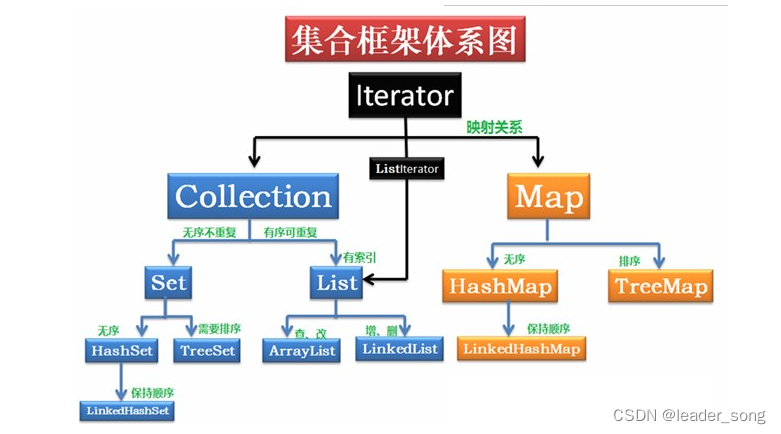
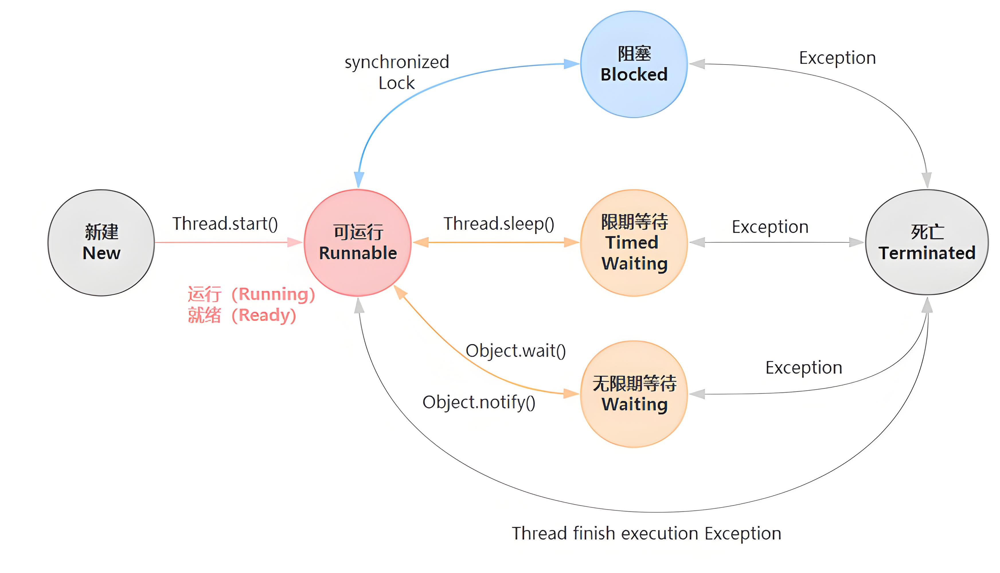
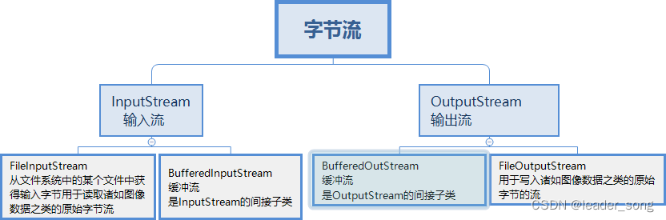
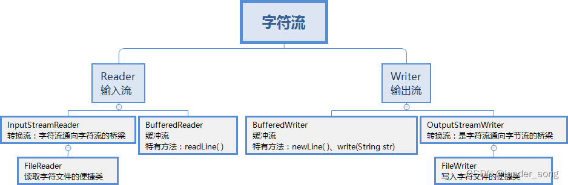

# 第一章-Java基础

## 1、你是怎样理解OOP面向对象

面向对象是利用语言对现实事物进行抽象。面向对象具有以下特征：

1. 继承：继承是从已有类得到继承信息创建新类的过程
2. 封装：封装是把数据和操作数据的方法绑定起来，对数据的访问只能通过已定义的接口
3. 多态：多态是指允许不同子类型的对象对同一消息作出不同的响应

## 2、重载和重写的区别

1. 重载发生在本类，重写发生在父类与子类之间
2. 重载的方法名必须相同，重写的方法名相同且返回值类型必须相同。
3. 重载的参数列表不同，重写的参数列表必须相同
4. 重写的访问权限不能比父类中被重写的方法的访问权限更低。
5. 构造方法不能被重写

## 3、接口与抽象类的区别

1. 抽象类要被子类继承，接口要被类实现
2. 接口可多继承接口，但类只单继承
3. 抽象类可以有构造器、接口不能有构造器
4. 抽象类：除了不能实例化抽象类之外，它和普通Java类没有任何区别
5. 抽象类抽象方法可以有public、protected和default这些修饰符、接口：只能是public
6. 抽象类：可以有成员变量；接口：只能声明常量

## 4、深拷贝与浅拷贝的理解

深拷贝和浅拷贝就是指对象的拷贝，一个对象中存在两种类型的属性，一种是基本数据类型，一种是实例对象的引用。

1. 浅拷贝是指，只会拷贝基本数据类型的值，以及实例对象的引用地址，并不会复制一份引用地址所指向的对象，也就是浅拷贝出来的对象，内部的类属性指向的是同一个对象
2. 深拷贝是指，既会拷贝基本数据类型的值，也会针对实例对象的引用地址所指向的对象进行复制，深拷贝出来的对象，内部的类指向的不是同一个对象。

- 浅拷贝实现方式

>  直接**.clone()**即可，也可以实现 `Cloneable` 接口并简单重写 `clone()` 方法

- 深拷贝实现方式

> 1. 重写`clone()`方法后，手动实现深拷贝
> 2. 通过序列化反序列化来实现深拷贝
> 3. 使用 `copy` 工具类（如 Apache Commons Lang 的 `SerializationUtils`）

## 5、sleep和wait区别

| **方法**  | **定义**                                                     | **常见用途**                   |
| --------- | ------------------------------------------------------------ | ------------------------------ |
| `wait()`  | 释放锁并进入等待状态，直到被其他线程 `notify()` 或 `notifyAll()` 唤醒 | 线程间协作，等待某个条件的发生 |
| `sleep()` | 暂停当前线程一段时间，但不释放锁                             | 模拟延迟，控制线程执行节奏     |

### 主要区别

| **特性**     | **`wait()`**                           | **`sleep()`**                 |
| ------------ | -------------------------------------- | ----------------------------- |
| **锁释放**   | 释放当前对象锁                         | 不释放锁                      |
| **调用位置** | 必须在同步块 (`synchronized`) 中调用   | 可以在任何地方调用            |
| **所属类**   | `Object` 类                            | `Thread` 类                   |
| **中断行为** | 会抛出 `InterruptedException`          | 会抛出 `InterruptedException` |
| **唤醒机制** | 需要 `notify()` 或 `notifyAll()`       | 自动恢复，无需唤醒            |
| **状态**     | 进入 `WAITING` 或 `TIMED_WAITING` 状态 | 进入 `TIMED_WAITING` 状态     |

- sleep方法

> 属于Thread类中的方法，释放cpu给其它线程，不释放锁资源。
>
> `sleep(1000)`等待1s被唤醒
>
> ```java
> public class SleepDemo {
>     public static void main(String[] args) throws InterruptedException {
>         Thread t1 = new Thread(() -> {
>             try {
>                 System.out.println("Thread 1 sleeping...");
>                 Thread.sleep(2000);
>                 System.out.println("Thread 1 woke up!");
>             } catch (InterruptedException e) {
>                 e.printStackTrace();
>             }
>         });
> 
>         Thread t2 = new Thread(() -> {
>             try {
>                 System.out.println("Thread 2 sleeping...");
>                 Thread.sleep(1000);
>                 System.out.println("Thread 2 woke up!");
>             } catch (InterruptedException e) {
>                 e.printStackTrace();
>             }
>         });
> 
>         t1.start();
>         t2.start();
>     }
> }
> 
> ```
>
> 

- wait方法

> 属于Object类中的方法，释放cpu给其它线程，同时释放锁资源。
>
> `wait(1000)`等待超过1s被唤醒，
>
> `wait()`一直等待需要通过notify或者notifyAll进行唤醒
>
> wait方法必须配合synchronized一起使用，不然在运行时就会抛出IllegalMonitorStateException异常
>
> ```java
> class Counter {
>     private int count = 0;
> 
>     public synchronized void increment() throws InterruptedException {
>         while (count >= 1) {
>             System.out.println(Thread.currentThread().getName() + " waiting...");
>             wait();  // 释放锁并等待
>         }
>         count++;
>         System.out.println(Thread.currentThread().getName() + " incremented: " + count);
>         notify();  // 唤醒其他等待的线程
>     }
> 
>     public synchronized void decrement() throws InterruptedException {
>         while (count == 0) {
>             System.out.println(Thread.currentThread().getName() + " waiting...");
>             wait();  // 释放锁并等待
>         }
>         count--;
>         System.out.println(Thread.currentThread().getName() + " decremented: " + count);
>         notify();  // 唤醒其他等待的线程
>     }
> }
> 
> public class WaitDemo {
>     public static void main(String[] args) {
>         Counter counter = new Counter();
> 
>         Thread t1 = new Thread(() -> {
>             try {
>                 counter.increment();
>             } catch (InterruptedException e) {
>                 e.printStackTrace();
>             }
>         }, "Incrementer");
> 
>         Thread t2 = new Thread(() -> {
>             try {
>                 counter.decrement();
>             } catch (InterruptedException e) {
>                 e.printStackTrace();
>             }
>         }, "Decrementer");
> 
>         t1.start();
>         t2.start();
>     }
> }
> 
> ```

## 6、什么是自动拆装箱，int和Integer有什么区别

### 自动拆装箱

**自动装箱（Autoboxing）** 和 **自动拆箱（Unboxing）** 是 Java 为了简化基本类型和包装类型之间的转换而引入的机制。java为什么要引入自动装箱和拆箱的功能？主要是用于java集合中，`List<Inteter> list=new ArrayList<Integer>();`list集合如果要放整数的话，只能放对象，不能放基本类型，因此需要将整数自动装箱成对象。

- **自动装箱（Autoboxing）**：将 **基本类型** 转换为 **对应的包装类型**。`int primitiveInt = 10;  Integer wrappedInt = primitiveInt;`

- **自动拆箱（Unboxing）**：将 **包装类型** 转换为 **对应的基本类型**。`Integer wrappedInt = 20; int primitiveInt = wrappedInt;`

### int和Integer的区别

| **特性**     | **int**         | **Integer**                                 |
| ------------ | --------------- | ------------------------------------------- |
| **类型**     | 基本数据类型    | 包装类（`java.lang.Integer`）               |
| **内存分配** | 栈内存          | 堆内存                                      |
| **初始值**   | 0               | `null`                                      |
| **存储范围** | -2^31 到 2^31-1 | -2^31 到 2^31-1                             |
| **性能**     | 更高            | 较低                                        |
| **方法**     | 无              | 包含常用方法，如 `parseInt()`、`toString()` |
| **比较**     | `==` 比较值     | `==` 比较引用，`.equals()` 比较值           |

### Integer缓存机制

`Integer` 在 **-128 到 127** 之间的值会 **缓存**，在这个范围内的 `Integer` 对象会复用已有实例，超出这个范围的值则会创建新的实例。

## 7、==和equals区别

| **特性**       | **`==`**                           | **`equals()`**                           |
| -------------- | ---------------------------------- | ---------------------------------------- |
| **比较内容**   | 比较**引用地址**（基本类型比较值） | 默认比较**引用地址**，可重写后比较**值** |
| **适用类型**   | 基本数据类型和引用类型             | 仅适用于引用类型                         |
| **性能**       | 更快                               | 较慢（涉及方法调用）                     |
| **可重写性**   | 不可重写                           | 可在类中重写                             |
| **空指针安全** | 安全                               | 可能抛出 `NullPointerException`          |

### String特殊情况

- 虽然 **`String` 是引用类型**，但在某些情况下可以直接使用 **`==`** 进行比较，这是因为 **`String` 具有常量池机制**。但String还是建议使用`.equals()`去比较字符串，也可使用`Objects.equals()`避免空指针异常。

  > **String 常量池**（String Constant Pool）是 Java 在方法区（JDK 7+ 是堆）中专门为字符串优化的内存区域。
  >
  > **主要特点：**
  >
  > - **相同内容的字符串只存储一份**，节省内存。
  > - **编译时确定**的字符串会自动放入常量池。
  > - **运行时**可以手动将字符串添加到常量池中。
  >
  > ```java
  > public class StringPoolExample {
  >     public static void main(String[] args) {
  >         String s1 = "hello";       // 存入常量池
  >         String s2 = "hello";       // 复用常量池中的 "hello"
  >         String s3 = new String("hello");  // 创建新对象，不在常量池
  >         String s4 = s3.intern();   // 将 s3 放入常量池
  > 
  >         System.out.println(s1 == s2);  // true, 指向常量池同一地址
  >         System.out.println(s1 == s3);  // false, 不同引用
  >         System.out.println(s1 == s4);  // true, intern() 返回常量池中的引用
  >     }
  > }
  > ```

## 8、String能被继承吗？为什么使用final修饰

- String不能被继承，因为它是一个final修饰的类

### 为什么String被final修饰

1. 保证字符串的不可变性
2. 提高字符串常量池的效率
3. String 类中有native关键字修饰的调用系统级别的本地方法，调用了操作系统的 API，如果方法可以重写，可能被植入恶意代码，破坏程序。Java 的安全性也体现在这里。

## 9、StringBuffer和StringBuilder的区别

| **特性**       | **`StringBuffer`**                              | **`StringBuilder`**                             |
| -------------- | ----------------------------------------------- | ----------------------------------------------- |
| **线程安全性** | 线程安全（方法同步）                            | 非线程安全                                      |
| **性能**       | 较慢（同步开销）                                | 较快                                            |
| **适用场景**   | 多线程环境                                      | 单线程环境                                      |
| **初始版本**   | JDK 1.0                                         | JDK 1.5                                         |
| **常用方法**   | `append()`, `insert()`, `delete()`, `reverse()` | `append()`, `insert()`, `delete()`, `reverse()` |
| **是否可变**   | 可变                                            | 可变                                            |

## 10、final、finally、finalize？

- **final：**修饰符（关键字）有三种用法：修饰类、变量和方法。修饰类时，意味着它不能再派生出新的子类，即不能被继承，因此它和abstract是反义词。修饰变量时，该变量使用中不被改变，必须在声明时给定初值，在引用中只能读取不可修改，即为常量。修饰方法时，也同样只能使用，不能在子类中被重写。

- **finally：**通常放在try…catch的后面构造最终执行代码块，这就意味着程序无论正常执行还是发生异常，这里的代码只要JVM不关闭都能执行，可以将释放外部资源的代码写在finally块中。

- **finalize：**Object类中定义的方法，Java中允许使用finalize() 方法在垃圾收集器将对象从内存中清除出去之前做必要的清理工作。这个方法是由垃圾收集器在销毁对象时调用的，通过重写finalize() 方法可以整理系统资源或者执行其他清理工作。

## 11、Object中有哪些方法？

1. `protected Object clone()`——创建并返回此对象的一个副本。

2. `boolean equals(Object obj)`——指示某个其它对象是否与此对象相等。

3. `protected void finalize()`——当垃圾回收器确定不存在对该对象的更多引用时，由对象的垃圾回收器调用此方法。

4. `Class<? extends Object> getClass()`——返回一个对象的运行时类。

5. `int hashCode()`——返回该对象的哈希码值。

6. `void notify()`——唤醒在此对象监视器上等待的单个线程。

7. `void notifyAll()`——唤醒在此对象监视器上等待的所有线程。

8. `String toString()`——返回该对象的字符串表示。

9. > `void wait()`——导致当前的线程等待，直到其他线程调用此对象的`notify()`方法或`notifyAll()`方法。
   >
   > `void wait(long timeout)`——导致当前的线程等待，直到其他线程调用此对象的`notify()`方法或`notifyAll()`方法，或者超过指定的时间量，`timeout`以毫秒为单位。
   >
   > `void wait(long timeout, int nanos)`——导致当前的线程等待，直到其他线程调用此对象的`notify()`方法或`notifyAll()`方法，或者超过指定的时间量，`nanos`以纳秒为单位，表示额外要等待的超时时间，相当于在timeout的基础上加上nanos。

## 12、集合体系



```mathematica
java.util.Collection (顶层接口)
├── java.util.List（有序、可重复）
│   ├── java.util.ArrayList
│   ├── java.util.LinkedList
│   └── java.util.Vector
│       └── java.util.Stack
├── java.util.Set（无序、不可重复）
│   ├── java.util.HashSet
│   ├── java.util.LinkedHashSet
│   └── java.util.TreeSet
└── java.util.Queue（队列，FIFO）
    ├── java.util.PriorityQueue
    └── java.util.Deque（双端队列）
        ├── java.util.LinkedList
        └── java.util.ArrayDeque

java.util.Map（键值对）
├── java.util.HashMap
├── java.util.LinkedHashMap
├── java.util.TreeMap
└── java.util.Hashtable
```

## 13、ArrayList和LinkedList区别

1. ArrayList是实现了基于动态数组的数据结构，LinkedList基于链表的数据结构。
2. 对于随机访问get和set，ArrayList效率优于LinkedList，因为LinkedList要移动指针。
3. 对于新增和删除操作add和remove，LinekdList比较占优势，因为ArrayList要移动数据。这一点要看实际情况的。只对单条数据插入或删除，ArrayList的速度反而优于LinkedList。但若是批量随机的插入删除数据，LinkedList的速度大大优于ArrayList，因为ArrayList每插入一条数据，要移动插入点之后的所有数据。

## 14、HashMap底层是什么，为什么要用这几类结构

- HashMap的底层是**数组+链表+红黑树（JDK 8+）**。

```scss
HashMap (JDK 8+)
├── 数组（Node<K, V>[]）
│   ├── 链表
│   └── 红黑树
└── 散列函数（hash()）
```

- Node<K, V>结构

> 每个数组元素是一个 **`Node<K, V>`**，包含键、值、哈希值和下一个节点的引用。
>
> ```java
> static class Node<K,V> implements Map.Entry<K,V> {
>     final int hash;
>     final K key;
>     V value;
>     Node<K,V> next;
> 
>     Node(int hash, K key, V value, Node<K,V> next) {
>         this.hash = hash;
>         this.key = key;
>         this.value = value;
>         this.next = next;
>     }
> 
>     public final K getKey()        { return key; }
>     public final V getValue()      { return value; }
>     public final String toString() { return key + "=" + value; }
> 
>     public final int hashCode() {
>         return Objects.hashCode(key) ^ Objects.hashCode(value);
>     }
> 
>     public final V setValue(V newValue) {
>         V oldValue = value;
>         value = newValue;
>         return oldValue;
>     }
> 
>     public final boolean equals(Object o) {
>         if (o == this)
>             return true;
> 
>         return o instanceof Map.Entry<?, ?> e
>                 && Objects.equals(key, e.getKey())
>                 && Objects.equals(value, e.getValue());
>     }
> }
> ```

- 为什么要使用数组+链表+红黑树

数组：查询效率高，O(1)时间复杂度；

链表：处理哈希冲突，适合小规模冲突；

红黑树：当链表长度超过8时，转换为红黑树，提高查询效率。

- 哈希函数

```java
static final int hash(Object key) {
    int h;
    //异或高位扰动，减少哈希冲突
    return (key == null) ? 0 : (h = key.hashCode()) ^ (h >>> 16);
}
```

> HashMap 的 **`hash()`** 方法用于计算键的哈希值，并将其映射到数组索引
>
> **`(n - 1) & hash`** 取模运算，效率比 **`%`** 高。

## 15、HashMap和HashTable的区别

| **特性**        | **`HashMap`**                       | **`Hashtable`**              |
| --------------- | ----------------------------------- | ---------------------------- |
| **线程安全**    | **非线程安全**                      | **线程安全**                 |
| **效率**        | 高                                  | 低                           |
| **Null 键和值** | **允许** 1 个 null 键，多个 null 值 | **不允许** null 键和 null 值 |
| **初始容量**    | 16                                  | 11                           |
| **容量要求**    | 容量一定是2的整数幂                 | 不一定是2的整数幂            |
| **扩容机制**    | **容量翻倍**                        | **容量翻倍 + 1**             |
| **负载因子**    | **0.75（默认）**                    | **0.75（固定）**             |
| **遍历方式**    | **Iterator**                        | **Enumerator**               |
| **底层实现**    | **数组 + 链表 + 红黑树**            | **数组 + 链表**              |
| **JDK 版本**    | JDK 1.2                             | JDK 1.0                      |
| **推荐使用**    | 大部分场景                          | 兼容旧代码                   |

## 16、线程的创建方式

### 方式

1. 继承 `Thread` 类，重写 `Thread` 类的 `run()` 方法，通过 `start()` 方法启动线程

```java
// 继承 Thread 实现线程
class MyThread extends Thread {
    @Override
    public void run() {
        for (int i = 0; i < 5; i++) {
            System.out.println(Thread.currentThread().getName() + " - Count: " + i);
        }
    }
}

public class ThreadTest {
    public static void main(String[] args) {
        MyThread thread1 = new MyThread();
        MyThread thread2 = new MyThread();

        thread1.start();
        thread2.start();
    }
}
```

2. 实现 `Runnable` 接口，实现 `Runnable` 接口的 `run()` 方法，通过 `Thread` 构造函数传入 `Runnable` 实例

```java
// 实现 Runnable 接口
class MyRunnable implements Runnable {
    @Override
    public void run() {
        for (int i = 0; i < 5; i++) {
            System.out.println(Thread.currentThread().getName() + " - Count: " + i);
        }
    }
}

public class RunnableTest {
    public static void main(String[] args) {
        Thread thread1 = new Thread(new MyRunnable());
        Thread thread2 = new Thread(new MyRunnable());

        thread1.start();
        thread2.start();
    }
}

```

3. 实现 `Callable` 接口（带返回值），实现 `Callable` 接口的 `call()` 方法，使用 `FutureTask` 包装 `Callable` 实例，通过 `Thread` 启动

```java
import java.util.concurrent.Callable;
import java.util.concurrent.ExecutionException;
import java.util.concurrent.FutureTask;

class MyCallable implements Callable<String> {
    @Override
    public String call() throws Exception {
        Thread.sleep(1000);
        return Thread.currentThread().getName() + " - Task Completed";
    }
}

public class CallableTest {
    public static void main(String[] args) throws ExecutionException, InterruptedException {
        FutureTask<String> task = new FutureTask<>(new MyCallable());
        Thread thread = new Thread(task);
        thread.start();

        // 阻塞等待线程执行完毕
        String result = task.get();
        System.out.println(result);
    }
}
```

4. 使用线程池（`ExecutorService`），使用 `Executors` 创建线程池，提交任务 (`submit()` / `execute()`)

```java
import java.util.concurrent.ExecutorService;
import java.util.concurrent.Executors;

public class ThreadPoolTest {
    public static void main(String[] args) {
        ExecutorService executor = Executors.newFixedThreadPool(3);

        for (int i = 0; i < 5; i++) {
            executor.execute(() -> {
                System.out.println(Thread.currentThread().getName() + " is running");
            });
        }

        executor.shutdown();
    }
}
```

5. 使用匿名内部类

```java
public class AnonymousThreadTest {
    public static void main(String[] args) {
        Thread thread = new Thread(() -> {
            for (int i = 0; i < 5; i++) {
                System.out.println(Thread.currentThread().getName() + " - Count: " + i);
            }
        });

        thread.start();
    }
}
```

6. 使用Lambda表达式

```java
public class LambdaThreadTest {
    public static void main(String[] args) {
        new Thread(() -> {
            for (int i = 0; i < 5; i++) {
                System.out.println(Thread.currentThread().getName() + " - Count: " + i);
            }
        }).start();
    }
}

```

### 对比

| **方式**          | **优点**                   | **缺点**           |
| ----------------- | -------------------------- | ------------------ |
| **继承 Thread**   | 代码简单，易于理解         | 不能继承其他类     |
| **实现 Runnable** | 可实现多继承，解耦逻辑     | 无返回值           |
| **实现 Callable** | 支持返回值和异常处理       | 代码稍复杂         |
| **线程池**        | 高效管理线程，复用线程资源 | 需要手动关闭线程池 |
| **匿名内部类**    | 简化代码结构               | 可读性较差         |
| **Lambda**        | 简洁、高效                 | 只能用于函数式接口 |

## 17、线程的生命周期



1. NEW（新建状态）

- **定义**：线程对象被创建，但尚未启动。
- **特征**：未调用 `start()` 方法，无任何资源占用。
- **典型场景**：`Thread thread = new Thread();`

2. RUNNABLE（就绪状态）

- **定义**：线程已经调用 `start()` 方法，可能正在运行或等待 CPU 调度。
- **特征**：处于就绪状态，等待 CPU 时间片。
- **典型场景**：`thread.start();`

3. BLOCKED（阻塞状态）

- **定义**：线程尝试获取锁失败，等待进入同步块或方法。
- **特征**：等待获取 `synchronized` 锁。
- **典型场景**：多个线程竞争同一个锁。

4. WAITING（等待状态）

- **定义**：线程主动放弃 CPU，等待其他线程的通知。
- **特征**：无限期等待，直到被 `notify()` 或 `notifyAll()` 唤醒。
- **典型场景**：`Object.wait()`、`Thread.join()`。

5. TIMED_WAITING（计时等待状态）

- **定义**：线程在有限时间内等待其他线程的通知或资源。
- **特征**：超时后自动返回 RUNNABLE 状态。
- **典型场景**：`Thread.sleep()`、`Object.wait(timeout)`。

6. TERMINATED（终止状态）

- **定义**：线程执行完毕或出现异常退出。
- **特征**：生命周期结束，无法再次启动。
- **典型场景**：正常结束、抛出异常。

## 18、Java中有几种类型的流





| **类别**       | **输入流**            | **输出流**                    |
| -------------- | --------------------- | ----------------------------- |
| **文件流**     | `FileInputStream`     | `FileOutputStream`            |
| **缓冲流**     | `BufferedInputStream` | `BufferedOutputStream`        |
| **字符流**     | `FileReader`          | `FileWriter`                  |
| **缓冲字符流** | `BufferedReader`      | `BufferedWriter`              |
| **数据流**     | `DataInputStream`     | `DataOutputStream`            |
| **对象流**     | `ObjectInputStream`   | `ObjectOutputStream`          |
| **打印流**     | -                     | `PrintStream` / `PrintWriter` |

## 19、请写出你最常见的5个RuntimeException

1. `java.lang.NullPointerException`‘

空指针异常；出现原因：调用了未经初始化的对象或者是不存在的对象。

2. `java.lang.ClassNotFoundException`

指定的类找不到；出现原因：类的名称和路径加载错误；通常都是程序试图通过字符串来加载某个类时可能引发异常。

3. `java.lang.NumberFormatException`

字符串转换为数字异常；出现原因：字符型数据中包含非数字型字符。

4. `java.lang.IndexOutOfBoundsException`

数组角标越界异常，常见于操作数组对象时发生。

5. `java.lang.IllegalArgumentException`

方法传递参数错误。

6. `java.lang.ClassCastException`

数据类型转换异常。

## 20、谈谈你对反射的理解

### **1. 什么是反射（Reflection）**

- **反射** 是 **Java** 提供的一种在 **运行时** 获取类信息并操作类对象的机制。
- 它允许在运行时 **动态** 访问类的方法、属性、构造器，并创建对象或调用方法。
- **反射** 是 **Java** 语言动态性的重要体现。

------

### **2. 反射的核心类**

- **`Class`**：代表类的元数据，可以获取类的信息。
- **`Method`**：代表类的方法。
- **`Field`**：代表类的成员变量。
- **`Constructor`**：代表类的构造方法。

------

### **3. 反射的常见用途**

- **动态加载类**（如插件机制）
- **框架设计**（Spring、Hibernate、MyBatis）
- **注解处理**（如 Spring Bean 的依赖注入）
- **序列化和反序列化**（Gson、Jackson）
- **测试工具**（JUnit）

------

### **4. 反射的基本操作**

#### **4.1. 获取 `Class` 对象**

```java
Class<?> clazz1 = Class.forName("java.lang.String");

Class<?> clazz2 = String.class;

String str = "Hello";
Class<?> clazz3 = str.getClass();
```

**4.2. 创建对象**

```java
Class<?> clazz = Class.forName("java.util.ArrayList");
Object obj = clazz.getDeclaredConstructor().newInstance();  // 反射创建对象
```

#### **4.3. 获取构造方法**

```java
Constructor<?> constructor = clazz.getDeclaredConstructor(int.class);
Object instance = constructor.newInstance(10);  // 传参构造
```

#### **4.4. 获取字段**

```java
Field field = clazz.getDeclaredField("size");
field.setAccessible(true);  // 设置可访问私有字段
int size = (int) field.get(instance);
```

#### **4.5. 获取方法**

```java
Method method = clazz.getMethod("add", Object.class);
method.invoke(instance, "Hello World");  // 调用方法
```

### **5. 反射的典型应用**

- **Spring** 中的 **Bean 容器**
- **MyBatis** 中的 **动态 SQL 映射**
- **JUnit** 中的 **测试用例执行**
- **Gson** / **Jackson** 的 **序列化与反序列化**

## 21、谈一谈Java的序列化和反序列化

### 1. 什么是序列化和反序列化

**序列化（Serialization）**

- 将 **Java 对象** 转换为 **字节序列**，以便存储到文件、数据库或在网络上传输。
- **典型场景**：缓存对象、远程调用（RMI）、消息传递（MQ）。

**反序列化（Deserialization）**

- 将 **字节序列** 还原为 **Java 对象**。
- **典型场景**：从文件、数据库或网络中读取对象数据。

### 2. 序列化和反序列化的基本实现

#### **2.1. 实现 `Serializable` 接口**

- 任何希望被序列化的对象必须实现 **`java.io.Serializable`** 接口。
- 该接口是一个 **标记接口**，不包含任何方法。

```java
import java.io.*;

class Person implements Serializable {
    private static final long serialVersionUID = 1L;  // 序列化版本号
    private String name;
    private int age;

    public Person(String name, int age) {
        this.name = name;
        this.age = age;
    }

    @Override
    public String toString() {
        return "Person{name='" + name + "', age=" + age + "}";
    }
}

//序列化对象
public class SerializationDemo {
    public static void main(String[] args) throws IOException {
        Person person = new Person("Alice", 30);
        
        try (ObjectOutputStream oos = new ObjectOutputStream(new FileOutputStream("person.ser"))) {
            oos.writeObject(person);
            System.out.println("Person serialized");
        }
    }
}

//反序列化对象
public class DeserializationDemo {
    public static void main(String[] args) throws IOException, ClassNotFoundException {
        try (ObjectInputStream ois = new ObjectInputStream(new FileInputStream("person.ser"))) {
            Person person = (Person) ois.readObject();
            System.out.println("Person deserialized: " + person);
        }
    }
}
```

### 3. 序列化的细节

#### **3.1. `serialVersionUID`**

- **作用**：版本控制，确保反序列化时类版本一致。
- **自动生成**：如果不显式声明，JVM 会自动生成一个版本号。
- **版本不匹配**：会抛出 **`InvalidClassException`**。

**3.2. `transient` 关键字**

- **作用**：阻止字段序列化，`private transient String password;`。
- **典型场景**：密码、敏感信息。

### 4. 序列化的限制

- 静态字段不能序列化
- 父类未实现Serializable
- 循环引用问题：序列化可能导致循环引用的问题，JVM 会自动处理，但效率较低。

### 5. 自定义序列化

- 可以通过实现 **`writeObject()`** 和 **`readObject()`** 方法自定义序列化过程。

```java
private void writeObject(ObjectOutputStream oos) throws IOException {
    oos.defaultWriteObject();  // 序列化非 transient 字段
    oos.writeObject(this.password.toUpperCase());  // 自定义序列化
}

private void readObject(ObjectInputStream ois) throws IOException, ClassNotFoundException {
    ois.defaultReadObject();  // 反序列化非 transient 字段
    this.password = ((String) ois.readObject()).toLowerCase();  // 自定义反序列化
}
```

### 6. 序列化框架

**Java 原生序列化**

**JSON 序列化**（Gson、Jackson）

**XML 序列化**

**ProtoBuf、Avro、Kryo**（更高效）

### 7. 序列化常见应用

**分布式系统**（RPC、RMI）

**缓存机制**

**会话管理**（Web Session）

**深拷贝**

## 22、Http常见的状态码

200 OK      //客户端请求成功
301      Permanently Moved （永久移除)，请求的 URL 已移走。Response 中应该包含一个 Location URL, 说明资源现在所处的位置
302      Temporarily Moved  临时重定向
400      Bad Request //客户端请求有语法错误，不能被服务器所理解
401      Unauthorized //请求未经授权，这个状态代码必须和 WWW-Authenticate 报头域一起使用
403      Forbidden //服务器收到请求，但是拒绝提供服务
404      Not Found //请求资源不存在，eg：输入了错误的 URL
500      Internal Server Error //服务器发生不可预期的错误
503      Server Unavailable //服务器当前不能处理客户端的请求，一段时间后可能恢复正常

## 23、GET 和POST 的区别

| **属性**         | **GET**                         | **POST**                         |
| ---------------- | ------------------------------- | -------------------------------- |
| **传输数据位置** | URL 参数                        | 请求体                           |
| **数据长度限制** | 受 URL 长度限制（一般 2KB-8KB） | 理论上无限制（受服务器配置影响） |
| **安全性**       | 较低，数据暴露在 URL            | 较高，数据在请求体中             |
| **幂等性**       | 是（多次请求结果相同）          | 否（可能产生副作用）             |
| **可缓存性**     | 是                              | 否（除非明确设置）               |
| **典型应用**     | 获取资源                        | 提交表单，上传数据               |
| **浏览器历史**   | 会记录参数                      | 不记录参数                       |
| **书签**         | 可以保存                        | 不可以保存                       |
| **断点续传**     | 不支持                          | 支持（需要服务端配合）           |

## 24、Cookie和Session的区别

| **属性**         | **Cookie**                     | **Session**                 |
| ---------------- | ------------------------------ | --------------------------- |
| **存储位置**     | 客户端浏览器                   | 服务器端                    |
| **数据存储形式** | 纯文本                         | 内存、文件、数据库          |
| **存储的数据量** | 只能存储String类型的对象       | 可以存储任意的Java对象      |
| **安全性**       | 较低，易被篡改                 | 较高，存储在服务器          |
| **数据量限制**   | 一般 4KB                       | 受服务器内存限制            |
| **生命周期**     | 由 `max-age` 或 `expires` 控制 | 由 `session timeout` 控制   |
| **跨域支持**     | 受限                           | 受限                        |
| **适用场景**     | 轻量状态、记录用户偏好         | 用户登录、敏感数据存储      |
| **浏览器支持**   | 所有浏览器                     | 需通过 `Cookie` 关联        |
| **传输频率**     | 每次请求都会携带               | 仅首次请求携带 `Session ID` |
| **实现方式**     | HTTP 头部 `Set-Cookie`         | 服务器 `session` 对象       |

- 常见使用场景

| **场景**         | **推荐使用**        |
| ---------------- | ------------------- |
| **记住用户名**   | **Cookie**          |
| **用户登录状态** | **Session**         |
| **临时存储**     | **Session**         |
| **广告跟踪**     | **Cookie**          |
| **跨域认证**     | **Token（如 JWT）** |
