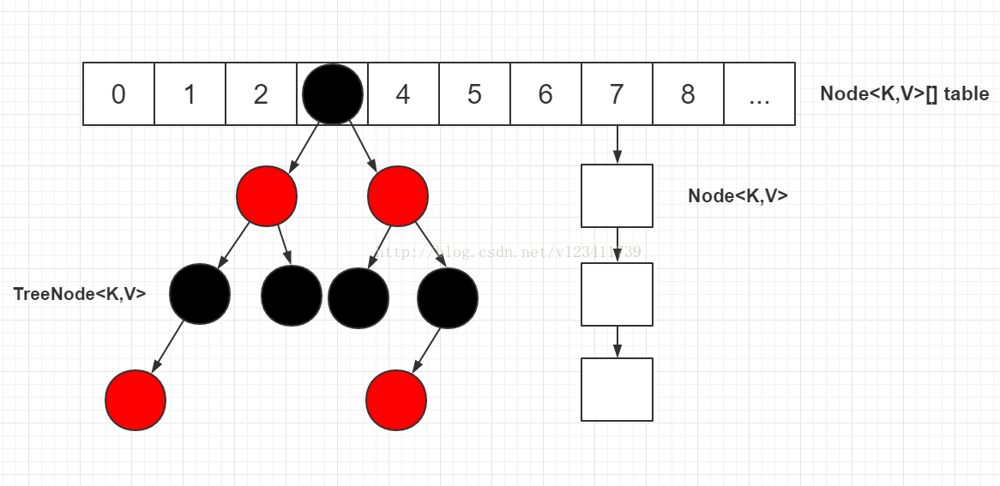
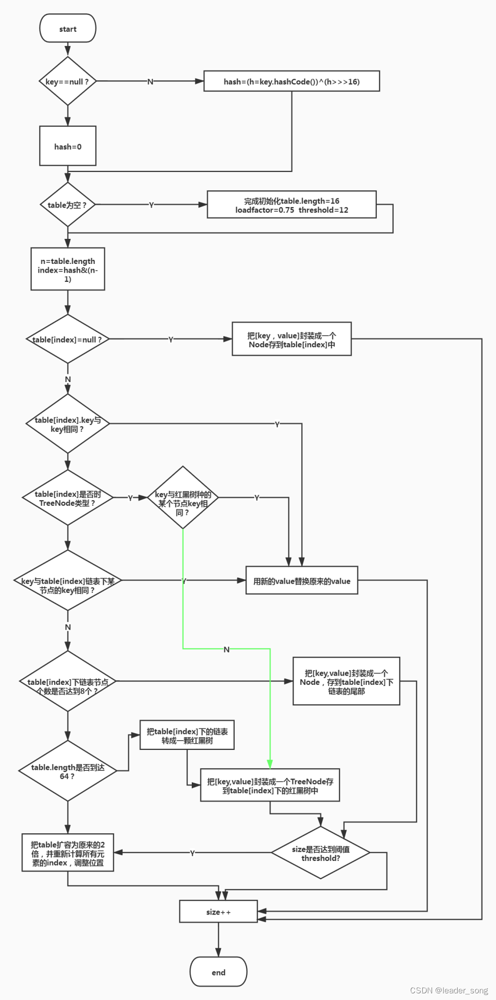
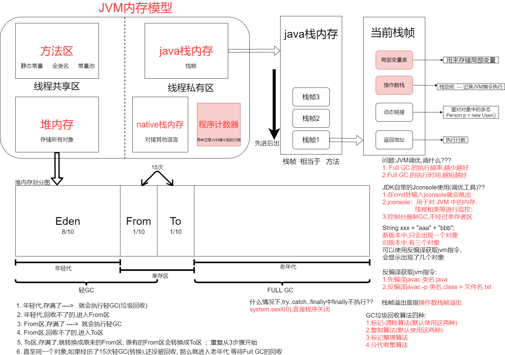

## 1. HashMap底层源码

> [HashMap详解](https://blog.csdn.net/v123411739/article/details/78996181)

### 数据结构

**数组（Node[] table）**：HashMap 的主体，存储键值对节点。

**链表**：解决哈希冲突的主要方式（Java 8 之前）。

**红黑树**：当单个桶中的元素超过阈值（默认 8），链表转换为红黑树，提高查询效率（Java 8 起）。



### 核心流程

#### 存储（put）

> 1. 计算键的 `hash` 值。
>
> 2. 根据 `hash % table.length` 定位数组索引。
>
> 3. 如果该位置为空，直接插入；
>    如果不为空，遍历链表或树：
>
>    - key 已存在：更新 value；
>
>    - key 不存在：添加新节点，必要时树化。

- put方法流程图。



#### 查询（get）

1. 计算 `hash`。

2. 定位数组索引。

3. 根据 key 遍历链表或红黑树，匹配相同 key。

### 负载因子

- 默认负载因子：0.75
- 当元素数量 > 阈值（capacity × load factor）时，数组扩容为原来的 2 倍，重新哈希分布所有节点。

### 特点

- key 允许为 null（最多一个）。
- 非线程安全（需使用 `Collections.synchronizedMap` 或 `ConcurrentHashMap`）。

## 2. JVM内存分哪几个区，每个区的作用是什么

| 名称                                     | 是否线程私有   | 主要作用说明                                                 |
| ---------------------------------------- | -------------- | ------------------------------------------------------------ |
| **方法区（Method Area）**                | 否（线程共享） | 存放类的元信息（类结构、常量池、静态变量、JIT 编译代码等）。Java 8 后为**元空间**，使用本地内存。 |
| **堆内存（Heap）**                       | 否（线程共享） | 存储**所有对象实例**和数组，是 GC 的主要区域。               |
| **Java 栈内存（JVM Stack）**             | 是（线程私有） | 方法调用时创建栈帧，保存局部变量、操作数栈、返回值等。       |
| **Native 栈内存（Native Method Stack）** | 是（线程私有） | 用于支持 Native 方法的调用（如 JNI）。                       |
| **程序计数器（Program Counter）**        | 是（线程私有） | 指示当前线程所执行的字节码行号地址，类似“行号指针”。         |



| 名称                                     | 是否线程私有   | 主要作用说明                                                 |
| ---------------------------------------- | -------------- | ------------------------------------------------------------ |
| **方法区（Method Area）**                | 否（线程共享） | 存放类的元信息（类结构、常量池、静态变量、JIT 编译代码等）。Java 8 后为**元空间**，使用本地内存。 |
| **堆内存（Heap）**                       | 否（线程共享） | 存储**所有对象实例**和数组，是 GC 的主要区域。               |
| **Java 栈内存（JVM Stack）**             | 是（线程私有） | 方法调用时创建栈帧，保存局部变量、操作数栈、返回值等。       |
| **Native 栈内存（Native Method Stack）** | 是（线程私有） | 用于支持 Native 方法的调用（如 JNI）。                       |
| **程序计数器（Program Counter）**        | 是（线程私有） | 指示当前线程所执行的字节码行号地址，类似“行号指针”。         |

## 3. Java中垃圾回收（GC）的方式有哪些

### 按回收算法分类

| 算法名称                     | 原理简介                                                     | 优点                                         | 缺点                                                 | 适用场景                 |
| ---------------------------- | ------------------------------------------------------------ | -------------------------------------------- | ---------------------------------------------------- | ------------------------ |
| **标记-清除** (Mark-Sweep)   | 标记所有存活对象 → 清除未标记对象                            | 实现简单，无需复制，节省空间                 | 会产生**内存碎片**，回收速度慢，分配大对象可能失败   | 老年代（早期使用）       |
| **复制算法** (Copying)       | 存活对象复制到另一块区域，清空原区域                         | **无碎片**，分配连续内存，回收快             | 空间浪费大（只能用一半），对象存活率高时，复制开销大 | 新生代（对象生命周期短） |
| **标记-整理** (Mark-Compact) | 标记存活对象 → 整理到一端 → 清理无效对象                     | 无碎片，不浪费内存，支持大对象分配           | 移动对象成本高，整理耗时                             | 老年代（对象存活率高）   |
| **分代收集** (Generational)  | 将内存划分为新生代、老年代，分别使用不同算法（如复制 + 标记整理） | 综合多种算法优点，高效适应不同生命周期的对象 | 实现复杂，分代调整策略需要调优                       | JVM 默认策略             |

### 按垃圾回收器名称分类（HotSpot JVM 常见 GC）

| 回收器                              | 适用区域                  | 特点                                           |
| ----------------------------------- | ------------------------- | ---------------------------------------------- |
| **Serial**                          | 新生代（复制算法）        | 单线程，适用于小内存、单核。                   |
| **ParNew**                          | 新生代（复制算法）        | 多线程版 Serial，可与 CMS 搭配使用。           |
| **Parallel Scavenge（吞吐量优先）** | 新生代（复制算法）        | 多线程，追求高吞吐量，配合 Parallel Old 使用。 |
| **Parallel Old**                    | 老年代（标记-整理）       | Parallel Scavenge 的老年代回收器。             |
| **CMS（Concurrent Mark Sweep）**    | 老年代（标记-清除）       | 并发低停顿，适合响应时间敏感应用；有碎片问题。 |
| **G1（Garbage First）**             | 新生代+老年代（分区回收） | 支持并发、低停顿、可预测，适合大内存。         |
| **ZGC（Java 11+）**                 | 全区域并发回收            | 极低停顿（<10ms），支持大内存（TB 级）。       |
| **Shenandoah（Java 12+）**          | 全区域并发回收            | 类似 ZGC，适合低延迟场景。                     |

## 4. 如何判断一个对象是否存活(或者GC对象的判定方法)

### 引用计数法（Reference Counting，已淘汰）

#### 原理：

- 每个对象维护一个**引用计数器**，被引用一次计数加一，引用断开减一；
- 计数为 0 的对象会被判定为垃圾。

#### 缺点：

- 无法处理**循环引用**，比如两个对象互相引用但已无外部引用，仍然无法被回收；
- 因此被 **HotSpot JVM** 等主流虚拟机淘汰。

### 可达性分析算法（Reachability Analysis，主流）

#### 原理：

- 从一组称为 **GC Roots** 的对象出发，向下搜索，能连通的对象为**可达对象**，否则为垃圾；
- **不可达 ≠ 立即死亡**，还可能进入 “**四次判死**” 机制。

#### GC Roots 包括：

- 虚拟机栈中的**引用变量**（方法栈帧中的局部变量表）
- 方法区中的**类静态属性**
- 方法区中的**常量引用**
- 本地方法栈中 JNI 引用（Native 方法）

#### 对象“真正死亡”前的判断过程

- 对于不可达对象，还要经历如下判定才会被彻底GC：

| 判定阶段       | 条件                                  | 说明                              |
| -------------- | ------------------------------------- | --------------------------------- |
| **第一次判定** | 是否重写 `finalize()` 方法            | 如果没有，立即判定为垃圾          |
| **第二次判定** | 执行 `finalize()`，是否重新建立引用链 | 有引用则“复活”；否则进入下一轮 GC |
| **最终回收**   | finalize 后仍不可达                   | 判定死亡，GC 回收                 |

> **finalize()**：
>
> - 在对象被 GC 前做一些**资源释放**、**日志记录**等清理工作；
> - 允许对象“**自救**”，即在 `finalize()` 中重新让自己变为可达对象（比如把 `this` 赋值给某个静态变量）。
> - GC 判定对象“不可达”后，若重写了 `finalize()`：
>   - 会将该对象放入 `F-Queue`（Finalizer Reference Queue）；
>   - 由一个 JVM 内部线程（Finalizer Thread）异步调用其 `finalize()` 方法；
>   - 如果在方法中重新建立引用链，GC 会“放你一马”；
>   - 每个对象的 `finalize()` **最多只会被调用一次**。

## 5. 什么情况下会产生StackOverflowError（栈溢出）和OutOfMemoryError（堆溢出）？怎么排查？

### StackOverflowError（栈溢出）

#### 常见原因

1. 递归调用过深（最常见）。

2. **方法调用层级过深**，每个方法占用栈帧过多；

3. 设置的 **栈大小过小**（`-Xss` 参数）；

#### 排查

**查看异常堆栈信息**：函数调用是否死递归；

**调试终止条件**：确认递归有明确返回条件；

**调整 JVM 参数**（如增大线程栈大小）：`-Xss512k（默认） → -Xss1m`

### OutOfMemoryError（堆溢出）

#### 常见原因

1. **创建了过多对象，未释放引用**；

2. **大集合或缓存未清理**（如 List 不断添加元素）；

3. **内存泄漏**：对象应该被回收却被意外引用；

4. **JVM 堆内存设置太小**（默认最大内存不足）；

5. **线程数过多间接耗尽堆空间**；

6. **某些场景下 String.intern() 导致元空间爆满**（老版本 PermGen）；

#### 排查方法

- **查看 GC 日志/内存监控**：
  - 使用 `-XX:+PrintGCDetails -Xloggc:gc.log`；
  - 或 JVisualVM、MAT、JProfiler 工具；
- **定位内存泄漏对象**：
  - 使用 MAT 工具分析 `.hprof` 文件；
  - 查找 “GC Roots” 强引用链；

- **调整 JVM 参数**（如增大堆内存）：`-Xms512m -Xmx1024m`

## 6. 什么是线程池，有什么类型，如何创建？

### 什么是线程池？

**线程池（Thread Pool）**是一种**复用线程资源**的机制，用于限制和管理线程的创建与销毁，避免频繁创建/销毁线程带来的性能损耗。

> 本质上就是一个**线程的容器**，可以反复使用已有线程执行任务。

### 线程池的作用？

| 优点             | 说明                                     |
| ---------------- | ---------------------------------------- |
| 降低资源开销     | 复用已有线程，避免频繁创建销毁线程       |
| 提高响应速度     | 提交任务即可立即执行，不需等待新线程创建 |
| 提供线程管理机制 | 控制最大并发数、超时策略、任务排队策略等 |
| 提高系统稳定性   | 防止无限制创建线程导致 OOM 或系统崩溃    |

### 线程池的类型

| 线程池类型                    | 创建方式                              | 特点说明                                                     |
| ----------------------------- | ------------------------------------- | ------------------------------------------------------------ |
| **固定大小线程池**            | `Executors.newFixedThreadPool(n)`     | 线程数固定，适合负载稳定的场景；超出部分排队执行             |
| **单线程线程池**              | `Executors.newSingleThreadExecutor()` | 只有一个线程，顺序执行任务FIFO，适用于顺序任务处理           |
| **缓存线程池（无限大）**      | `Executors.newCachedThreadPool()`     | 空闲线程可复用，线程可无限增长（Integer.MAX_VALUE），适合任务密集但执行快的场景 |
| **定时任务线程池**            | `Executors.newScheduledThreadPool(n)` | 支持定时任务或周期任务执行                                   |
| **工作窃取线程池（Java 8+）** | `Executors.newWorkStealingPool()`     | 利用多核 CPU，自动进行任务分配与负载均衡                     |

### 自定义线程池

通过 `ThreadPoolExecutor` 类构建，更灵活：

```java
ThreadPoolExecutor executor = new ThreadPoolExecutor(
    corePoolSize,         // 核心线程数
    maximumPoolSize,      // 最大线程数
    keepAliveTime,        // 空闲线程存活时间
    TimeUnit.SECONDS,     // 时间单位
    new LinkedBlockingQueue<>(100), // 阻塞队列（任务等待区）
    Executors.defaultThreadFactory(),  // 线程工厂
    new ThreadPoolExecutor.AbortPolicy() // 拒绝策略
);
```

拒绝策略说明：

| 策略名                | 说明                                 |
| --------------------- | ------------------------------------ |
| `AbortPolicy`（默认） | 抛异常拒绝任务                       |
| `CallerRunsPolicy`    | 由调用者线程执行任务（降级）         |
| `DiscardPolicy`       | 直接丢弃任务                         |
| `DiscardOldestPolicy` | 丢弃队列中最老的任务，尝试提交新任务 |

### 注意事项

- **不要直接使用 `Executors` 创建线程池**（原因：默认策略不安全，易OOM），推荐用 `ThreadPoolExecutor` 明确参数；

- 对于 Web 服务类系统，建议根据 **CPU核心数** 配置线程数（如 `CPU核数 * 2`）；

- 配合监控工具（如 `JVisualVM`）观察线程池状态，有助于调优。

## 7. 为什么要使用线程

| 原因                            | 解释                                                         |
| ------------------------------- | ------------------------------------------------------------ |
| **1. 降低资源开销**             | 线程复用，避免频繁创建与销毁线程带来的**性能开销**。         |
| **2. 提高响应速度**             | 任务提交后可以直接复用已有线程，**立即执行**，无需等待线程创建。 |
| **3. 控制最大并发量**           | 限制同时运行的线程数，**防止系统资源耗尽**导致崩溃。         |
| **4. 实现任务排队与调度**       | 内部维护**任务队列**，支持任务**排队、延迟、定时、周期**执行。 |
| **5. 提升系统稳定性和可维护性** | 通过统一的线程管理机制，更易于**监控、调优和故障恢复**。     |