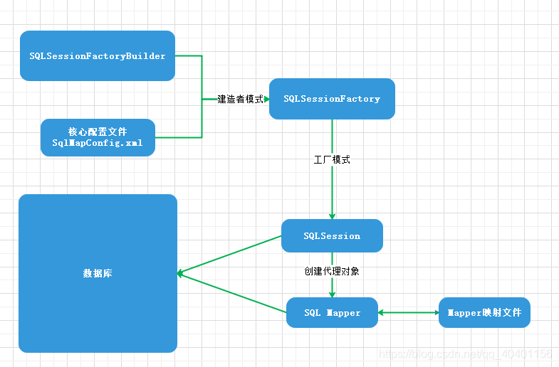

[TOC]

# MyBatis

### MyBatis执行流程

#### 1️⃣ 配置加载

- 读取 **mybatis-config.xml** 配置文件。
- 加载数据库连接、事务管理器、映射器（Mapper）等配置信息。
- 创建 **SqlSessionFactory**。

#### 2️⃣ 获取 SqlSession

- 通过 SqlSessionFactory 获取 **SqlSession**。
- SqlSession 负责执行 SQL、管理事务、获取映射器接口对象。

#### 3️⃣ 获取 Mapper

- 通过 SqlSession 获取 **Mapper 接口的代理对象**。
- Mapper 接口的方法对应 XML 或注解中的 SQL 语句。

#### 4️⃣ 执行 SQL

- 调用 Mapper 方法，MyBatis 生成 **MappedStatement**。
- 输入参数映射。
- 通过 Executor 执行对应的 SQL。
  - 一级缓存检查是否命中。
  - 若未命中，调用 JDBC 操作数据库。
  - 结果缓存到一级缓存中。
- 使用 **ResultSetHandler** 将结果映射为 Java 对象。

#### 5️⃣ 关闭 SqlSession

- 手动关闭 SqlSession（或者用 try-with-resources 自动关闭）。
- 事务提交或回滚。

### MyBatis有哪些主要构件

| 构件             | 描述                                                         |
| ---------------- | ------------------------------------------------------------ |
| SqlSession       | 作为 MyBatis 工作的主要顶层 API，表示和数据库交互的会话，完成必要数据库增删改查功能 |
| Executor         | MyBatis 执行器，是 MyBatis 调度的核心，负责 SQL 语句的生成和查询缓 存的维护 |
| StatementHandler | 封装了 JDBC Statement 操作，负责对 JDBC statement 的操作，如设置参数、将 Statement 结果集转换成 List 集合。 |
| ParameterHandler | 负责对用户传递的参数转换成 JDBC Statement 所需要的参数       |
| ResultSetHandler | 负责将 JDBC 返回的 ResultSet 结果集对象转换成 List 类型的集合 |
| TypeHandler      | 负责 java 数据类型和 jdbc 数据类型之间的映射和转换           |
| MappedStatement  | 维护了一条 \<select \| update \| delete \| insert\> 节点的封装 |
| SqlSource        | 负责根据用户传递的 parameterObject，动态地生成 SQL 语句，将信息封装到 BoundSql 对象中，并返回 |
| BoundSql         | 表示动态生成的 SQL 语句以及相应的参数信息                    |



### MyBatis是否支持延迟加载

#### 延迟加载

**场景**

- 你查询一个对象 A，A 里有一个关联对象 B，或者一个 List\<B\> 集合。
- 你只想在 **访问 B 时再去查询 B**，而不是一开始就联表查出来。

#### 开启方式

在 `mybatis-config.xml` 配置：

```xml
<settings>
    <!-- 开启全局延迟加载 -->
    <setting name="lazyLoadingEnabled" value="true"/>
    <!-- 关联对象按需加载，而不是主动加载 -->
    <setting name="aggressiveLazyLoading" value="false"/>
</settings>
```

- 可以在Mapper的配置文件中添加`fetchType=lazy`

```xml
<resultMap id="userResultMap" type="User">
    <id property="id" column="id"/>
    <result property="username" column="username"/>
    <association property="address" column="address_id" javaType="Address" select="selectAddressById" fetchType="lazy"/>
</resultMap>
```

#### 工作原理

- 使用了CGLIB创建目标对象的代理对象
- 当调用目标方法user.getOrderList()时，进入拦截器invoke方法，发现user.getOrderList()是null值，执行sql查询order列表
- 把order查询上来，然后调用user.setOrderList(List\<Order\> orderList)，接着完成user.getOrderList()方法的调用


### MyBatis的一级、二级缓存

- 本地缓存，基于PerpetualCache，本质是一个HashMap
- 一级缓存：作用域是session级别
- 二级缓存：作用域是namespace和mapper的作用于，不依赖于session

#### 一级缓存（默认开启）

- 范围：**SqlSession 级别**，同一个 SqlSession 内，重复查询相同的 SQL，第二次从缓存取。
- 生命周期：**随 SqlSession 关闭而失效**。
- 特点：
  - 默认开启。
  - 只对当前 SqlSession 有效。
  - INSERT、UPDATE、DELETE 操作会清空一级缓存。

```java
SqlSession session = sqlSessionFactory.openSession();
User u1 = session.selectOne("selectUserById", 1);
User u2 = session.selectOne("selectUserById", 1); // 从缓存取
```

#### 二级缓存

范围：**Mapper 映射器级别**（namespace 级别）。

生命周期：**SqlSession 关闭后，数据写入二级缓存**，多个 SqlSession 共享。

特点：

- 默认关闭，需配置开启。
- 配合缓存插件可支持内存、磁盘、分布式缓存。
- INSERT、UPDATE、DELETE 操作会刷新对应 namespace 的缓存。

**开启方式**

① 配置全局开启：

```xml
<settings>
    <setting name="cacheEnabled" value="true"/>
</settings>
```

② Mapper.xml 中配置：

```xml
<cache/>
```

③ 使用：

```java
// 第一个 SqlSession 查询，结果存入二级缓存
try (SqlSession session1 = sqlSessionFactory.openSession()) {
    session1.selectOne("selectUserById", 1);
}

// 第二个 SqlSession 查询，命中二级缓存
try (SqlSession session2 = sqlSessionFactory.openSession()) {
    session2.selectOne("selectUserById", 1);
}
```

#### 注意事项

1. 对于缓存数据更新机制，当某一个作用域（一级缓存Session/二级缓存Namespaces）进行了新增、修改、删除操作后，默认该作用域下的所有select中的缓存将被clear。
2. 二级缓存需要缓存的数据实现Serializable接口
3. 只有会话提交或者关闭以后，一级缓存中的数据才会转移到二级缓存中

### 与传统的JDBC相比，MyBatis的优点？

##### 简化 SQL 操作

- 不需要手写复杂的 **JDBC 模板代码**（如加载驱动、创建连接、处理 ResultSet、关闭资源）。
- 只需编写 Mapper 接口 + XML/注解，调用接口即可。

##### SQL 与 Java 解耦

- SQL 统一放在 XML 或注解中，**方便管理和优化**。
- JDBC 是硬编码 SQL，改 SQL 需改代码。

##### 自动映射

- **ResultMap 自动映射**数据库字段 → Java 对象属性，减少手动赋值。
- JDBC 需手动一行一行解析 ResultSet。

##### 动态 SQL 支持

- MyBatis 支持 **动态 SQL**（if、choose、foreach 等），方便拼接复杂查询。
- JDBC 拼接 SQL 需要手动处理，容易出错、存在 SQL 注入风险。

##### 缓存机制

- 内置 **一级缓存、二级缓存** 支持，减少数据库访问。
- JDBC 无缓存机制，重复查询都需访问数据库。

##### 易于集成

- MyBatis **易于集成 Spring、Spring Boot**，支持事务、依赖注入。
- JDBC 需要自己管理事务、连接等，开发复杂度高。

##### 插件机制

- MyBatis 支持 **拦截器插件**（分页、日志、性能分析等）。
- JDBC 没有统一插件机制，功能扩展困难。

### JDBC连接数据库的步骤

1. 加载数据库驱动（新版 JDBC 可省略，自动加载）

2. 获取数据库连接

3. 创建 Statement 或 PreparedStatement

4. 执行 SQL

5. 处理结果集

6. 关闭资源

```java
public class Main {
    public static void main(String[] args) {
        try{
            // 加载数据库驱动程序
            Class.forName("com.mysql.cj.jdbc.Driver");

            // 建立数据库连接
            Connection connection = DriverManager.getConnection("jdbc:mysql://localhost:3306/mydatabase","username","password");

            // 创建Statement对象
            Statement statement = connection.createStatement();

            // 执行SQL查询
            ResultSet resultSet = statement.executeQuery("SELECT * FROM mytable");

            // 处理查询结果
            while (resultSet.next()){
                // 处理每一行数据
            }

            //关闭资源
            resultSet.close();
            statement.close();
            connection.close();
        }catch (ClassNotFoundException e){
            e.printStackTrace();
        }catch (SQLException e){
            e.printStackTrace();
        }
    }
}
```

### 如果项目中要用到原生的mybatis去查询，该怎样写

#### 步骤概述

1. 配置MyBatis：在配置文件中配置数据源、MyBatis的Mapper文件位置等信息

2. 创建实体类：创建与数据库表对应的实体类，字段名和类型需要与数据库表保持一致。

   ```java
   public class User {
       private Long id;
       private String username;
       
       //Getters and setters
   }
   ```

3. 编写SQL映射文件：在resources目录下创建XML文件，定义SQL语句和映射关系

   ```xml
   <!-- userMapper.xml -->
   <mapper namespace="com.example.dao.UserMapper">
   	<select id="selectUserById" resultType="com.example.model.User">
       	SELECT * FROM users WHERE id = #{id}
       </select>
   </mapper>
   ```

4. 编写DAO接口：创建DAO接口，定义查询方法

   ```java
   public interface UserMapper {
       User selectUserById(long id);
   }
   ```

5. 编写具体的SQL查询语句

6. 调用查询方法：在服务层或者控制层中调用DAO接口中的方法进行查询。

   ```java
   // 在service层中调用
   User user = userMapper.selectUserById(1);
   ```

### MyBatis里的#和$的区别？

| 项目     | `#`（占位符）               | `$`（字符串拼接）           |
| -------- | --------------------------- | --------------------------- |
| 替换方式 | 使用 **预编译参数占位符**   | **直接字符串拼接**          |
| 安全性   | **安全，防 SQL 注入**       | 不安全，容易 SQL 注入       |
| 使用场景 | 大多数情况（如 where 条件） | 表名/列名动态拼接等特定场景 |
| SQL 示例 | `WHERE id = #{id}`          | `ORDER BY ${column}`        |

- MyBatis在处理#{}时，会创建预编译的SQL语句，将SQL中的#{}替换为?号，在执行SQL时会为预编译SQL中的占位符（？）赋值，调用PreparedStatement的set方法来赋值，预编译的SQL语句执行效率高，并且可以防止SQL注入，提供更高的安全性，适合传递参数值。
- MyBatis在处理${}时，只是创建普通的SQL语句，然后在执行SQL语句时MyBatis将参数直接拼入到SQL里，不能防止SQL注入，因为参数直接拼接到SQL语句中，如果参数未经验证、过滤，可鞥会导致安全问题。

### MyBatis运用了哪些常见的设计模式

##### 1️⃣ 代理模式（Proxy Pattern）

- 应用：

  - Mapper 接口的实现是由 MyBatis 通过 **JDK 动态代理** 生成的。

- 作用：

  - 拦截方法调用，将其转换为 SQL 执行过程。

- 示例：

  ```java
  UserMapper mapper = sqlSession.getMapper(UserMapper.class);
  ```

  实际返回的是代理对象，不是真实实现类。

##### 2️⃣ 工厂模式（Factory Pattern）

- 应用：
  - `SqlSessionFactory`、`SqlSessionFactoryBuilder`
- 作用：
  - **统一创建 SqlSession**，封装构建细节。

##### 3️⃣ 单例模式（Singleton Pattern）

- 应用：
  - `Configuration`、`MapperRegistry` 、`LogFactory`等核心类通常是单例使用，统一配置管理。
- 作用：
  - 保证配置对象在应用中唯一。

##### 4️⃣ 建造者模式（Builder Pattern）

- 应用：
  - `SqlSessionFactoryBuilder`、`XMLConfigBuilder` 等。
- 作用：
  - **分步构建复杂对象**（如 SqlSessionFactory）。

##### 5️⃣ 策略模式（Strategy Pattern）

- 应用：
  - `Executor` 接口的多种实现（如 SimpleExecutor、ReuseExecutor、BatchExecutor）。
- 作用：
  - **封装不同执行策略**，运行时动态选择。

##### 6️⃣ 模板方法模式（Template Method Pattern）

- 应用：
  - `BaseExecutor` 提供模板方法，子类实现具体步骤（如执行 SQL、缓存处理等）。
- 作用：
  - **统一流程控制，具体实现延迟到子类**。

## MyBatis-Plus

### MyBatis-Plus和MyBatis的区别

| 方面         | MyBatis                       | MyBatis-Plus                                            |
| ------------ | ----------------------------- | ------------------------------------------------------- |
| 基础框架     | SQL 映射框架                  | **基于 MyBatis，增强工具包**                            |
| 配置复杂度   | 配置较复杂，需要写 Mapper XML | **零侵入，开箱即用，简化配置**                          |
| CRUD 代码    | 需手写 CRUD SQL + XML         | **提供通用 CRUD 接口**，无需 XML                        |
| 代码量       | 较多，重复性高                | 大量减少重复代码                                        |
| 动态条件构造 | 需手写动态 SQL                | 提供 **LambdaWrapper、QueryWrapper** 等丰富封装         |
| 分页功能     | 需手写分页 SQL                | 内置 **分页插件**，一键分页                             |
| 主键策略     | 手动配置                      | 内置 **主键自动生成策略**                               |
| 代码生成     | 无官方代码生成器              | **提供代码生成器**，自动生成 Entity、Mapper、Service 等 |
| 插件支持     | 插件生态一般                  | 插件丰富，如乐观锁、性能分析、多租户等                  |
| 学习成本     | 基础 SQL 要掌握良好           | 基于 MyBatis，**学习成本低**，上手快                    |
| 多租户支持   | 无                            | 提供了多租户支持，可以轻松实现多租户数据隔离的功能。    |

> **多租户问题**：在同一套系统中服务多个客户（租户）时，如何保证数据隔离、功能隔离、安全隔离。
>
> MyBatis-Plus 提供 **多租户插件（TenantLineInterceptor）**。
>
> 可以自动在 SQL 中加上租户 ID 条件，避免忘加租户条件导致数据泄露。
>
> ```sql
> SELECT * FROM user → 自动变为 → SELECT * FROM user WHERE tenant_id = 1
> ```

### MyBatis-Plus 的主要特性是什么？

MyBatis-Plus 是对 MyBatis 的增强，提供了以下主要特性：

- **无 XML 配置**：支持注解方式进行 SQL 映射。
- **内置 CRUD 方法**：提供了 `insert()`, `update()`, `delete()`, `selectById()` 等常用方法。
- **条件构造器**：通过 `QueryWrapper` 和 `UpdateWrapper` 构建动态 SQL。
- **分页插件**：内置分页功能，支持多种数据库。
- **代码生成器**：自动生成实体类、Mapper、XML 等代码。
- **逻辑删除**：支持逻辑删除字段的自动处理。

### 如何使用 MyBatis-Plus 进行分页查询？

```java
IPage<User> page = new Page<>(1, 10); // 当前页和每页大小
IPage<User> userPage = userMapper.selectPage(page, null);
```

`selectPage` 方法返回一个 `IPage` 对象，包含分页信息和查询结果。

### 如何在 MyBatis-Plus 中实现逻辑删除？

1. 在实体类中添加逻辑删除字段，并使用 `@TableLogic` 注解：

   ```java
   @TableLogic
   private Integer isDeleted;
   ```

2. 在`application.yml`或者全局配置中启用逻辑删除

### MyBatis-Plus 的 `@TableField` 注解的作用是什么？

`@TableField` 注解用于指定实体类字段与数据库表字段的映射关系。常用属性包括：

- `value`：指定数据库表字段名。
- `exist`：是否为数据库字段，默认 `true`，表示是数据库字段。
- `fill`：字段填充策略，如 `FieldFill.INSERT` 表示在插入时填充。

### 如何使用 MyBatis-Plus 进行批量插入？

```java
List<User> userList = Arrays.asList(new User("Alice"), new User("Bob"));
userMapper.insertBatchSomeColumn(userList);
```

`insertBatchSomeColumn` 方法用于批量插入数据。

### MyBatis-Plus中的Db工具类

`Db` 是 MyBatis-Plus 提供的一个操作数据库的工具类，封装了常用的增删改查操作，简化了开发流程。它内部使用默认的 `SqlSessionFactory`，让你无需写 Mapper 接口即可执行简单的数据库操作。

- 在日常开发中，如果一个`service`必须要调用其它数据表的数据，可以使用Db工具调用，避免循环依赖问题。

```java
// 查询单条记录
User user = Db.lambdaQuery(User.class)
              .eq(User::getId, 1)
              .one();

// 插入记录
User newUser = new User();
newUser.setName("张三");
Db.save(newUser);

// 更新记录
Db.lambdaUpdate(User.class)
  .eq(User::getId, 1)
  .set(User::getName, "李四")
  .update();

```

### MyBatis-Plus中各种条件构造器的区别

| 条件构造器          | 作用                | 特点                             | 示例                                                         |
| ------------------- | ------------------- | -------------------------------- | ------------------------------------------------------------ |
| QueryWrapper        | 构建查询条件        | 使用字段名字符串，链式调用       | `new QueryWrapper<>().eq("age", 18)`                         |
| UpdateWrapper       | 构建更新条件        | 设置更新字段和条件，字段名字符串 | `new UpdateWrapper<>().eq("id", 1).set("name", "李四")`      |
| LambdaQueryWrapper  | Lambda 风格查询条件 | 类型安全，避免硬编码字段名       | `new LambdaQueryWrapper<>().eq(User::getAge, 18)`            |
| LambdaUpdateWrapper | Lambda 风格更新条件 | 类型安全，支持自动重构           | `new LambdaUpdateWrapper<>().eq(User::getId, 1).set(User::getName, "李四")` |
| Wrappers            | 条件构造器工具类    | 统一创建各种构造器，简化调用     | `Wrappers.<User>lambdaQuery().eq(User::getAge, 18)`          |

### 如何在 MyBatis-Plus 中使用乐观锁？

> 乐观锁是一种并发控制机制，用于防止多个线程同时修改同一数据时产生冲突，通常在数据表加一列`version`，用来记录数据的版本号，每次更新时版本号自动加1。
>
> **原理：**
>
> 每次读取数据时，会带上一个版本号（或时间戳）；更新数据时，会检查版本号是否未变，只有版本号没变，才允许更新；如果版本号变了，说明数据被其他线程修改过，当前更新失败，需重新读取数据再操作。

1. 在实体类中添加版本字段

   ```java
   @Version
   private Integer version;
   ```

2. 在全局配置中启用乐观锁插件