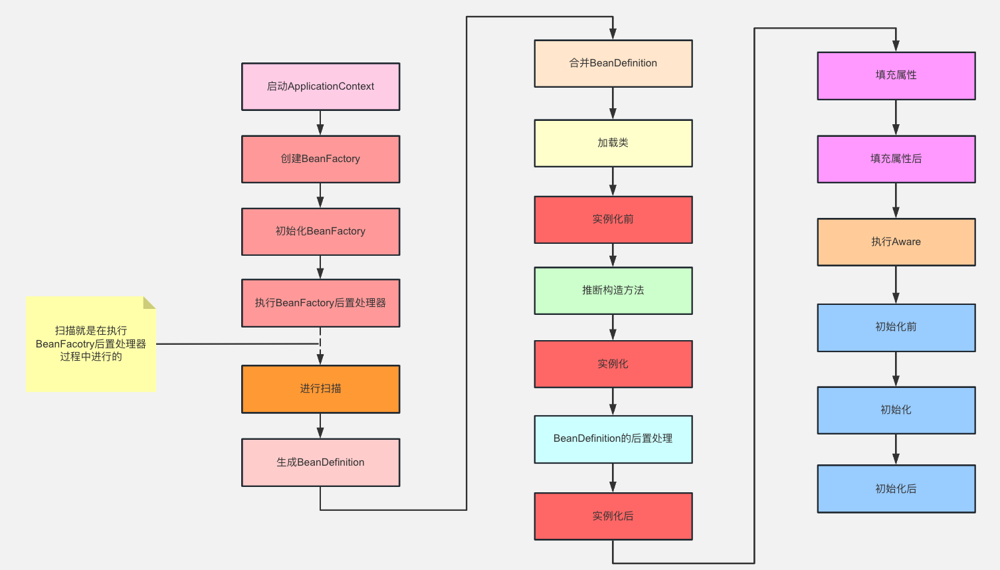
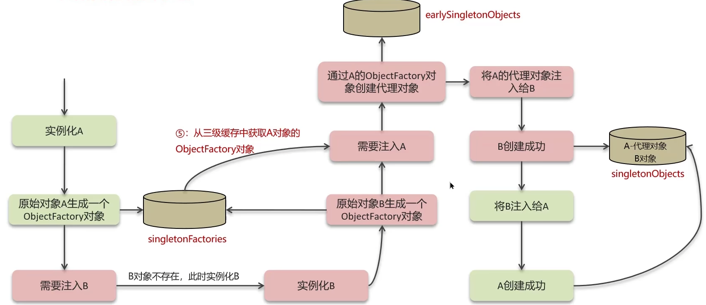
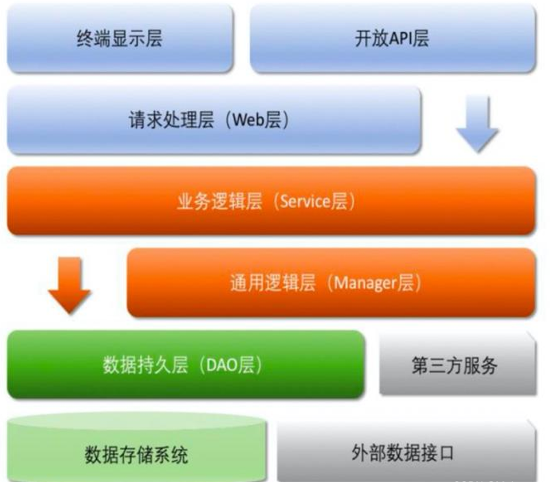
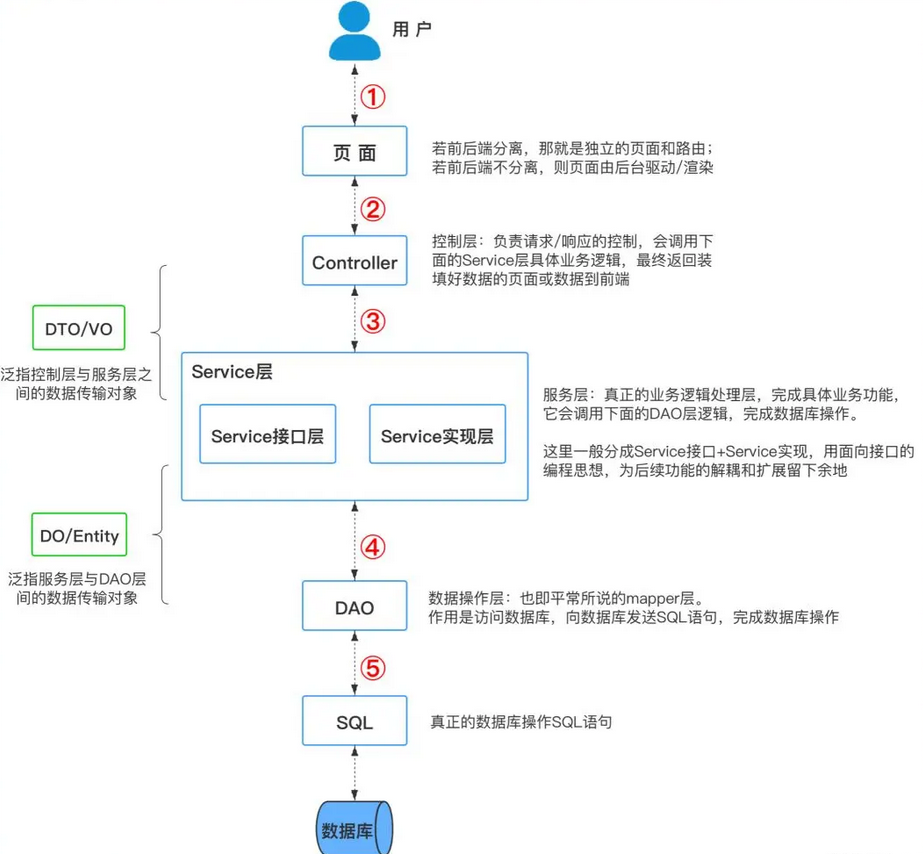
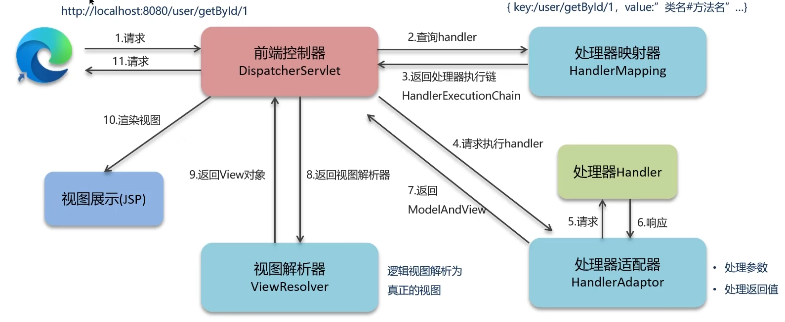
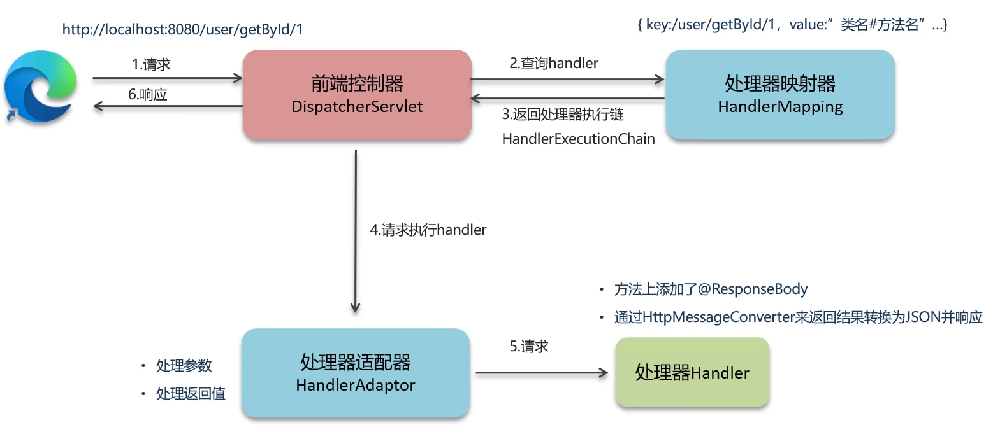
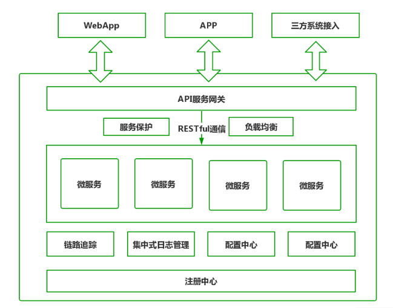
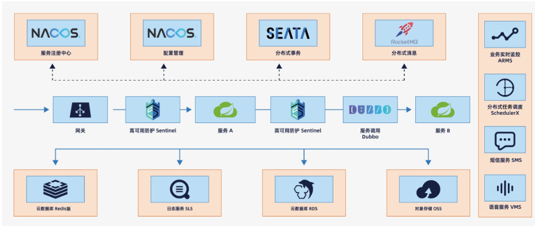

[TOC]

# Java八股文——Spring篇

## Spring

### Spring的IoC和AOP

> **IoC：**即控制反转的意思，它是一种创建和获取对象的技术思想，依赖注入（DI）是实现这种技术的一种方式。传统开发过程中，我们需要通过new关键字来创建对象。使用IoC思想开发方式的话，我们不通过new关键字创建对象，而是通过IoC容器来帮助我们实例化对象。通过IoC的方式，可以大大降低对象之间的耦合度。
>
> **AOP**：面向切面编程，能够将那些与业务无关，却为业务模块所共同调用的逻辑封装起来，以减少系统的重复代码，降低模块间的耦合度。Spring AOP就是基于动态代理的，如果要代理的对象，实现了某个接口，那么Spring AOP会使用JDK Proxy，去创建代理对象，而对于没有实现接口的对象，就无法使用JDK Proxy去进行代理了，这时候Spring AOP会使用Cglib生成一个被代理对象的子类来作为代理。

#### Spring IoC实现机制

- **反射：**Spring IoC容器利用Java的反射机制动态加载类、创建对象实例及调用对象方法，反射允许在运行时检查类、方法、属性等信息，从而实现灵活的对象实例化和管理。

- **依赖注入：**IoC的核心概念是依赖注入，即容器负责管理应用程序组件之间的依赖关系。Spring通过构造函数注入、属性注入或方法注入，将组件之间的依赖关系描述在配置文件中或使用注解。

  > 依赖注入是将对象的创建和依赖关系的管理交给Spring容器来完成，类只需要声明自己所依赖的对象， 容器在运行时将这些依赖对象注入到类中，从而降低了类与类之间的耦合度，提高了代码的可维护性和可测试性。
  >
  > - 构造器注入：通过构造函数传递依赖对象，保证对象初始化时依赖已就绪。
  > - Setter方法注入：通过Setter方法设置依赖，灵活性高，但依赖可能未完全初始化。
  > - 字段注入：直接通过`@Autowired`注解字段，代码简洁但隐藏依赖关系，不推荐生产代码。

- **设计模式-工厂模式：**Spring IoC容器通常采用工厂模式来管理对象的创建和生命周期。容器作为工厂负责实例化Bean并管理它们的生命周期，将Bean的实例化过程交给容器来管理。

- **容器实现：**Spring IoC容器是实现IoC的核心，通常使用BeanFactory或ApplicationContext来管理Bean。BeanFactory是IoC容器的基本形式，提供基本的IoC功能；ApplicationContext是BeanFactory扩展，并提供更多企业级功能。

#### Spring AOP实现机制

> Spring AOP的实现依赖于**动态代理技术**。动态代理是在运行时动态生成代理对象，而不是在编译时。它允许开发者在运行时指定要代理的接口和行为，从而实现在不修改源码的情况下增强方法的功能。

SpringAOP支持两种动态代理：

- 基于JDK的动态代理：使用`java.lang.reflect.Proxy`类和`java.lang.reflect.InvocationHandler`接口实现。这种方式需要代理的类实现一个或多个接口。
- 基于CGLIB的动态代理：当被代理的类没有实现接口时，Spring会使用CGLIB库生成一个被代理类的子类作为代理。CGLIB是一个第三方代码生成库，通过继承方式实现代理。

### 动态代理

| 特性                | JDK 动态代理                       | CGLIB                    | ByteBuddy          |
| ------------------- | ---------------------------------- | ------------------------ | ------------------ |
| 是否内置于 JDK      | 是                                 | 否（需要额外依赖）       | 否（需要额外依赖） |
| 代理对象            | 接口                               | 类                       | 类（也支持接口）   |
| 代理原理            | Java 反射 + Proxy.newProxyInstance | 继承目标类，动态生成子类 | 修改或生成字节码   |
| 是否支持 final 类   | 否                                 | 否                       | 支持               |
| 是否支持 final 方法 | 否                                 | 否                       | 支持（可配置）     |
| 性能                | 较高（接口）                       | 较高（类）               | 非常高，灵活       |

#### JDK Proxy

这种类型的代理要求目标对象必须实现至少一个接口。Java动态代理会创建一个实现了相同接口的代理类，然后在运行时动态生成该类的实例。这种代理的核心是`java.lang.reflect.Proxy`类和`java.lang.reflect.InvocationHandler`接口。每一个动态代理类都必须实现`InvocationHandler`接口，并且每个代理类的实例都关联到一个`handler`。当通过代理对象调用一个方法时，这个方法的调用会被转发为由`InvocationHandler`接口的`invoke()`方法来进行调用。

```java
HelloService proxy = (HelloService) Proxy.newProxyInstance(
    HelloService.class.getClassLoader(),
    new Class[]{HelloService.class},
    (proxyObj, method, args) -> {
        System.out.println("Before method");
        return method.invoke(realObj, args);
    });
```

#### CGLIB

- 使用 CGLIB（Code Generation Library）库。

- 通过**继承目标类**，动态生成子类。

- 使用**ASM 字节码框架**底层生成字节码。

- 不能代理 final 类 / final 方法。

```java
Enhancer enhancer = new Enhancer();
enhancer.setSuperclass(TargetClass.class);
enhancer.setCallback((MethodInterceptor) (obj, method, args, proxy) -> {
    System.out.println("Before method");
    return proxy.invokeSuper(obj, args);
});
TargetClass proxy = (TargetClass) enhancer.create();
```

#### ByteBuddy

- 使用ByteBuddy框架，**动态生成/修改字节码**。

- 不仅能做代理，还能修改类定义，创建复杂代理。

- 灵活性高，可以代理final类、final方法。

```java
HelloService proxy = new ByteBuddy()
    .subclass(HelloService.class)
    .method(ElementMatchers.any())
    .intercept(MethodDelegation.to(new HelloServiceInterceptor()))
    .make()
    .load(HelloService.class.getClassLoader())
    .getLoaded()
    .newInstance();
```

### Spring框架中的单例Bean是线程安全的吗？

> Spring框架中的bean是单例的吗？
>
> - singleton：bean在每个Spring IOC容器中只有一个实例。**默认**，通过`@Scope("singleton")`指定。
> - prototype：一个bean的定义可以有多个实例。

- 不是线程安全的
- Spring框架中有一个@Scope注解，默认的值就是singleton，单例的。
- 因为一般在Spring的bean中都是注入无状态的对象，没有线程安全问题，如果在bean中定义了可修改的成员变量，是要考虑线程安全问题的，可以使用多例或者加锁来解决。

### 什么是AOP，你们项目中有没有使用到AOP

> AOP称为面向切面编程，用于将那些与业务无关，但却对多个对象产生影响的公共行为和逻辑，抽取并封装为一个可重用的模块，这个模块被命名为“切面”（Aspect），减少系统中的重复代码，降低了模块间的耦合度，同时提高了系统的可维护性。

**常见AOP使用场景：**

- 记录操作日志
- 缓存处理
- Spring中内置的事务处理

#### Spring中的事务是如何实现的

Spring支持编程式事务管理和声明式事务管理两种方式

- 编程式事务控制：需使用TransactionTemplate来进行实现，对业务代码有侵入性，项目中很少使用
- 声明式事务管理：声明式事务管理建立在AOP之上的。其本质是通过AOP功能，对方法前后进行拦截，将事务处理的功能编制到拦截的方法中，也就是在目标方法开始之前加入一个事务，在执行完目标方法之后根据执行情况提交或者回滚事务。

- `@Trasactional`

### Spring中事务失效的场景有哪些方法

#### 异常捕获处理

- 事务通知只有捕捉到了目标抛出的异常，才能进行后续的回滚处理，如果目标自己处理掉异常，事务通知无法知悉

- **解决方法：**在catch块添加throw new RuntimeException(e)抛出

#### 抛出检查异常

- Spring默认只会回滚非检查异常。

  > ### **检查异常（Checked Exception）**
  >
  > - **继承自 `Exception`，但不是 `RuntimeException` 的子类**。
  > - 编译时**强制检查**，必须使用 `try-catch` 捕获，或者 `throws` 抛出。
  > - 典型场景：**外部资源操作**，如文件、网络、数据库。
  > - 例子：
  >   - `IOException`
  >   - `SQLException`
  >   - `ParseException`
  >
  > **非检查异常（Unchecked Exception）**
  >
  > - **继承自 `RuntimeException`**。
  > - 编译器**不强制处理**，可以不写 `try-catch` 或 `throws`。
  > - 通常是程序逻辑错误，程序员自己修正。
  > - 例子：
  >   - `NullPointerException`
  >   - `ArrayIndexOutOfBoundsException`
  >   - `IllegalArgumentException`

- **解决方法：**添加`@Transactional(rollbackFor = Exception.class)`

#### 非public方法导致事务失效

- Spring为方法创建代理、添加事务通知、前提条件都是该方法是public的
- **解决方法：**改为public方法

#### 自调用

- 同一个类中一个方法调用另一个 `@Transactional` 方法，事务不会生效（因为绕过了 Spring 的代理）

#### 多线程操作

- `@Transactional` 只作用于当前线程，**新开线程**不会受事务控制。

### Spring的Bean的生命周期



#### BeanDefinition

> Spring容器在进行实例化时，会将xml配置的\<bean\>的信息封装成一个BeanDefinition对象，Spring根据BeanDefinition来创建Bean对象，里面有很多的属性来描述Bean。

#### Bean生命周期

1. 通过BeanDefinition获取bean的定义信息。
2. 调用构造函数实例化bean
3. bean的依赖注入
4. 处理Aware接口（BeanNameAware、BeanClassLoaderAware、BeanFactoryAware、ApplicationContextAware）
5. Bean的后置处理器`BeanPostProcessor`-前置，执行所有注册的 `BeanPostProcessor` 的 `postProcessBeforeInitialization` 方法，允许对 Bean 进行修改。
6. 初始化方法（InitializingBean、init-method），如果实现了 `InitializingBean`，调用其 `afterPropertiesSet` 方法。如果配置了 `init-method`，调用该方法。
7. Bean的后置处理器BeanPostProcessor-后置，执行所有注册的 `BeanPostProcessor` 的 `postProcessAfterInitialization` 方法，允许对 Bean 进行修改增强（如 AOP 代理）。
8. 销毁阶段，如果实现了 `DisposableBean`，调用其 `destroy` 方法。如果配置了 `destroy-method`，调用该方法。

### Spring中的循环依赖

>  **Spring 循环依赖**指的是 **多个 Bean 之间互相依赖，形成闭环**，在创建 Bean 时相互引用，导致无法完成实例化过程。

#### 三级缓存

循环依赖在Spring中是允许存在，spring框架依据三级缓存已经解决了大部分的循环依赖问题

> 1. 一级缓存：单例池，缓存已经经历了完整的生命周期，已经初始化完成的bean对象
> 2. 二级缓存：缓存早期的bean对象（生命周期还没走完）
> 3. 三级缓存：缓存的是ObjectFactory，表示对象工厂，用来创建某个对象的



#### 构造方法出现循环依赖

> 优于Bean生命周期第一步就是执行构造函数，所以三级缓存无法解决构造方法出现的循环依赖

- 解决方式：加`@Lazy`延迟加载

  ```java
  public A(@Lazy B b){
      this.b = b;
  }
  ```

  ### Spring给我们提供了很多扩展点

  | 扩展点接口                                 | 说明                                                         | 典型使用场景                         |
  | ------------------------------------------ | ------------------------------------------------------------ | ------------------------------------ |
  | `BeanFactoryPostProcessor`                 | BeanFactory 初始化后，修改 BeanDefinition                    | 修改 Bean 属性定义，比如修改配置值   |
  | `BeanDefinitionRegistryPostProcessor`      | 在 BeanFactoryPostProcessor 之前，操作 BeanDefinition 注册表 | 动态注册 BeanDefinition              |
  | `BeanPostProcessor`                        | Bean 实例化后，初始化前后进行处理                            | AOP、事务、注入代理 Bean             |
  | `InstantiationAwareBeanPostProcessor`      | BeanPostProcessor 子接口，控制 Bean 实例化过程               | 提前暴露代理对象、循环依赖处理       |
  | `SmartInstantiationAwareBeanPostProcessor` | 更智能的 InstantiationAwareBeanPostProcessor                 | 预测 Bean 类型、提前暴露 Bean        |
  | `ApplicationContextInitializer`            | ApplicationContext 初始化时执行                              | 自定义 ApplicationContext 初始化逻辑 |
  | `ApplicationListener`                      | 监听 ApplicationEvent 事件                                   | 发布订阅模式，解耦组件               |
  | `EnvironmentPostProcessor`                 | 修改 Environment 对象，优先加载配置                          | 修改配置属性，优先级比配置文件还高   |
  | `CommandLineRunner`                        | Spring Boot 启动完成后执行                                   | 启动后执行任务（如初始化数据）       |
  | `ApplicationRunner`                        | Spring Boot 启动完成后执行，支持 ApplicationArguments        | 更灵活的启动后执行任务               |

### Spring的常见注解有哪些

| 注解                                             | 说明                                                         |
| ------------------------------------------------ | ------------------------------------------------------------ |
| `@Component、@Controller、@Service、@Repository` | 使用在类上用于实例化Bean                                     |
| `@Autowired`                                     | 使用在字段上用于根据类型依赖注入                             |
| `@Qualifier`                                     | 结合@Autowired一起使用用于根据名称进行依赖注入               |
| `@Scope`                                         | 标注Bean的作用范围                                           |
| `@Configuration`                                 | 指定当前类是一个Spring配置类，当创建容器时会从该类上加载注解 |
| `@ComponentScan`                                 | 用于指定Spring在初始化容器时要扫描的包                       |
| `@Bean`                                          | 使用在方法上，标注将该方法的返回值存储到Spring容器中         |
| `@Import`                                        | 使用@Import导入的类会被Spring加载到IOC容器中                 |
| `@Transactional`                                 | 声明式事务管理                                               |
| `@Aspect、@Before、@After、@Around、@Pointcut`   | 用于切面编程（AOP）                                          |

## SpringBoot

### 为什么使用SpringBoot

- 简化开发：SpringBoot通过提供一系列的开箱即用的组件和自动配置，简化了项目的配置和开发过程，开发人员可以更专注于业务逻辑的实现，而不需要花费过多时间在繁琐的配置上。
- 快速启动：SpringBoot提供了快速的应用程序启动方式，可通过内嵌的Tomcat、Jetty或Undertow等容器快速启动应用程序，无需额外的配置步骤，方便快捷。
- 自动化配置：SpringBoot通过自动配置功能，根据项目中的依赖关系和约定俗成的规则来配置应用程序，减少了配置的复杂性，使开发者更容易实现应用的最佳实践。

### SpringBoot自动配置原理

> 借助 `@EnableAutoConfiguration` + `spring.factories` 机制，自动装配符合条件的 Bean，减少手动配置。
>
> ```less
> @SpringBootApplication
>     |
> @EnableAutoConfiguration
>     |
> AutoConfigurationImportSelector
>     |
> 读取 META-INF/spring.factories
>     |
> 按条件导入 xxxAutoConfiguration
>     |
> 自动装配 Bean 进 IoC 容器
> ```

#### 1️⃣ 启动入口

- `@SpringBootApplication` 注解其实是组合注解，里面包含：
  - `@EnableAutoConfiguration`
  - `@ComponentScan`
  - `@Configuration`

#### 2️⃣ EnableAutoConfiguration

- 核心注解是 `@EnableAutoConfiguration`。
- 它通过 `@AutoConfigurationImportSelector` 实现自动配置导入。

#### 3️⃣ AutoConfigurationImportSelector

- 作用：扫描 **所有需要自动配置的类**，动态导入到 Spring 容器。
- 自动配置类来自 `META-INF/spring.factories` 或 `META-INF/spring/org.springframework.boot.autoconfigure.AutoConfiguration.imports` 文件中定义。

```
# META-INF/spring.factories 示例
org.springframework.boot.autoconfigure.EnableAutoConfiguration=\
org.springframework.boot.autoconfigure.jdbc.DataSourceAutoConfiguration,\
org.springframework.boot.autoconfigure.web.servlet.DispatcherServletAutoConfiguration
```

#### 4️⃣ 条件装配

- 每个 `xxxAutoConfiguration` 配置类，内部通常会使用以下注解组合，按需配置：
  - `@ConditionalOnClass` → 某个类存在时才生效。
  - `@ConditionalOnMissingBean` → 容器里没有某个 Bean 时才创建。
  - `@ConditionalOnProperty` → 某个配置开启时生效。
  - `@ConditionalOnBean` / `@ConditionalOnMissingBean` → 依赖其他 Bean。

**保证不会乱配、重复配，按需装配。**

#### 5️⃣ 装配完成

- 满足条件的 Bean 被自动注册进 IoC 容器。
- 我们只需要简单配置 yml/properties 即可生效。

### SpringBoot用到哪些设计模式

| 设计模式     | 应用场景                                  |
| ------------ | ----------------------------------------- |
| 单例模式     | Bean 默认单例                             |
| 工厂模式     | BeanFactory、ApplicationContext 创建 Bean |
| 代理模式     | AOP 实现方法拦截、事务管理                |
| 观察者模式   | 事件发布监听（ApplicationEventPublisher） |
| 模板方法模式 | JdbcTemplate、RestTemplate、事务模板      |
| 策略模式     | 多种 Bean 实现同一接口时，按需选择        |
| 适配器模式   | HandlerAdapter 适配不同类型的 Controller  |
| 装饰器模式   | Servlet Filter 链、增强 Bean 功能         |
| 责任链模式   | Spring Security 过滤器链、FilterChain     |
| 建造者模式   | 配置对象（Builder）、RestTemplateBuilder  |
| 享元模式     | 复用 Bean 减少内存消耗                    |

### 怎么理解SpringBoot中的约定大于配置

> **框架提供了一套合理默认配置**，只要你按照约定来组织代码、命名、放位置，大部分功能可以**开箱即用**，你不需要写很多配置。

- **自动化配置**：SpringBoot提供了大量的自动化配置，通过分析项目的依赖和环境，自动配置应用程序的行为。开发者无需显式地配置每个细节，大部分常用的配置都已经预设好了。
- **默认配置**：SpringBoot为诸多方面提供了大量默认配置，如连接数据、设置Web服务器、处理日志。开发人员无需手动配置这些常见内容，框架与做好决策。
- **约定的项目结构**：SpringBoot提倡特定项目结构，通常主应用程序类（含main方法）置于根包，控制器类、服务类、数据访问类等分别放在相应子包。

### SpringBoot项目结构



#### 流程图



### 说几个Starter

- sping-boot-stater-web：最常用的起步依赖之一，包含Spring MVC和Tomcat嵌入式服务，用于快速构建Web应用程序
- sping-boot-starter-security：提供了Spring Security的基本配置。
- mybatis-spring-boot-starter：简化Spring Boot应用中集成MyBatis的过程。
- spring-boot-starter-data-redis：继承Reds缓存。
- sping-boot-starter-test：包含单元测试和集成测试所需的库，如JUnit，Spring Test等。

### 写过SpringBoot starter吗

1. 创建Maven项目，添加Spring Boot和starter parent和一些必要依赖

   ```xml
   <parent>
       <groupId>org.springframework.boot</groupId>
       <artifactId>spring-boot-starter-parent</artifactId>
       <version>2.7.0</version>
   </parent>
   
   <dependencies>
       <dependency>
           <groupId>org.springframework.boot</groupId>
           <artifactId>spring-boot-starter-web</artifactId>
       </dependency>
       
       <dependency>
           <groupId>org.springframework.boot</groupId>
           <artifactId>spring-boot-autoconfigure</artifactId>
       </dependency>
   </dependencies>
   ```

2. 编写自动配置类和属性类，属性类绑定配置文件中的属性。

   ```java
   package io.github.l4vid4.starter;
   
   @Configuration
   @EnableConfigurationProperties(KitProperties.class)
   public class KitAutoConfiguration {
   
       @Bean
       public MybatisPlusInterceptor mybatisPlusInterceptor() {
           MybatisPlusInterceptor interceptor = new MybatisPlusInterceptor();
           // 添加分页插件（你可以支持多数据库）
           interceptor.addInnerInterceptor(new PaginationInnerInterceptor(DbType.MYSQL));
           return interceptor;
       }
   
       @Bean
       @ConditionalOnMissingBean(ResponseWrapperAdvice.class)
       @ConditionalOnProperty(prefix = "mybatis-plus-kit", name = "response-wrapper-enabled", havingValue = "true", matchIfMissing = true)
       public ResponseWrapperAdvice responseWrapperAdvice(KitProperties properties) {
           return new ResponseWrapperAdvice(properties);
       }
   
   }
   ```

   ```java
   package io.github.l4vid4.starter.conf;
   
   @ConfigurationProperties(prefix = "mybatis-plus-kit")
   @Data
   @Getter
   public class KitProperties {
       /**
        * 是否启用统一响应封装（默认启用）
        */
       private boolean responseWrapperEnabled = true;
   }
   ```

   

3. 需要在 `resources/META-INF/spring.factories` 中声明（sping3以下）：

   ```properties
   org.springframework.boot.autoconfigure.EnableAutoConfiguration=io.github.l4vid4.starter.KitAutoConfiguration
   ```

   - Spring3+需要在`META-INF/spring/org.springframework.boot.autoconfigure.AutoConfiguration.import`中声明：

     ```java
     io.github.l4vid4.starter.KitAutoConfiguration
     ```

   Spring Boot 启动时会自动扫描 `spring.factories` 里的配置，加载你的自动配置类。

4. 将starter发布到maven仓库

### SpringBoot的过滤器和拦截器

在Spring Boot中，过滤器和拦截器是用来处理请求和响应的两种不同机制

| 特性     | Filter（过滤器）                                | Interceptor（拦截器）                                |
| -------- | ----------------------------------------------- | ---------------------------------------------------- |
| 所属规范 | Servlet 规范                                    | Spring MVC                                           |
| 作用范围 | 所有请求，包括静态资源                          | 仅 Spring MVC 控制器请求                             |
| 拦截阶段 | 请求到达 Servlet 前后                           | 请求到达 Controller 前后，视图渲染前后               |
| 触发时机 | `doFilter()`在请求前/响应后被调用               | `preHandler、postHandler、afterCompletion`分阶段触发 |
| 配置方式 | 注册 `Filter` Bean，或 `FilterRegistrationBean` | 实现 `HandlerInterceptor`，配置 `WebMvcConfigurer`   |
| 使用场景 | 日志、编码、权限、跨域处理等通用功能            | 认证鉴权、业务逻辑处理、记录用户操作等               |

- 过滤器是Java Servlet规范中的一部分，它可以对进入Servlet容器的请求和响应进行预处理和后处理。过滤器通过实现`javax.servlet.Filter`接口，并重写其中的`init、doFilter`和`destroy`方法来完成相应的逻辑。当请求进入Servlet容器时，会按照配置的顺序依次经过各个过滤器，然后再到达目标Servlet或控制器；响应返回时，也会按照相反的顺序再次经过这些过滤器。
- 拦截器是Spring框架提供的一种机制，它可以对控制器方法的执行进行拦截。拦截器通过实现`org.springFramework.web.servlet.HandlerInterceptor`接口，并重写其中的`preHandle、PostHandle`和`afterCompletion`方法来完成相应的逻辑。当请求到达控制器时，会先经过拦截器的`preHandle`方法，如果该方法返回`true`，则继续执行后续的控制器方法和其他拦截器；在控制器方法执行完成后，会调用拦截器的`postHandle`方法；最后，在请求处理完成后，会调用拦截器的`afterCompletion`方法。

### SpringBoot常见注解有哪些？

| 注解                              | 说明                                                         |
| --------------------------------- | ------------------------------------------------------------ |
| `@SpringBootApplication`          | 启动入口注解，包含 `@Configuration`、`@EnableAutoConfiguration`、`@ComponentScan` |
| `@SpringBootConfiguration`        | 标注 Spring Boot 配置类，本质是 `@Configuration`，被 `@SpringBootApplication` 包含 |
| `@EnableAutoConfiguration`        | 开启自动配置（被 `@SpringBootApplication` 包含）             |
| `@ConfigurationProperties`        | 将配置文件中的属性绑定到 Java Bean 上                        |
| `@EnableConfigurationProperties`  | 开启 `@ConfigurationProperties` 注解生效                     |
| `@ConditionalOnClass`             | 某个类存在时自动配置生效                                     |
| `@ConditionalOnMissingBean`       | 当容器中不存在指定 Bean 时进行自动配置                       |
| `@ConditionalOnProperty`          | 当指定配置属性存在且满足条件时生效                           |
| `@ConditionalOnBean`              | 当容器中存在某个 Bean 时生效                                 |
| `@ConditionalOnMissingClass`      | 某个类不存在时自动配置生效                                   |
| `@ConditionalOnWebApplication`    | Web 应用环境下自动配置生效                                   |
| `@ConditionalOnNotWebApplication` | 非 Web 应用环境下自动配置生效                                |
| `@SpringBootTest`                 | 用于测试类，启动完整的 Spring Boot 应用上下文                |
| `@TestConfiguration`              | 专门为测试提供的配置类                                       |
| `@DataJpaTest`                    | 测试 JPA 相关组件（Repository 层）                           |
| `@WebMvcTest`                     | 测试 MVC Controller 层                                       |
| `@MockBean`                       | 在测试中 Mock 某个 Bean                                      |
| `@EnableScheduling`               | 启用定时任务调度功能                                         |
| `@EnableAsync`                    | 启用异步方法执行                                             |


## SpringMVC

### SpringMVC的执行流程

#### 视图阶段（JSP）

1. 用户发送请求到前端控制器DispatcherServlet
2. DispatcherServlet收到请求调用HandlerMapping（处理器映射器）
3. HandlerMapping找到具体的处理器，生成处理器对象及处理器拦截器（如果有），再一起返回给DispatcherServlet。
4. DispatcherServlet调用HandlerAdapter（处理器适配器）
5. HandlerAdapter经过适配调用具体的处理器（Handler/Controller）
6. Controller执行完成返回ModelAndView对象
7. HandlerAdapter将Controller执行结果ModelAndView返回给DispatcherServlet
8. DispatcherServlet将ModelAndView传给ViewReslover（视图解析器）
9. ViewReslover解析后返回具体的View（视图）
10. DispatcherServlet根据View进行渲染视图（即将模型数据填充至视图中）
11. Dispatcher响应用户

  

#### 前后端分离阶段（接口开发，异步请求）

1. 用户发送请求到前端控制器DispatcherServlet
2. DispatcherServlet收到请求调用HandlerMapping（处理器映射器）
3. HandlerMapping找到具体的处理器，生成处理器对象及处理器拦截器（如果有），再一起返回给DispatcherServlet。
4. DispatcherServlet调用HandlerAdapter（处理器适配器）
5. HandlerAdapter经过适配调用具体的处理器（Handler/Controller）
6. 方法上添加了@ResponseBody
7. 通过HttpMessageConverter来将返回结果转换为JSON并响应



### SpringMVC的常见注解有哪些

| 注解              | 说明                                                         |
| ----------------- | ------------------------------------------------------------ |
| `@RequestMapping` | 映射请求路径到 Controller 方法，可指定 GET、POST 等          |
| `@RequestBody`    | 将请求体中的 JSON/XML 数据绑定到方法参数上，将Json转换为Java对象 |
| `@RequestParam`   | 将请求参数绑定到方法参数上，通常用于 URL 参数                |
| `@PathVariable`   | 将 URL 路径中的占位符绑定到方法参数上（/user/{id}）          |
| `@ResponseBody`   | 将方法返回值直接写入 HTTP 响应体，通常用于返回 JSON          |
| `@RequestHeader`  | 将请求头中的值绑定到方法参数上                               |
| `@RestController` | 组合注解，等于 `@Controller + @ResponseBody`，用于 RESTful API |

## SpringCloud

### SpringCloud和SpringBoot的区别

- SpringBoot是用于构建单个Spring应用的框架，而SpringCloud则是用于构建分布式系统中的微服务架构的工具，Spring Cloud提供了服务注册与发现、负载均衡、断路器、网关等功能。
- 两者可以结合使用，通过Spring Boot构建微服务应用，然后用Spring Cloud来实现微服务架构中的各种功能。

### 微服务常用的组件



- **注册中心：**注册中心是微服务架构最核心的组件。它起到的作用是对新节点的注册与状态维护，解决了**如何发现新节点以及检查各节点的运行状态的问题**。微服务节点在启动时会将自己的服务名称、IP、端口等信息在注册中心登记，注册中心会定时检查该节点的运行状态。注册中心通常会采用心跳机制最大程度保证已登记过的服务节点都是可用的。
- **负载均衡：**负载均衡解决了**如何发现服务及负载均衡如何实现的问题**，通常微服务在互相调用时，并不是直接通过IP、端口进行访问调用。而是先通过服务名在注册中心查询该服务拥有哪些节点，注册中心将该服务可用节点列表返回给服务调用者，这个过程叫服务发现，因服务高可用的要求，服务调用者会接收到多个节点，必须要从中进行选择。因此服务调用者一端必须内置负载均衡器，通过负载均衡策略选择合适的节点发起实质性的通信请求。
- **服务通信：**服务通信组件解决了**服务间如何进行消息通信的问题**，服务间通信采用轻量级协议，通常时HTTP RESTful风格。但因为RESTful风格过于灵活，必须加以约束，通常应用时对其封装。例如在SpingCloud中就提供了Feign和RestTemplate两种技术屏蔽底层的实现细节，所有开发者都是基于封装后统一的SDK进行开发，有利于团队间的相互合作。
- **配置中心：**配置中心主要解决了**如何集中管理各节点配置文件的问题**，在微服务架构下，所有的微服务节点都包含自己的各种配置文件，如jdbc配置、自定义配置、环境配置、运行参数配置等。要知道有的微服务可能有几十个节点，如果将这些配置文件分散存储在节点上，发生配置更改就需要逐个节点调整，将给运维人员带来巨大的压力。配置中心便由此而生，通过部署配置中心服务器，将各节点配置文件从服务中剥离，集中转存到配置中心。一般配置中心都有UI界面，方便实现大规模集群配置调整。
- **集中式日志管理：**集中式日志主要解决了**如何收集各节点日志并统一管理的问题**。微服务架构默认将应用日志分别保存在部署节点上，当需要对日志数据和操作数据进行数据分析和数据统计时，必须收集所有节点的日志数据。那么怎么高效收集所有节点的日志数据呢？业内常见的方案有ELF、EFK。通过搭建独立的日志收集系统，定时抓取各节点增量日志形成有效的统计报表，为统计和分析提供数据支撑。
- **分布式链路追踪：**分布式链路解决了**如何直观的了解各节点间的调用链路的问题**。系统中一个复杂的业务流程，可能会出现连续调用多个微服务，我们需要了解完整的业务逻辑涉及的每个微服务的运行状态，通过可视化链路图展现，可以帮助开发人员快速分析系统瓶颈及出错的服务。
- **服务保护：**服务保护主要是解决了**如何对系统进行链路保护，避免服务雪崩的问题**。在业务运行时，微服务间互相调用支撑，如果某个微服务出现高延迟导致线程池满载，或是业务处理失败。这里就需要引入服务保护组件来实现高延迟服务的快速降级，避免系统崩溃。

### SpringCloud Alibaba实现的微服务结构



- SpringCloud Alibaba 中使用 **Alibaba Nacos** 组件实现 **注册中心**，Nacos 提供了一组简单易用的特性集，可快速实现动态服务发现、服务配置、服务元数据及流量管理。

- SpringCloud Alibaba 使用 **Nacos 服务均衡** 实现负载均衡，区别于 Ribbon 是在调用端负载，Nacos 是在服务发现时即负载均衡。

- SpringCloud Alibaba 使用 **Netflix Feign** 和 **Alibaba Dubbo** 组件实现服务通信，Feign 是基于 HTTP，Dubbo 是基于 RPC。

- SpringCloud Alibaba 在 **API 网关** 使用 **Spring Cloud Gateway**。

- SpringCloud Alibaba 配置中心使用 **Nacos 内置配置中心**，可将配置信息存储在指定数据库中。

- SpringCloud Alibaba 支持阿里云 **日志服务（LOG）** 实现日志集中管理。

- SpringCloud Alibaba 支持 **分布式链路追踪**，可选 **Sleuth/Zipkin Server**。

- SpringCloud Alibaba 使用 **Alibaba Sentinel** 实现系统保护，比 Hystrix 更优雅、功能更强大。

### 负载均衡有哪些算法

- 简单轮询：将请求按顺序分发给后端服务器上，不关心服务器当前的状态，比如后端服务器的性能、当前的负载。
- 加权轮询：根据服务器自身的性能给服务器设置不同的权重，将请求按顺序和权重分发给后端服务器，可以让性能高的机器处理更多的请求。
- 简单随机：将请求随机分发到后端服务器上，请求越多，各个服务器接收到的请求越平均。
- 加权随机：根据服务器自身的性能给服务器设置不同的权重，将请求按各个服务器的权重随即分发给后端服务器。
- 一致性哈希：根据请求的客户端ip、或请求参数通过哈希算法得到一个数值，利用该数值取模映射出对应的后端服务器，这样能保证同一个客户端或相同参数的请求每次都使用同一台服务器。
- 最小活跃数：统计每台服务器上当前正在处理的请求数，也就是请求活跃数，将请求分发给活跃数最少的后台服务器。

### 介绍一下服务熔断

服务熔断是应对微服务雪崩效应的一种链路保护机制，类似保险丝。

当某个服务出现故障（如响应超时、错误率升高）时，**主动中断对该服务的调用**，避免大量请求继续压垮服务，影响整个系统。

#### 主要概念

- **熔断器**（Circuit Breaker）：像电路的保险丝，触发后“断开”调用链。
- **三种状态**：
  1. **闭合（Closed）**：正常调用，监控失败率。
  2. **打开（Open）**：熔断状态，直接失败，快速返回，保护服务。
  3. **半开（Half-Open）**：试探恢复，部分请求允许通过，成功则关闭熔断器，失败继续打开。

#### 触发条件

- 请求失败率超过阈值
- 响应时间过长
- 异常量过大

### 介绍一下服务降级

服务降级一般是指在服务器压力剧增的时候，根据实际业务使用情况以及流量，对一些服务和页面有策略的不处理或者用一种简单的方式处理，从而**释放服务器资源以保证核心业务的正常高效运行**。

服务降级是从整个系统的负荷情况出发和考虑的，对某些负荷比较高的情况，为了预防某些功能（业务场景）出现符合过载或者响应慢的情况，在其内部暂时舍弃对一些非核心的接口和数据的请求，而直接返回一个提前准备好的fallback（退路）错误处理信息。这样，虽然提供的是一个有损的服务，但却保证了整个系统的稳定性和可用性。

| 场景             | 降级策略                           |
| ---------------- | ---------------------------------- |
| 推荐系统不可用   | 返回缓存推荐                       |
| 某服务调用超时   | 返回默认值、缓存数据、提示稍后再试 |
| 订单服务超时     | 提示用户稍后再试                   |
| 非核心服务压力大 | 暂时关闭该服务                     |
| 大促期间高并发   | 关闭部分耗资源的统计/监控功能      |

### 服务熔断和服务降级的区别

| 对比项       | 服务熔断                           | 服务降级                           |
| ------------ | ---------------------------------- | ---------------------------------- |
| 定义         | 自动**中断调用**，防止连锁故障扩散 | 主动**降低服务质量**，保证核心可用 |
| 触发条件     | 故障率高、超时多、异常量大         | 服务不可用、高并发、资源不足       |
| 行为         | 直接拒绝请求，快速失败             | 返回默认值、缓存、简化逻辑         |
| 作用对象     | 主要针对**调用链中的下游服务**     | 针对**本地服务或全链路服务**       |
| 是否主动控制 | 否（框架监控后自动熔断）           | 是（开发者主动配置）               |
| 恢复方式     | 半开状态自动探测后恢复             | 手动/自动恢复                      |
| 场景         | 防止雪崩、保护依赖服务             | 高峰限流、功能降级、提升可用性     |

## SpringAI

### 什么是SpringAI

Spring AI 是 **Spring 官方推出的 AI 集成框架**，用于简化将 AI 服务（如 OpenAI、Azure OpenAI、Anthropic、HuggingFace 等）集成到 Spring 应用中，具备：

- 简化 API 调用
- 支持 Prompt 工程
- 支持 RAG（检索增强生成）
- 支持向量数据库集成（如 Pinecone、Milvus 等）
- 易于与 Spring Boot、Spring Cloud 生态整合

### 什么是 RAG？Spring AI 如何实现？

- **RAG**（Retrieval-Augmented Generation，检索增强生成）是一种将外部知识与大模型结合的技术，提升回答质量。

- Spring AI 支持通过 VectorStore 配合 ChatClient 实现 RAG：

1. 查询 VectorStore → 找到相关文档
2. 拼接到 Prompt 里 → 提交给 LLM
3. 返回生成结果

### SpringAI向量数据库

**Spring AI 的向量数据库（Vector Store）功能**，是用来支持 **RAG（检索增强生成）** 场景的。 它将文本、文档等内容转成 **向量（Embedding）**，存入向量数据库，后续可以通过相似度检索相关内容，增强 LLM 的回答效果。

#### 使用流程：

1. **生成向量**
    调用 LLM/Embedding API 将文本转成向量。

2. **存储向量**
    通过 `vectorStore.add(doc)` 存入数据库。

3. **相似度检索**
    用当前用户问题转成向量，做 `similaritySearch` 检索。

4. **拼接上下文到 Prompt**
    将检索到的相关内容拼 Prompt 提交给 LLM，提升答案准确性。

### SpringAI会话记忆功能

**Spring AI 的会话记忆功能**，是指在多轮对话场景中，**自动保存对话历史上下文**，让大模型（LLM）能够理解前后语境，做出更连贯的回答。

Spring AI 提供了 `MemoryChatClient`，在调用时会自动将之前的对话历史拼接到 Prompt 里发送给模型，开发者无需手动管理上下文。

常见的 Memory 存储实现包括：

- `InMemoryChatMemory`（内存型，适合单机调试）
- `RedisChatMemory`（支持跨服务/分布式场景）
- 自定义 `ChatMemory` 接口实现（如数据库）

### SpringAI的PromptTemplate

通过 PromptTemplate 可以动态构建 Prompt，支持参数化，提升 Prompt 工程的可复用性和可维护性。

```java
PromptTemplate template = new PromptTemplate("请介绍一下{topic}");
Prompt prompt = template.create(Map.of("topic", "Spring AI"));
```