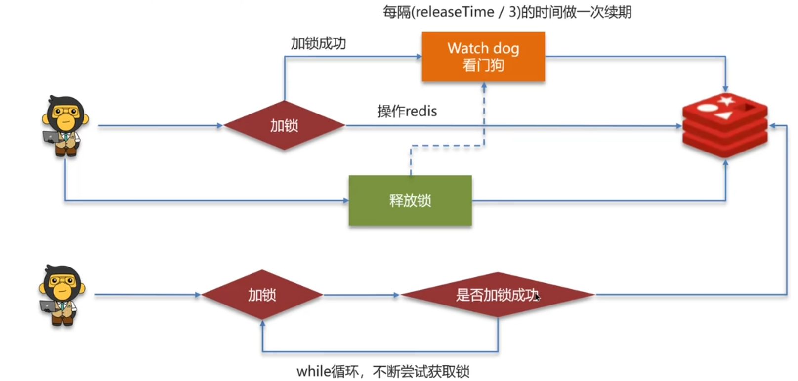

[TOC]

## 1. 缓存穿透

> **缓存穿透**是指：**请求的数据在缓存（如 Redis）和数据库中都不存在，导致每次请求都会穿过缓存直接请求数据库**，从而失去了缓存的意义，严重时可能压垮数据库。

### 解决方案

#### 1. 缓存空值

- 即：对于查询结果为 `null` 的数据，也写入缓存。

- 示例：

  ```redis
  SET user:999999 null EX 300
  ```

- 设置一个较短的过期时间，避免缓存占用过多空间。

> 缺点：可能消耗内存，或造成数据不一致的问题。

#### 2. 布隆过滤器（Bloom Filter）

- 在访问缓存之前，先用布隆过滤器判断 key 是否可能存在；
- 若布隆过滤器判断为“不存在”，就直接拦截请求；
- 优点：占用空间小，性能高；
- 缺点：有**误判率**（可能判断存在，但实际不存在）。

> **布隆过滤器**
>
> - 采用bitmap（位图）数组。
> - 存储数据：id为1的数据，通过多个hash函数获取hash值，根据hash计算数组对应位置改为1。
> - 查询数据：使用相同hash函数获取hash值，判断对应位置是否都为1。
> - 误判率可以在初始化时手动设置，一般为0.05.

#### 3. 参数校验

- 对传入的参数（如 ID）进行格式校验；
- 非法参数直接拒绝请求，不查询缓存或数据库。

#### 4. 接口限流与验证码

- 对频繁请求的 IP 或用户加限制；
- 对可疑请求增加验证码验证，避免恶意攻击。

## 2. 缓存击穿

> **缓存击穿**是指：某个热点数据在缓存中失效（过期）的一瞬间，有大量并发请求同时访问该数据，由于缓存没有命中，导致这些请求都直接访问数据库，造成数据库压力剧增甚至宕机。

### 解决方案

#### 1. 设置热点数据永不过期（或很长过期时间）

- 对于访问频繁的数据，可以设置较长 TTL，甚至不设过期时间；
- 由后台程序定期更新缓存，而不是自动失效。

#### 2. 使用互斥锁（如分布式锁）

> 特点：强一致，性能差

- 当缓存失效时，**只有一个线程能去加载数据库并回填缓存**；

- 其余线程等待或短时间重试，防止并发访问数据库；

- 示例伪代码：

  ```java
  if (redis.get(key) == null) {
      if (acquireLock(key)) {
          value = queryDatabase();
          redis.set(key, value, ttl);
          releaseLock(key);
      } else {
          sleep(50ms);
          retry();
      }
  }
  
  ```

#### 3. 利用异步更新 + 逻辑过期

> 特点：高可用，性能优

- 缓存数据不真实删除，而是加上一个“逻辑过期时间”（在设置key的时候一并存入缓存）；
- 请求到达时若数据已逻辑过期，则：
  - 先返回旧值；
  - 异步由后台线程更新缓存，避免并发冲击；
- 常用于读多写少的场景（如热点文章详情页）。

#### 4. 提前预热缓存

- 对于已知的热点数据（如大促商品、首页模块等），**在系统启动或业务高峰前提前加载进缓存**，避免过期带来的击穿。

## 3. 缓存雪崩

> **缓存雪崩**是指：**大量缓存数据在同一时间集中过期或失效或者Redis服务宕机，导致大批请求绕过缓存直接访问数据库，引起数据库压力骤增甚至崩溃**，从而造成整个系统不可用。

### 解决方案

#### 1. 缓存过期时间加随机值

- 避免所有 key 过期时间一致；
- 示例：设置过期时间为 `600s + random(0~300s)`；
- 这样 key 的过期时间分散，避免集中过期。

#### 2. 利用Redis集群提高服务的可用性

**主从复制 + 哨兵模式（Sentinel）**

- Redis 主从架构，主节点写、从节点读；
- 配合哨兵（Sentinel）自动监控主节点健康；
- 主节点宕机时，哨兵自动完成故障转移（选举新的主节点）；
- 客户端自动感知主节点变化，保障服务不中断。

**Redis Cluster 模式**

- 数据分片到多个节点，每个节点负责部分 key；
- 自动管理主从结构和数据分布；
- 某个节点宕机时，其从节点可自动顶替，保证整体服务可用；
- 适用于大数据量 + 高并发场景。

#### 3. 使用多级缓存架构

- 如：本地缓存（Guava、Caffeine） + 分布式缓存（Redis）；
- 缓解 Redis 失效时对数据库的直接冲击；
- 缺点是增加系统复杂性。

#### 4. 请求限流与降级处理

- 设置接口限流策略，避免短时间请求爆发；
- 数据库压力过高时返回降级数据（如旧值、提示信息等）；
- 保证系统核心功能可用。

### 缓存三兄弟

| 名称     | 触发条件                  | 涉及 key         | 是否因攻击可控 | 解决重点               |
| -------- | ------------------------- | ---------------- | -------------- | ---------------------- |
| 缓存穿透 | 缓存和数据库都无该数据    | 大量不存在的 key | 可被恶意触发   | 拦截非法请求           |
| 缓存击穿 | 热点 key 过期被高并发访问 | 单个热点 key     | 部分可控       | 限流 + 加锁 + 异步更新 |
| 缓存雪崩 | 大量 key 同时过期         | 大批有效 key     | 通常不可控     | 平滑过期 + 异步预热    |

> 打油诗：
>
> 穿透无中生有key，布隆过滤null隔离。
>
> 缓存击穿过期key，锁与非期解难题。
>
> 雪崩大量过期key，过期时间要随机。
>
> 面试必考三兄弟，可用限流来保底。

## 4. 缓存双写一致性

### 双写一致

> 当修改了数据库的数据也要同时更新缓存的数据，缓存和数据库的数据要保持一致

- 读操作：缓存命中，直接返回；缓存未命中查询数据库，写入缓存，设定超时时间
- 写操作：延迟双删（删除缓存→修改数据库→延时时间→删除缓存）

### 强一致性

> **读多写少**
>
> 共享锁：读锁readLock，加锁之后，其他线程可以共享读操作
>
> 排他锁：独占锁writeLock，加锁之后，阻塞其他线程读写操作

### 允许延时一致

- 异步通知保证数据的最终一致性。基于MQ
- 基于Canal的异步通知，canal监听mysql的binlog（记录了所有DDL和DML语句），canal是基于mysql的主从同步来实现的

## 5. Redis持久化

> RDB全称Redis Database Backup file（Redis数据备份文件），也被叫做Redis数据快照。简单来说就是把内存中的所有数据都记录到磁盘中。当Redis实例故障重启后，从磁盘读取快照文件，恢复数据。
>
> Redis内部有触发RDB的机制，可以在redis.conf文件中找到。`save 900 1`，900秒内如果有1个key被修改，则触发RDB

### RDB的执行原理

bgsave开始时会fork主进程得到子进程，子进程共享主进程的内存数据。完成fork后读取内存数据并写入RDB文件。

- fork采用的是copy-on-write技术：

  > - 当主进程执行读操作时，访问共享内存
  > - 当主进程执行写操作时，则会拷贝一份数据，执行写操作。

### AOF

AOF全称为Append Only File（追加文件）。Redis处理的每一个写命令都会记录在AOF文件，可以看作是命令日志文件

AOF默认是关闭的，需要修改redis.conf配置文件来开启AOF：`appendonly yes`，`appendfilename "test.aof"`

AOF的命令记录的频率也可以通过redis.conf文件来配。

```bash
appendfsync always #表示每执行一次命令，立即记录到AOF文件
appendfsync everysec #写命令执行完先放入AOF缓冲区，然后表示每隔一秒将缓冲区数据写到AOF文件，默认
appendfsync no #写命令执行完先放入AOF缓冲区，由操作系统决定何时将缓冲区内容写回磁盘
```

因为是记录命令，AOF文件会比RDB文件大得多。而且AOF会记录对同一个key的多次写操作，但只有最后一次写操作才有意义。通过执行bgrewriteaof命令，可以让AOF文件执行重写功能，用最少的命令达到相同的效果。

Redis也会在触发阈值时自动去重写AOF文件。阈值可以在redis.conf中配置。

```bash
auto-aof-rewrite-percentage 100 #AOF文件比上次文件增长超过多少百分比则触发重写
auto-aof-rewrite-min-size 64mb #AOF文件体积最小多大以上才触发重写
```

### RDB和AOF对比

| 特性                   | RDB（快照）                                     | AOF（追加日志）                                |
| ---------------------- | ----------------------------------------------- | ---------------------------------------------- |
| **原理**               | 周期性保存内存数据快照到磁盘（`.rdb` 文件）     | 每次写操作追加到日志文件（`.aof` 文件）        |
| **触发方式**           | 自动（定时/满足条件）或手动触发 `SAVE`/`BGSAVE` | 每次写操作都记录，后台异步写入                 |
| **数据恢复速度**       | 恢复快（加载 RDB 文件即可）                     | 恢复较慢（需按日志重放命令）                   |
| **数据安全性（丢失）** | 可能丢失最后一次快照后的数据                    | 可配置为丢失毫秒级（appendfsync always）或秒级 |
| **文件大小**           | 更小（结构化紧凑）                              | 通常更大（命令日志）                           |
| **性能开销**           | 开销低，适合大数据量冷备                        | 写操作频繁时开销大                             |
| **适用场景**           | 数据安全要求低、启动快                          | 数据安全性要求高、日志追踪                     |

## 6. Redis数据删除策略

### 惰性删除

设置该key过期时间后，我们不管它，当需要该key时，我们再检查是否过期，如果过期，我们就删掉，反之返回该key

优点：对CPU友好，只会在使用时才检查

缺点：对内存不友好，如果一个Key过期，但长期未使用，那么该key就会一直存放在内存中，永远不会释放

### 定期删除

每隔一段时间，我们就对一些key进行检查，删除里面过期的key（从一定数量的数据库中取出一定数量的随机key进行检查，并删除其中的过期key）

- SLOW模式：定时任务，执行频率默认是10hz，每次不能超过25ms，以通过修改配置文件的 hz 选项调整
- FAST模式执行频率不固定，但两次间隔不低于2ms，每次耗时不超过1ms

> 优点：可以通过限制删除操作执行的时长和频率来减少对删除操作对CPU的影响
>
> 缺点：难以确定删除操作执行的时长和频率。

### Redis的过期删除策略：惰性删除+定期删除两种策略配合使用

## 7. Redis数据淘汰策略

Redis 的**数据淘汰策略**（Eviction Policy）是在内存用满时，决定**哪些数据要被删除**来腾出空间的策略。只有在配置了 `maxmemory` 且数据超出限制时才会触发。

| 策略名               | 含义说明                                                |
| -------------------- | ------------------------------------------------------- |
| `noeviction`（默认） | 不删除数据，内存满后写操作报错（适合缓存+持久化共存时） |
| `allkeys-lru`        | 在所有键中，淘汰最近最少使用的键                        |
| `volatile-lru`       | 在设置了过期时间的键中，淘汰最近最少使用的键            |
| `allkeys-random`     | 所有键中，随机淘汰一个键                                |
| `volatile-random`    | 在设置了过期时间的键中，随机淘汰一个键                  |
| `volatile-ttl`       | 在设置了过期时间的键中，优先淘汰快要过期的              |
| `allkeys-lfu`        | 所有键中，淘汰使用频率最少的（Redis 4.0+）              |
| `volatile-lfu`       | 在有过期时间的键中，淘汰使用频率最少的                  |

## 8. Redis分布式锁

Redis实现分布式锁主要利用Redis的setnx命令。setnx是SET if not exists（如果不存在，则SET）的简写

- 获取锁：

  ```bash
  #添加锁，NX是互斥的，EX是设置超时时间
  SET lock value NX EX 10
  ```

- 释放锁：

  ```bash
  #释放锁，删除即可
  DEL key
  ```

### Redis实现分布式锁如何合理的控制锁的有效时长？

> 使用redisson实现分布式锁-执行流程。
>
> 1. 看门狗机制，给锁续期
> 2. 抢不到锁的线程，会重试等待
> 3. 加锁、设置过期时间等操作都是基于lua脚本完成，保证执行的完整性。



### Redisson实现的分布式锁-可重入

- 利用hash结构记录线程id和重入次数

### Redisson实现的分布式锁-主从一致性

- RedLock(红锁)：不能只在一个redis实例上创建锁，应该是在多个redis实例上创建锁（n/2 + 1），避免在一个redis实例上加锁。

> 不建议使用，如果非要保证强一致，可以采用zookeeper

## 9. Redis集群方案

### 主从复制

单节点Redis的并发能力是有上限的，要进一步提高Redis的并发能力，就需要搭建主从集群，实现读写分离。

#### 主从数据同步原理

| 类型                           | 含义                                         |
| ------------------------------ | -------------------------------------------- |
| **全量同步（Full Sync）**      | 第一次连接、重连时使用，拷贝主节点全量数据   |
| **增量同步（Partial Resync）** | 在网络中断后尽可能同步缺失的命令，而不是全量 |

> **全量同步：**
>
> 1. 从节点请求主节点同步数据（replication id、offset）
> 2. 主节点判断是否是第一次请i去，是第一次就与节点同步版本信息（replication id和offset）
> 3. 主节点执行bgsave，生成rdb文件后，发送给从节点去执行
> 4. 在rdb生成执行期间，主节点会以命令的方式记录到缓冲区（一个日志文件）
> 5. 把生成之后的命令日志文件发送给从节点进行同步
>
> **增量同步：**
>
> 1. 从节点请求主节点同步数据，主节点判断不是第一次请求，获取从节点的offset值
> 2. 主节点从命令日志中获取offset值之后的数据，发送给从节点进行同步

### 哨兵模式

> Redis提供了哨兵（Sentinel）机制来实现主从集群的自动故障恢复。
>
> - 监控：Sentinel会不断检查mater和slave
> - 自动故障恢复：如果master故障，Sentinel会将一个slave提升至master。当故障实例恢复后也以新的master为主
> - 通知：Sentinel充当Redis客户端的服务发现来源，当集群发生故障转移时，会将最新信息推送给Redis的客户端。

#### 服务状态监控

- Sentinel基于心跳机制检测服务状态，每隔1秒向集群的每个实例发送ping命令
  - 主观下线：如果某sentinel节点发现某实例未在规定时间响应，则认为该实例主观下线。
  - 客观下线：若超过指定数量（quorum）的sentinel都认为该实例主观下线，则该实例客观下线。quorum值最好超过sentinel实例数量的一半

#### 哨兵选主规则

- 首先判断主与从节点断开时间长短，如超过指定值就排除该从节点。
- 然后判断从节点的slave-priority值，越小优先级越高
- **如果slave-priority一样，则判断slave节点的offset值，越大优先级越高。**
- 最后是判断slave节点的运行id大小，越小优先级越高

#### redis集群（哨兵模式）脑裂

> 同一个 Redis 集群中，**原主节点还在对外提供服务**，而哨兵却因网络原因误判其“宕机”，**选出了新的主节点**，导致同时存在两个主节点，造成**数据不一致、写入丢失**等问题。

**解决方式：**

设置 `min-slaves-to-write` + `min-slaves-max-lag`

```
min-slaves-to-write 1
min-slaves-max-lag 10
```

- 让主节点**感知自己已孤立时自动拒绝写入**，避免成为“孤岛主”。
- 如果主节点无法感知至少一个从节点 10 秒内正常响应，就拒绝写入；

### 分片集群

#### 分片集群特征

- 集群有多个master，每个master保存不同数据
- 每个master都可以有多个slave节点
- master之间通过ping监测彼此健康状态
- 客户端请求可以访问集群任意节点，最终都会被转发到正确节点

#### 数据读写

Redis分片集群引入了哈希槽的概念，Redis集群有16384个哈希槽，每个key通过CRC16校验后对16384取模来决定放置哪个槽，集群的每个节点负责一部分hash槽。

- 读写数据：根据key的有效部分计算哈希值，对16384取余（**有效部分**，如果key前面有大括号，大括号的内容就是有效部分，如果没有，则以key本身作为有效部分）余数为插槽，寻找插槽所在实例

## Redis是单线程的，但是为什么还那么快

### 完全基于内存操作

- 所有数据都在内存中，避免了磁盘 I/O 的高延迟；

- 访问速度可达**微秒级**；

### 使用高性能的 I/O 多路复用机制

- 底层采用 `epoll`（Linux）+ 自定义事件循环，单线程也能处理**高并发连接**；
- 没有线程上下文切换的开销；

> I/O 多路复用允许一个线程通过内核提供的接口，如 `select`、`poll`、`epoll`，同时监听多个 socket，当其中某个就绪后再处理，避免阻塞等待，极大提升了并发处理能力。目前的IO多路复用都是采用的epoll模式实现，它会在通知用户进程Socket就绪的同时，把已就绪的Socket写入用户空间，不需要挨个遍历Socket来判断是否就绪，提升了性能。Redis 就是基于 epoll 实现的高效事件驱动模型。

| 模型     | 是否阻塞       | 性能          | 特点                                   |
| -------- | -------------- | ------------- | -------------------------------------- |
| `select` | 是             | 最差          | 最多支持 1024 个连接，效率低           |
| `poll`   | 是             | 一般          | 支持更多连接，但每次都遍历全部 FD      |
| `epoll`  | 否（事件驱动） | 最佳（Linux） | 支持大量连接，效率高，Redis/NGINX 用它 |

### 单线程避免了锁竞争

- 所有命令顺序执行，不用加锁，没有并发冲突；
- 线程安全天然保障 → 极简代码路径；

### Redis网络模型

- Redis通过IO多路复用来提高网络性能，并且支持各种不同的多路复用实现，并且将这些实现进行了封装，提供了统一的高性能事件库。

- 连接应答处理器
- 命令回复处理器，在Redis6.0之后，为了提升更好的性能，使用了多线程
- 命令请求处理器，在Redis6.0之后，将命令的转换使用了多线程，增加命令转换速度，在命令执行时依然是单线程。