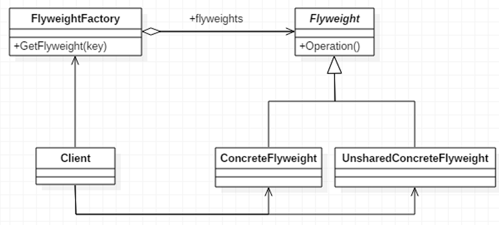
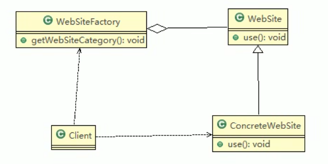

# 享元模式

## 基本介绍

1. 享元模式也叫蝇量模式，运用共享技术有效地支持大量细粒度的对象
2. 常用于系统底层开发，解决系统的性能问题。像数据库连接池，里面都是创建好的连接对象，在这些连接对象中有我们需要的则直接拿来用，避免重新创建，如果没有我们需要的，则创建一个
3. 享元模式能够解决重复对象的内存浪费的问题，当系统中有大量相似对象，需要缓冲池时。不需总是创建新对象，可以从缓冲池里拿。这样可以降低系统内存，同时提高效率。
4. 享元模式经典的应用场景就是池技术了，String常量池、数据库连接池、缓冲池等等都是享元模式的应用，享元模式是池技术的重要实现方式。



> 1. FlyWeight是抽象的享元角色，他是产品的抽象类，同时定义出对象的外部状态和内部状态的接口或实现。
> 2. ConcreteFlyweight是具体的享元角色，是具体的产品类，实现抽象角色定义的相关业务
> 3. UnSharedConcreteFlyweight是不可共享的角色，一般不会出现在享元工厂。
> 4. FlyWeightFactory：享元工厂类，用于构建一个池容器（集合），同时提供从池中获取对象方法。

### 内部状态和外部状态

比如围棋、五子棋、跳棋，它们都有大量的棋子对象，围棋和五子棋只有黑白两色，跳棋颜色多一 点，所以棋子颜色就是棋子的内部状态；而各个棋子之间的差别就是位置的不同，当我们落子后， 落子颜色是定的，但位置是变化的，所以棋子坐标就是棋子的外部状态 

1. 享元模式提出了两个要求：细粒度和共享对象。这里就涉及到内部状态和外部状态 了，即将对象的信息分为两个部分：内部状态和外部状态 

2) 内部状态指对象共享出来的信息，存储在享元对象内部且不会随环境的改变而改变 
3) 外部状态指对象得以依赖的一个标记，是随环境改变而改变的、不可共享的状态。 
4) 举个例子：围棋理论上有361个空位可以放棋子，每盘棋都有可能有两三百个棋子对象产生，因为内存空间有限，一台服务器很难支持更多的玩家玩围棋游戏，如果用享元模式来处理棋子，那么棋子对象就可以减少到只有两个实例，这样就很好的解决了对象的开销问题

## 享元模式解决网站外包问题



```java
// 网站工厂类，根据需要返回压一个网站
public class WebSiteFactory {
	//集合， 充当池的作用
	private HashMap<String, ConcreteWebSite> pool = new HashMap<>();
	
	//根据网站的类型，返回一个网站, 如果没有就创建一个网站，并放入到池中,并返回
	public WebSite getWebSiteCategory(String type) {
		if(!pool.containsKey(type)) {
			//就创建一个网站，并放入到池中
			pool.put(type, new ConcreteWebSite(type));
		}
		return (WebSite)pool.get(type);
	}
	
	//获取网站分类的总数 (池中有多少个网站类型)
	public int getWebSiteCount() {
		return pool.size();
	}
}

public abstract class WebSite {

	public abstract void use(User user);//抽象方法
}

public class ConcreteWebSite extends WebSite {

	//共享的部分，内部状态
	private String type = ""; //网站发布的形式(类型)
	
	//构造器
	public ConcreteWebSite(String type) {
		this.type = type;
	}

	@Override
	public void use(User user) {
		// TODO Auto-generated method stub
		System.out.println("网站的发布形式为:" + type + " 在使用中 .. 使用者是" + user.getName());
	}
	
	
}

```

# Integer源码

```java
package com.atguigu.jdk;

public class FlyWeight {

	public static void main(String[] args) {
		// TODO Auto-generated method stub
		//如果 Integer.valueOf(x) x 在  -128 --- 127 直接，就是使用享元模式返回,如果不在
		//范围类，则仍然 new 
		
		//小结:
		//1. 在valueOf 方法中，先判断值是否在 IntegerCache 中，如果不在，就创建新的Integer(new), 否则，就直接从 缓存池返回
		//2. valueOf 方法，就使用到享元模式
		//3. 如果使用valueOf 方法得到一个Integer 实例，范围在 -128 - 127 ，执行速度比 new 快
		Integer x = Integer.valueOf(127); // 得到 x实例，类型 Integer
		Integer y = new Integer(127); // 得到 y 实例，类型 Integer
		Integer z = Integer.valueOf(127);//..
		Integer w = new Integer(127);
		
		System.out.println(x.equals(y)); // 大小，true
		System.out.println(x == y ); //  false
		System.out.println(x == z ); // true
		System.out.println(w == x ); // false
		System.out.println(w == y ); // false
		
		
		Integer x1 = Integer.valueOf(200);
		Integer x2 = Integer.valueOf(200);
		System.out.println("x1==x2" + (x1 == x2)); // false
		
	}
}

public static Integer valueOf(int i) {
    if (i >= IntegerCache.low && i <= IntegerCache.high)
        return IntegerCache.cache[i + (-IntegerCache.low)];
    return new Integer(i);
}

```

# 注意事项与细节

1. 在享元模式这样理解，“享”就表示共享，“元”表示对象 
2.  系统中有大量对象，这些对象消耗大量内存，并且对象的状态大部分可以外部化时， 我们就可以考虑选用享元模式
3.  用唯一标识码判断，如果在内存中有，则返回这个唯一标识码所标识的对象，用 HashMap/HashTable存储
4. 享元模式大大减少了对象的创建，降低了程序内存的占用，提高效率
5. 享元模式提高了系统的复杂度。需要分离出内部状态和外部状态，而外部状态具有 固化特性，不应该随着内部状态的改变而改变，这是我们使用享元模式需要注意的 地方.
6. 使用享元模式时，注意划分内部状态和外部状态，并且需要有一个工厂类加以控制。
   1. 享元模式经典的应用场景是需要缓冲池的场景，比如String常量池、数据库连接池