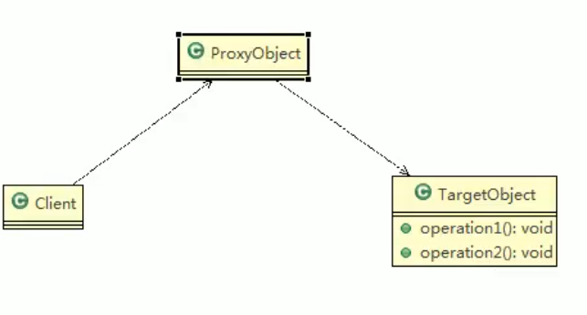
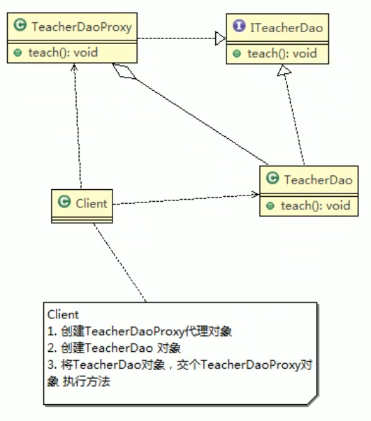
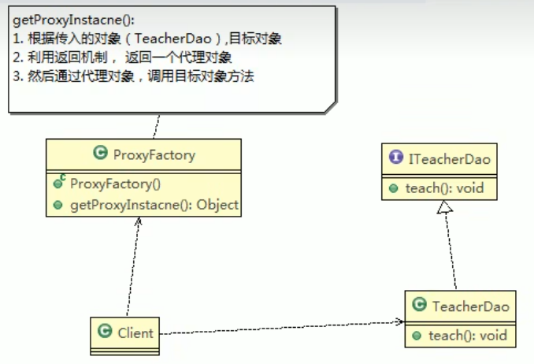
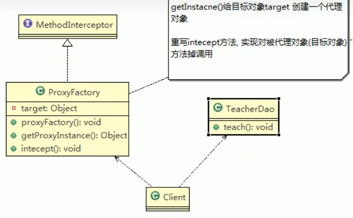

# 代理模式

## 基本介绍

1) 代理模式：为一个对象提供一个替身，以控制对这个对象的访问。即通过代理 对象访问目标对象.这样做的好处是:可以在目标对象实现的基础上,增强额外的 功能操作,即扩展目标对象的功能。 
2)  被代理的对象可以是远程对象、创建开销大的对象或需要安全控制的对象 
3) 代理模式有不同的形式, 主要有三种静态代理、动态代理(JDK代理、接口代 理)和Cglib代理(可以在内存动态的创建对象，而不需要实现接口，他是属于 动态代理的范畴)。 
4) 代理模式示意图



## 静态代理

静态代理在使用时,需要定义接口或者父类,被代理对象(即目标对象)与代理对象一 起实现相同的接口或者是继承相同父类 

### 应用实例 

1. 定义一个接口:ITeacherDao
2. 目标对象TeacherDAO实现接口ITeacherDAO 
3. 使用静态代理方式,就需要在代理对象TeacherDAOProxy中也实现ITeacherDAO 
4. 调用的时候通过调用代理对象的方法来调用目标对象. 
5. 特别提醒：代理对象与目标对象要实现相同的接口,然后通过调用相同的方法来 调用目标对象的方法



```java
//代理对象,静态代理
public class TeacherDaoProxy implements ITeacherDao{
	
	private ITeacherDao target; // 目标对象，通过接口来聚合
	
	//构造器
	public TeacherDaoProxy(ITeacherDao target) {
		this.target = target;
	}

	@Override
	public void teach() {
		// TODO Auto-generated method stub
		System.out.println("开始代理  完成某些操作。。。。。 ");//方法
		target.teach();
		System.out.println("提交。。。。。");//方法
	}

}
```

### 优缺点

- 优点：在不修改目标对象的功能前提下，能通过代理对象对目标进行扩展。
- 缺点：因为代理对象需要与目标对象实现一样的接口,所以会有很多代理类 一旦接口增加方法,目标对象与代理对象都要维护

## 动态代理

### 基本介绍

1. 代理对象，不需要实现接口，但是目标对象要实现接口，否则不能使用动态代理
2. 代理对象的生成，是利用JDK的API，动态的在内存中构建代理对象 

> 代理类所在包:java.lang.reflect.Proxy
>
> JDK实现代理只需要使用newProxyInstance方法,
>
> 但是该方法需要接收三个参数,完整的写法是:  static Object newProxyInstance(ClassLoader loader, Class[]  interfaces,InvocationHandler h )

3. 动态代理也叫做：JDK代理、接口代理



```java
package com.atguigu.proxy.dynamic;

import java.lang.reflect.InvocationHandler;
import java.lang.reflect.Method;
import java.lang.reflect.Proxy;

public class ProxyFactory {

	//维护一个目标对象 , Object
	private Object target;

	//构造器 ， 对target 进行初始化
	public ProxyFactory(Object target) {
		
		this.target = target;
	} 
	
	//给目标对象 生成一个代理对象
	public Object getProxyInstance() {
		
		//说明
		/*
		 *  public static Object newProxyInstance(ClassLoader loader,
                                          Class<?>[] interfaces,
                                          InvocationHandler h)
                                          
            //1. ClassLoader loader ： 指定当前目标对象使用的类加载器, 获取加载器的方法固定
            //2. Class<?>[] interfaces: 目标对象实现的接口类型，使用泛型方法确认类型
            //3. InvocationHandler h : 事情处理，执行目标对象的方法时，会触发事情处理器方法, 会把当前执行的目标对象方法作为参数传入
		 */
		return Proxy.newProxyInstance(target.getClass().getClassLoader(), 
				target.getClass().getInterfaces(), 
				new InvocationHandler() {
					@Override
					public Object invoke(Object proxy, Method method, Object[] args) throws Throwable {
						// TODO Auto-generated method stub
						System.out.println("JDK代理开始~~");
						//反射机制调用目标对象的方法
						Object returnVal = method.invoke(target, args);
						System.out.println("JDK代理提交");
						return returnVal;
					}
				}); 
	}
}

public class Client {
	public static void main(String[] args) {
		// TODO Auto-generated method stub
		//创建目标对象
		ITeacherDao target = new TeacherDao();
		
		//给目标对象，创建代理对象, 可以转成 ITeacherDao
		ITeacherDao proxyInstance = (ITeacherDao)new ProxyFactory(target).getProxyInstance();
	
		// proxyInstance=class com.sun.proxy.$Proxy0 内存中动态生成了代理对象
		System.out.println("proxyInstance=" + proxyInstance.getClass());
		
		//通过代理对象，调用目标对象的方法
		//proxyInstance.teach();
		
		proxyInstance.sayHello(" tom ");
	}
}
```

## Cglib代理

### 基本代理

1) 静态代理和JDK代理模式都要求目标对象是实现一个接口,但是有时候目标对象只 是一个单独的对象,并没有实现任何的接口,这个时候可使用目标对象子类来实现 代理-这就是Cglib代理 
2) Cglib代理也叫作子类代理,它是在内存中构建一个子类对象从而实现对目标对象功 能扩展, 有些书也将Cglib代理归属到动态代理。
3) Cglib是一个强大的高性能的代码生成包,它可以在运行期扩展java类与实现java接 口.它广泛的被许多AOP的框架使用,例如Spring AOP，实现方法拦截 
4) 在AOP编程中如何选择代理模式： 1. 目标对象需要实现接口，用JDK代理 2. 目标对象不需要实现接口，用Cglib代理
5) Cglib包的底层是通过使用字节码处理框架ASM来转换字节码并生成新的类

### 步骤

1. 需要引入cglib的jar文件，asm,asm-commons,asm-tree,cglib
2. 在内存中动态构建子类，注意代理的类不能为final，否则报错
3. 目标对象的方法如果为final/static，那么就不会被拦截，即不会执行目标对象额外的业务方法。



```java
package com.atguigu.proxy.cglib;

import java.lang.reflect.Method;

import net.sf.cglib.proxy.Enhancer;
import net.sf.cglib.proxy.MethodInterceptor;
import net.sf.cglib.proxy.MethodProxy;

public class ProxyFactory implements MethodInterceptor {

	//维护一个目标对象
	private Object target;
	
	//构造器，传入一个被代理的对象
	public ProxyFactory(Object target) {
		this.target = target;
	}

	//返回一个代理对象:  是 target 对象的代理对象
	public Object getProxyInstance() {
		//1. 创建一个工具类
		Enhancer enhancer = new Enhancer();
		//2. 设置父类
		enhancer.setSuperclass(target.getClass());
		//3. 设置回调函数
		enhancer.setCallback(this);
		//4. 创建子类对象，即代理对象
		return enhancer.create();
	}

	//重写  intercept 方法，会调用目标对象的方法
	@Override
	public Object intercept(Object arg0, Method method, Object[] args, MethodProxy arg3) throws Throwable {
		// TODO Auto-generated method stub
		System.out.println("Cglib代理模式 ~~ 开始");
		Object returnVal = method.invoke(target, args);
		System.out.println("Cglib代理模式 ~~ 提交");
		return returnVal;
	}
}

public class Client {
	public static void main(String[] args) {
		// TODO Auto-generated method stub
		//创建目标对象
		TeacherDao target = new TeacherDao();
		//获取到代理对象，并且将目标对象传递给代理对象
		TeacherDao proxyInstance = (TeacherDao)new ProxyFactory(target).getProxyInstance();

		//执行代理对象的方法，触发intecept 方法，从而实现 对目标对象的调用
		String res = proxyInstance.teach();
		System.out.println("res=" + res);
	}
}


```

# 代理模式变体

1. 防火墙代理：内网通过代理穿透防火墙，实现对公网的访问
2. 缓存代理：比如，当请求图片文件等资源时，先到缓存代理取，如果取到资源则ok，如果取不到资源再到公网或者数据库取，然后缓存
3. 远程代理：远程对象的本地代表，通过它可以把远程对象当本地对象来调用。远程代理通过网络和真正的远程对象沟通信息
4. 同步代理：主要使用多线程编程中，完成多线程间同步工作。
