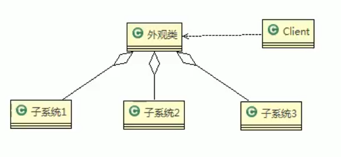

# 外观模式

## 基本介绍

- 外观模式，也叫过程模式，外观模式为子系统中的一组接口提供一个一致的界面，此模式定义了一个高层接口，这个接口使得这一子系统更加容易使用
- 外观模式通过定义一个一致的接口，用以屏蔽内部子系统的细节，使得调用端只需跟这个接口发生调用，而无需关心这个子系统的内部细节。



> 1. 外观类（Facade）：为调用端提供统一的调用接口，外观类知道哪些子系统负责处理请求，从而将调用端的请求代理给适当的子系统对象。
> 2. 调用者（Client）：外观接口的调用者
> 3. 子系统的集合：指模块或者子系统，处理Facade对象指派的任务，他是功能的提供者。

```java
public class HomeTheaterFacade {
	
	//定义各个子系统对象
	private TheaterLight theaterLight;
	private Popcorn popcorn;
	private Stereo stereo;
	private Projector projector;
	private Screen screen;
	private DVDPlayer dVDPlayer;
	
	
	//构造器
	public HomeTheaterFacade() {
		super();
		this.theaterLight = TheaterLight.getInstance();
		this.popcorn = Popcorn.getInstance();
		this.stereo = Stereo.getInstance();
		this.projector = Projector.getInstance();
		this.screen = Screen.getInstance();
		this.dVDPlayer = DVDPlayer.getInstanc();
	}

	//操作分成 4 步
	
	public void ready() {
		popcorn.on();
		popcorn.pop();
		screen.down();
		projector.on();
		stereo.on();
		dVDPlayer.on();
		theaterLight.dim();
	}
	
	public void play() {
		dVDPlayer.play();
	}
	
	public void pause() {
		dVDPlayer.pause();
	}
	
	public void end() {
		popcorn.off();
		theaterLight.bright();
		screen.up();
		projector.off();
		stereo.off();
		dVDPlayer.off();
	}
}

```

# MyBatis源码

- MyBatis 中的Configuration 去创建MetaObject 对象使用到外观模式

# 外观模式的注意事项和细节 外观模式的注意事项和细节 

1. 外观模式对外屏蔽了子系统的细节，因此外观模式降低了客户端对子系统使用的复 杂性 
2. 外观模式对客户端与子系统的耦合关系，让子系统内部的模块更易维护和扩展 
3. 通过合理的使用外观模式，可以帮我们更好的划分访问的层次 
4. 当系统需要进行分层设计时，可以考虑使用Facade模式 
5.  在维护一个遗留的大型系统时，可能这个系统已经变得非常难以维护和扩展，此时 可以考虑为新系统开发一个Facade类，来提供遗留系统的比较清晰简单的接口， 让新系统与Facade类交互，提高复用性 
6. 不能过多的或者不合理的使用外观模式，使用外观模式好，还是直接调用模块好。 要以让系统有层次，利于维护为目的。