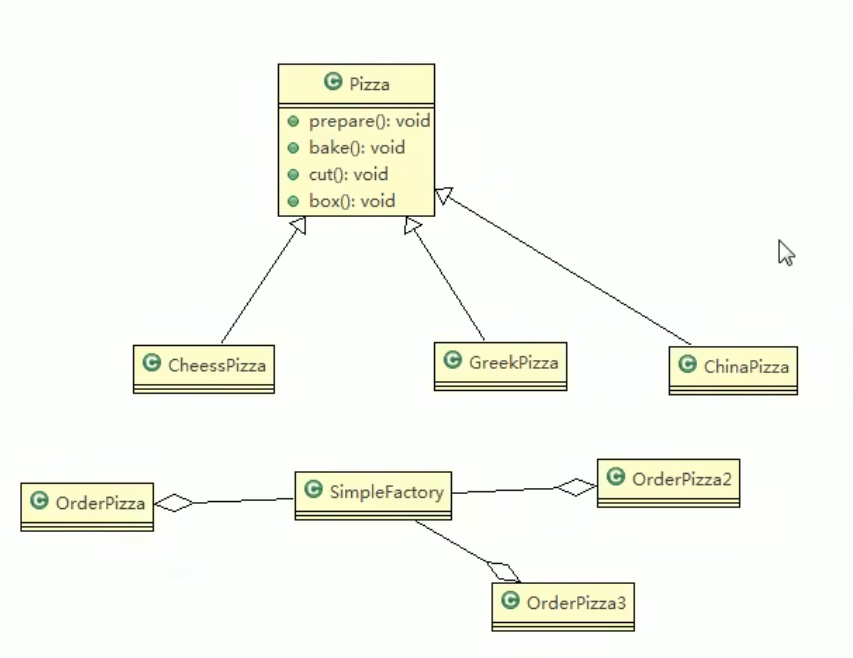
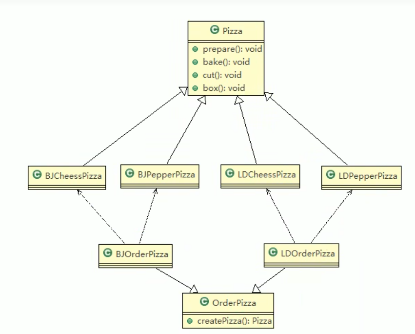
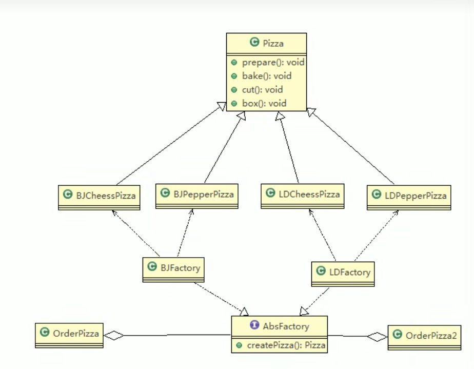

# 简单工厂模式

 ## Pizza工厂

```java
public abstract class Pizza{
    protected String name;
    
    public abstract void prepare();
    
    public void bake(){
        print();
    }
    
    public void cut(){
        print();
    }
    
    public void box(){
        print();
    }
    
    public void setName(String name){
        this.name = name
    }
}


public class CheesePizza extends Pizza{
    public void prepare(){
        print();
    }
}

public class OrderPizza{
    public OrderPizza(){
        Pizza pizza = null;
        
        String orderType;
        
        do {
            orderType = getType();
            if(orderType.equals("greek")){
                pizza = new GreekPizza();
            }else if(orderType.equals("cheese")){
                pizza = new CheesePizza();
            }else{
                break;
            }
        }while(true);
    }
    
    public String getType(){
        return "greek";
    }
}
```

> 缺点：违反了设计模式的ocp原则，即对扩展开放，对修改关闭。
>
> 分析：修改代码可以接受，但是如果我们在其它的地方也有创建Pizza的代码，就意味着也需要修改，而创建Pizza的代码，往往有多处。
>
> 思路：把创建Pizza对象封装到一个类中，这样我们有新的Pizza种类时，只需要修改该类即可，其它有创建到Pizza对象的代码就不需要修改了。——简单工厂模式

## 基本介绍

- 简单工厂模式是属于创建型模式，是工厂模式的一种。简单工厂模式是由一个工厂对象决定创建出哪一种产品类的实例。
- 简单工厂模式：定义了一个创建对象的类，由这个类来封装实例化对象的行为。
- 在软件开发中，我们会用到创建大批量对象时



## 修改代码

```java
// 简单工厂类
public class SimpleFactory{
	
    //根据orderType返回对应的Pizza对象
    //简单工厂模式也叫静态工厂模式，create方法可以变成静态的，更方便调用。
    public Pizza createPizza(String orderType){
        Pizza pizza = null;
        
        if(orderType.equals("greek")){
            pizza = new GreekPizza();
        }else if(orderType.equals("cheese")){
            pizza = new CheesePizza();
        }else{
            break;
        }
        return pizza;
    }
}

public class OrderPizza{
    SimpleFactory simpleFactory;
    
    public void setFactory(SimpleFactory simpleFactory){
        this.simpleFactory = simpleFactory;
        
    }
    
    public OrderPizza(){
        Pizza pizza = null;
        
        String orderType;
       
        do {
            orderType = getType();
            simpleFactory.createPizza(orderType);
        }while(true);
    }
    
    public String getType(){
        return "greek";
    }
}
```

# 工厂方法模式

- 工厂方法模式设计方案：将披萨项目的实例化功能抽象成抽象方法，在不同的口味点餐子类中具体实现。
- 工厂方法模式：定义了一个创建对象的抽象方法，由子类决定要实例化的类。工厂方法模式`将对象的实例化推迟到子类`。



```java
// 首先，我们需要定义一个图形接口
interface Shape {
    void draw();
}
// 然后，我们实现两个具体的图形类，分别是 Circle（圆形）和 Rectangle（矩形）
class Circle implements Shape {
    @Override
    public void draw() {
        System.out.println("Drawing a circle");
    }
}

class Rectangle implements Shape {
    @Override
    public void draw() {
        System.out.println("Drawing a rectangle");
    }
}
// 接下来，我们创建一个抽象工厂类 ShapeFactory
// 它定义了一个抽象的工厂方法 createShape，子类将实现这个方法来创建具体的图形对象
abstract class ShapeFactory {
    abstract Shape createShape();
}
// 然后，我们创建两个具体的工厂类，分别是 CircleFactory 和 RectangleFactory
// 它们分别实现了 ShapeFactory 并重写了 createShape 方法来返回相应的图形对象
class CircleFactory extends ShapeFactory {
    @Override
    Shape createShape() {
        return new Circle();
    }
}

class RectangleFactory extends ShapeFactory {
    @Override
    Shape createShape() {
        return new Rectangle();
    }
}
// 我们可以使用这些工厂类来创建图形对象
public class FactoryMethodExample {
    public static void main(String[] args) {
        ShapeFactory circleFactory = new CircleFactory();
        Shape circle = circleFactory.createShape();
        circle.draw();
        
        ShapeFactory rectangleFactory = new RectangleFactory();
        Shape rectangle = rectangleFactory.createShape();
        rectangle.draw();
    }
}

```

# 抽象工厂模式

## 基本介绍

- 抽象工厂模式：定义了一个interface用于创建相关或有依赖关系的对象簇，而无需指明具体的类
- 抽象工厂模式可以将简单工厂模式和工厂方法模式进行整合。
- 从设计层面看，抽象工厂模式就是对简单工厂模式的改进（或者称为进一步的抽象）
- 将工厂抽象成两层，AbsFactory（抽象工厂）和具体实现的工厂子类。程序员可以根据创建对象类型使用对应的工厂子类。这样将单个的简单工厂类变成了工厂簇，更利于代码的维护和扩展。

- 类图：



# 工厂模式使用实例

```java
Calendar calendar = Calendar.getInstance();
```

# 工厂模式小结

- 意义：将实例化对象的代码提取出来，放到一个类中统一管理和维护，达到和主项目的依赖关系的解耦。从而提高项目的扩展和维护性。
