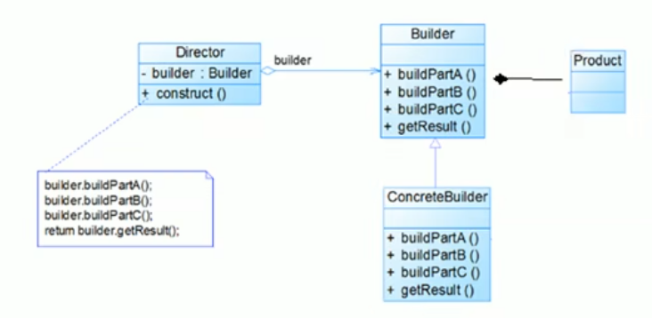
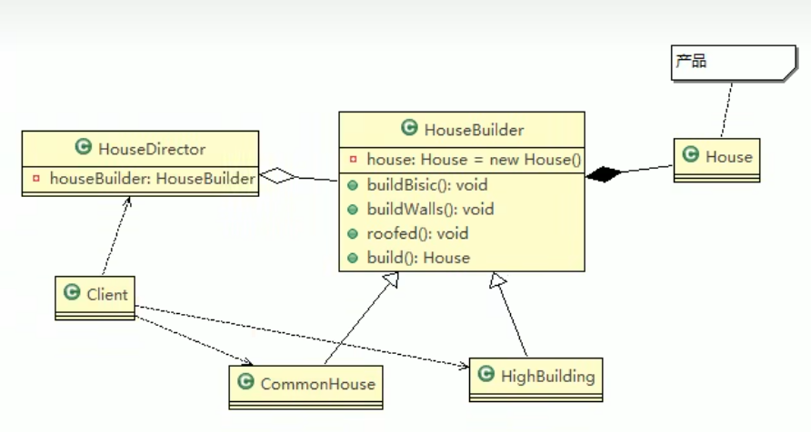

# 建造者模式

## 建房子

```java
public abstract class AbstractHouse{
    public abstract void buildBaisc();
    public abstract void buildWalls();
    public abstract void roofed();
    
    public void build(){
        buildBaisc();
        buildWalls();
        roofed();
    }
}
```

> 设计的程序结构，过于简单，没有涉及缓存层对象，程序的扩展和维护不好。这种设计方案，把产品和创建产品的过程封装在一起，耦合性增强了。
>
> 解决方案：将产品和产品建造过程解耦。

## 基本介绍

- 是一种对象构建模式，它可以将复杂对象的建造过程抽象出来，使这个抽象过程的不同实现方法可以构造出不同表现（属性）的对象
- 建造者模式是一步一步创建一个复杂的对象，它允许用户只通过指定复杂对象的类型和内容就可以构建它们，用户不需要知道内部的具体构建细节。

## 建造者模式的四个角色

1. Product（产品角色）：一个具体的产品对象
2. Builder（抽象建造者）：创建一个Product对象的各个部件指定的接口/抽象类。
3. ConcreteBuilder（具体建造者）：实现接口，构建和装配各个部件
4. Director（指挥者）：构建一个使用Builder接口的对象。它主要适用于创建一个复杂的对象。两个作用：1. 隔离了客户与对象的生产过程，2.负责控制产品对象的生产过程。



## 建房子重构



```java
// 抽象的建造者
public abstract class HouseBuilder {

	protected House house = new House();
	
	//将建造的流程写好, 抽象的方法
	public abstract void buildBasic();
	public abstract void buildWalls();
	public abstract void roofed();
	
	//建造房子好， 将产品(房子) 返回
	public House buildHouse() {
		return house;
	}
	
}

//指挥者，这里去指定制作流程，返回产品
public class HouseDirector {
	
	HouseBuilder houseBuilder = null;

	//构造器传入 houseBuilder
	public HouseDirector(HouseBuilder houseBuilder) {
		this.houseBuilder = houseBuilder;
	}

	//通过setter 传入 houseBuilder
	public void setHouseBuilder(HouseBuilder houseBuilder) {
		this.houseBuilder = houseBuilder;
	}
	
	//如何处理建造房子的流程，交给指挥者
	public House constructHouse() {
		houseBuilder.buildBasic();
		houseBuilder.buildWalls();
		houseBuilder.roofed();
		return houseBuilder.buildHouse();
	}
	
	
}

```

## 建造者模式的注意事项和细节

1. 客户端不比知道产品内部组成的细节，将产品本身与产品的创建过程解耦，使得相同的创建过程可以创建不同的产品对象
2. 每一个具体建造者都相对独立，而与其它具体建造者无关，因此可以很方便地替换具体建造者或增加新的具体建造者，用户使用不同的具体建造者即可得到不同的产品对象
3. 可以更加精细地控制产品的创建过程。将复杂产品的创建步骤分解在不同的方法中，使得创建过程更加清晰，也更方便使用程序来控制创建过程
4. 增加新的具体建造者无需修改原有类库的代码，指挥者类针对抽象建造者类变成，系统扩展方便，符合“开闭原则”
5. 建造者模式所创建的产品一般具有较多的共同点，如果产品之间的差异性很大，则不适合使用建造者模式。
6. 抽象工厂模式实现对产品家族的创建，一个产品家族是这样的一系列产品：具有不同分类维度的产品组合，采用抽象工厂模式不需要关心构建过程，只关心什么产品由什么工厂生产即可。而建造者模式则是要求按照指定的蓝图建造产品，它的主要目的是通过组装零配件而chan'sheng

## JDK源码分析

- java.lang.StringBuilder

> Appendable接口定义了多个append方法（抽象方法），即Appendable为抽象建造者，定义了抽象方法
>
> AbstractStringBuilder实现了Appendable接口方法，它已经是建造者，只是不能实例化
>
> StringBuilder即充当了指挥者角色，同时充当了具体的建造者，建造方法是实现是由AbstractStringBuilder完成，而StringBuilder继承了AbstractStringBuilder。