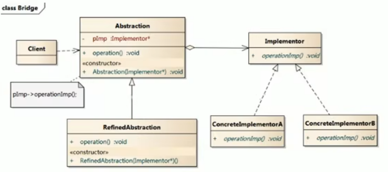
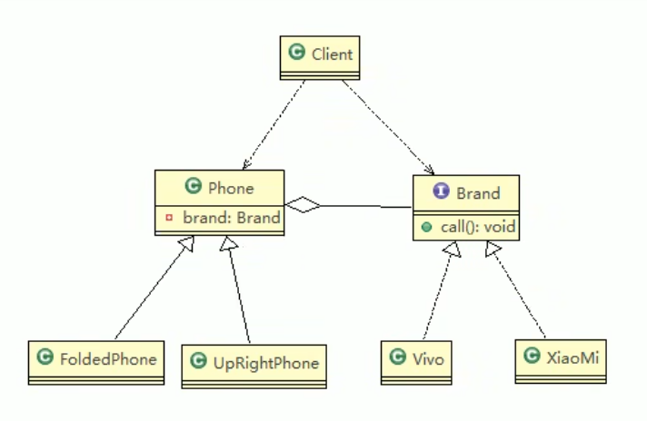

# 基本介绍

- 桥接模式（Bridge模式）是指：将实现与抽象放在两个不同的类层次中，使两个层次可以独立改变
- 是一种结构型设计模式
- Bridge模式基于类的最小设计原则，通过使用封装、聚合及继承等行为让不同的类承担不同的职责。它的主要特点是把抽象与行为实现分离开来，从而可以保持各部分的独立性以及应对他们的功能扩展。



> 1. Client类：桥接模式的调用者
> 2. 抽象类（Abstraction）：维护了Implementor / 即它的实现类ConcrretelImplementorA...，二者是聚合关系，Abstrraction充当桥接类
> 3. RefinedAbstraction：是抽象类的子类
> 4. Implementor：行为实现类的接口
> 5. ConcreteImplementorA/B：行为的具体实现类
> 6. 从UML图：这里的抽象类和接口是聚合的关系，其实调用和被调用的关系。



```java
public abstract class Phone {
	
	//组合品牌
	private Brand brand;

	//构造器
	public Phone(Brand brand) {
		super();
		this.brand = brand;
	}
	
	protected void open() {
		this.brand.open();
	}
	protected void close() {
		brand.close();
	}
	protected void call() {
		brand.call();
	}
	
}

package com.atguigu.bridge;


//折叠式手机类，继承 抽象类 Phone
public class FoldedPhone extends Phone {

	//构造器
	public FoldedPhone(Brand brand) {
		super(brand);
	}
	
	public void open() {
		super.open();
		System.out.println(" 折叠样式手机 ");
	}
	
	public void close() {
		super.close();
		System.out.println(" 折叠样式手机 ");
	}
	
	public void call() {
		super.call();
		System.out.println(" 折叠样式手机 ");
	}
}
```

- 这里的Phone充当桥的作用，将类型和品牌结合起来。Phone相当于乘号，类型和品牌相当于因数。

# JDBC源码

- Jdbc的Driver接口，如果从桥接模式来看，Driver就是一个接口，下面可以有MySQL的Driver，Oracle的Driver，这些就可以当作实现接口类

# 注意事项和细节

1) 实现了抽象和实现部分的分离，从而极大的提供了系统的灵活性，让抽象部分和实 现部分独立开来，这有助于系统进行分层设计，从而产生更好的结构化系统。 
2) 对于系统的高层部分，只需要知道抽象部分和实现部分的接口就可以了，其它的部 分由具体业务来完成。 
3) 桥接模式替代多层继承方案，可以减少子类的个数，降低系统的管理和维护成本。
4) 桥接模式的引入增加了系统的理解和设计难度，由于聚合关联关系建立在抽象层， 要求开发者针对抽象进行设计和编程 
5) 桥接模式要求正确识别出系统中两个独立变化的维度，因此其使用范围有一定的局 限性，即需要有这样的应用场景。
6) 对于那些不希望使用继承或因为多层次继承导致系统类的个数急剧增加的系统，桥 接模式尤为适用.