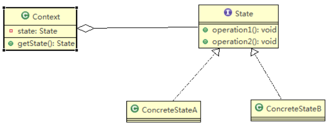

# 状态模式

## 基本介绍

1) 状态模式（State Pattern）：它主要用来解决对象在多种状态转换时，需要对外输出不同的行为的问题。状态和行为是一一对应的，状态之间可以相互转换
2) 当一个对象的内在状态改变时，允许改变其行为，这个对象看起来像是改变了其类



> 1) Context 类为环境角色, 用于维护State实例,这个实例定义当前状态
> 2) State 是抽象状态角色,定义一个接口封装与Context 的一个特点接口相关行为
> 3) ConcreteState 具体的状态角色，每个子类实现一个与Context 的一个状态相关行为

```java
package 状态模式;
/*状态（State）模式的定义：对有状态的对象，把复杂的“判断逻辑”提取到不同的状态对象中，允许状态对象在其内部状态发生改变时改变其行为。
 * 模式结构：
 * 		1、环境（Context）角色：也称为上下文，它定义了客户感兴趣的接口，维护一个当前状态，并将与状态相关的操作委托给当前状态对象来处理。
 * 		2、抽象状态（State）角色：定义一个接口，用以封装环境对象中的特定状态所对应的行为。
 * 		3、具体状态（Concrete    State）角色：实现抽象状态所对应的行为。
 * 
 */
public class StateClient {
	public static void main(String[] args) {
		Context context = new Context();
		context.Handle();
		context.Handle();
		context.Handle();
		context.Handle();
		context.Handle();
	}
}

public interface State {	//抽象状态接口
	public void Handle(Context context);
}

public class ConcreteStateA implements State{
	@Override
	public void Handle(Context context) {
		// TODO Auto-generated method stub
		System.out.println("起始状态！！！");
		context.setState(new ConcreteStateB());
	}
}

public class ConcreteStateB implements State{
	@Override
	public void Handle(Context context) {
		// TODO Auto-generated method stub
		System.out.println("中间状态！！！");
		context.setState(new ConcreteStateC());
	}
}

public class ConcreteStateC implements State{
	@Override
	public void Handle(Context context) {
		// TODO Auto-generated method stub
		System.out.println("结束状态！！！");
		context.setState(new ConcreteStateA());
	}
}

public class Context {		//环境类
	private State state;
	public Context() {	//设置初始状态
		this.state = new ConcreteStateA();
	}
	
	public void setState(State state) {	//设置新状态
		this.state = state;
	}
	
	public State getState() {	//获取当前状态
		return state;
	}
	
	public void Handle() {
		state.Handle(this);
	}
}

```

# 状态模式的注意事项和细节

1) 代码有很强的可读性。状态模式将每个状态的行为封装到对应的一个类中
2)  方便维护。将容易产生问题的if-else语句删除了，如果把每个状态的行为都放到一 个类中，每次调用方法时都要判断当前是什么状态，不但会产出很多if-else语句， 而且容易出错
3) 符合“开闭原则”。容易增删状态
4) 会产生很多类。每个状态都要一个对应的类，当状态过多时会产生很多类，加大维 护难度
5) 应用场景：当一个事件或者对象有很多种状态，状态之间会相互转换，对不同的状 态要求有不同的行为的时候，可以考虑使用状态模式
