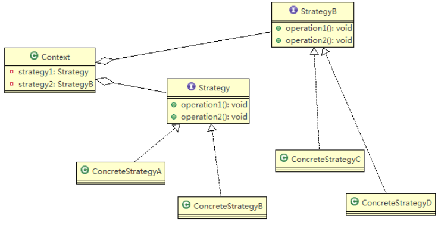
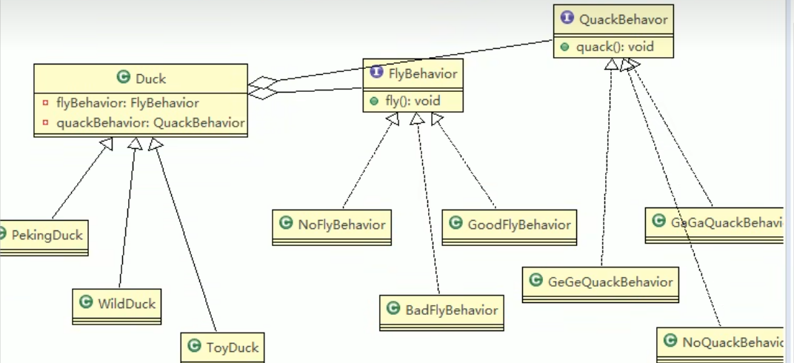

# 策略模式

## 鸭子问题

> 有各种鸭子(比如 野鸭、北京鸭、水鸭等， 鸭子有各种行为，比如 叫、飞行等)。显示鸭子的信息

1) 其它鸭子，都继承了Duck类，所以fly让所有子类都会飞了，这是不正确的
2) 上面说的1 的问题，其实是继承带来的问题：对类的局部改动，尤其超类的局部改动，会影响其他部分。会有溢出效应
3) 为了改进1问题，我们可以通过覆盖fly 方法来解决 => 覆盖解决
4) 问题又来了，如果我们有一个玩具鸭子ToyDuck, 这样就需要ToyDuck去覆盖Duck的所有实现的方法 => 解决思路 策略模式 (strategy pattern)

## 基本介绍

1) 策略模式（Strategy Pattern）中，定义算法族，分别封装起来，让他们之间可以互相替换，此模式让算法的变化独立于使用算法的客户
2) 这算法体现了几个设计原则，第一、把变化的代码从不变的代码中分离出来；第二、针对接口编程而不是具体类（定义了策略接口）；第三、多用组合/聚合，少用继承（客户通过组合方式使用策略）。



> 说明：从上图可以看到，客户context 有成员变量strategy或者其他的策略接口,至于需要使用到哪个策略，我们可以在构造器中指定。

## 策略模式解决鸭子问题



```java

public abstract class Duck {

	//属性, 策略接口
	FlyBehavior flyBehavior;
	//其它属性<->策略接口
	QuackBehavior quackBehavior;
	
	public Duck() {
	
	}

	public abstract void display();//显示鸭子信息
	
	public void quack() {
		System.out.println("鸭子嘎嘎叫~~");
	}
	
	public void swim() {
		System.out.println("鸭子会游泳~~");
	}
	
	public void fly() {
		
		//改进
		if(flyBehavior != null) {
			flyBehavior.fly();
		}
	}

	public void setFlyBehavior(FlyBehavior flyBehavior) {
		this.flyBehavior = flyBehavior;
	}
	
	
	public void setQuackBehavior(QuackBehavior quackBehavior) {
		this.quackBehavior = quackBehavior;
	}
	
	
	
}

public class PekingDuck extends Duck {

	//假如北京鸭可以飞翔，但是飞翔技术一般
	public PekingDuck() {
		// TODO Auto-generated constructor stub
		flyBehavior = new BadFlyBehavior();
	}
	
	@Override
	public void display() {
		// TODO Auto-generated method stub
		System.out.println("~~北京鸭~~~");
	}
}

```

# 🎯 策略模式在 Java 的 Arrays.sort 中的体现

### 🧠 策略模式简介

策略模式（Strategy Pattern）的核心思想是：

> 将算法的行为抽象成一个“策略接口”，然后可以将不同的实现注入到使用它的上下文中，从而在运行时切换行为。

---

### ✅ 在 `Arrays.sort()` 中的体现

Java 的 `Arrays.sort()` 方法支持传入一个 `Comparator`，这是策略模式的典型应用：

```java
public static <T> void sort(T[] a, Comparator<? super T> c)
```

### 🎯 角色对应关系：

| 策略模式角色                 | 在 `Arrays.sort()` 中的具体体现  |
| ---------------------------- | -------------------------------- |
| Context（上下文）            | `Arrays.sort()` 方法本身         |
| Strategy（策略接口）         | `Comparator<T>` 接口             |
| ConcreteStrategy（具体策略） | 你实现的各种 `Comparator` 比较器 |

# 策略模式的注意事项和细节

1) 策略模式的关键是：分析项目中变化部分与不变部分
2) 策略模式的核心思想是：多用组合/聚合 少用继承；用行为类组合，而不是行为的继承。更有弹性
3) 体现了“对修改关闭，对扩展开放”原则，客户端增加行为不用修改原有代码，只要添加一种策略（或者行为）即可，避免了使用多重转移语句（if..else if..else）
4) 提供了可以替换继承关系的办法： 策略模式将算法封装在独立的Strategy类中使得你可以独立于其Context改变它，使它易于切换、易于理解、易于扩展
5) 需要注意的是：每添加一个策略就要增加一个类，当策略过多是会导致类数目庞大