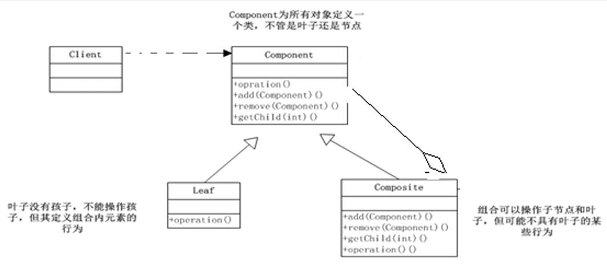
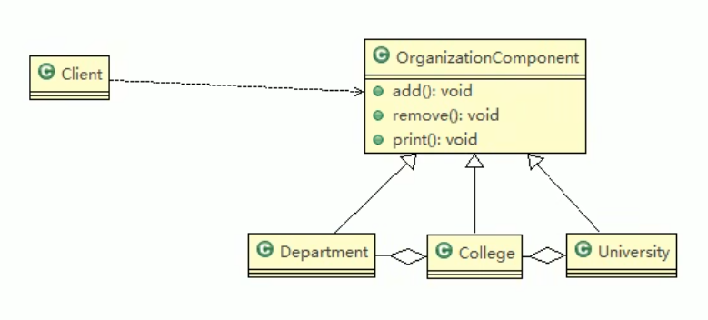

# 组合模式

## 基本介绍

1. 组合模式，又叫部分整体模式，它创建了对象组的树形结构，将对象组合成树状结构以表示整体-部分的层次关系
2. 组合模式依据树形结构来组合对象，用来表示部分以及整体层次
3. 这种类型的设计模式属于结构型模式
4. 组合模式使得用户对单个对象和组合对象的访问具有一致性，即：组合能让客户以一致的方式处理个别对象以及组合对象。
5. 组合模式解决这样的问题，当我们的要处理的对象可以生成一颗树形结构，而 我们要对树上的节点和叶子进行操作时，它能够提供一致的方式，而不用考虑 它是节点还是叶子



> 1. Component：这是组合中对象声明接口，在适当情况下，实现所有类共有的接口默认行为，用于访问和管理Component子部件，Component可以是抽象类或者是接口
> 2. Leaf：在组合中表示叶子节点，叶子节点没有子节点
> 3. Composite：非叶子节点，用于存储子部件，在Component接口中实现子部件的相关操作，比如增加，删除

## 代码实现



```java
public abstract class OrganizationComponent {

	private String name; // 名字
	private String des; // 说明
	
	protected  void add(OrganizationComponent organizationComponent) {
		//默认实现
		throw new UnsupportedOperationException();
	}
	
	protected  void remove(OrganizationComponent organizationComponent) {
		//默认实现
		throw new UnsupportedOperationException();
	}

	//构造器
	public OrganizationComponent(String name, String des) {
		super();
		this.name = name;
		this.des = des;
	}

	public String getName() {
		return name;
	}

	public void setName(String name) {
		this.name = name;
	}

	public String getDes() {
		return des;
	}

	public void setDes(String des) {
		this.des = des;
	}
	
	//方法print, 做成抽象的, 子类都需要实现
	protected abstract void print();
}


//University 就是 Composite , 可以管理College
public class University extends OrganizationComponent {

	List<OrganizationComponent> organizationComponents = new ArrayList<OrganizationComponent>();

	// 构造器
	public University(String name, String des) {
		super(name, des);
		// TODO Auto-generated constructor stub
	}

	// 重写add
	@Override
	protected void add(OrganizationComponent organizationComponent) {
		// TODO Auto-generated method stub
		organizationComponents.add(organizationComponent);
	}

	// 重写remove
	@Override
	protected void remove(OrganizationComponent organizationComponent) {
		// TODO Auto-generated method stub
		organizationComponents.remove(organizationComponent);
	}

	@Override
	public String getName() {
		// TODO Auto-generated method stub
		return super.getName();
	}

	@Override
	public String getDes() {
		// TODO Auto-generated method stub
		return super.getDes();
	}

	// print方法，就是输出University 包含的学院
	@Override
	protected void print() {
		// TODO Auto-generated method stub
		System.out.println("--------------" + getName() + "--------------");
		//遍历 organizationComponents 
		for (OrganizationComponent organizationComponent : organizationComponents) {
			organizationComponent.print();
		}
	}

}


public class College extends OrganizationComponent {

	//List 中 存放的Department
	List<OrganizationComponent> organizationComponents = new ArrayList<OrganizationComponent>();

	// 构造器
	public College(String name, String des) {
		super(name, des);
		// TODO Auto-generated constructor stub
	}

	// 重写add
	@Override
	protected void add(OrganizationComponent organizationComponent) {
		// TODO Auto-generated method stub
		//  将来实际业务中，Colleage 的 add 和  University add 不一定完全一样
		organizationComponents.add(organizationComponent);
	}

	// 重写remove
	@Override
	protected void remove(OrganizationComponent organizationComponent) {
		// TODO Auto-generated method stub
		organizationComponents.remove(organizationComponent);
	}

	@Override
	public String getName() {
		// TODO Auto-generated method stub
		return super.getName();
	}

	@Override
	public String getDes() {
		// TODO Auto-generated method stub
		return super.getDes();
	}

	// print方法，就是输出University 包含的学院
	@Override
	protected void print() {
		// TODO Auto-generated method stub
		System.out.println("--------------" + getName() + "--------------");
		//遍历 organizationComponents 
		for (OrganizationComponent organizationComponent : organizationComponents) {
			organizationComponent.print();
		}
	}
}

public class Department extends OrganizationComponent {

	//没有集合
	
	public Department(String name, String des) {
		super(name, des);
		// TODO Auto-generated constructor stub
	}

	
	//add , remove 就不用写了，因为他是叶子节点
	
	@Override
	public String getName() {
		// TODO Auto-generated method stub
		return super.getName();
	}
	
	@Override
	public String getDes() {
		// TODO Auto-generated method stub
		return super.getDes();
	}
	
	@Override
	protected void print() {
		// TODO Auto-generated method stub
		System.out.println(getName());
	}

}

```

```java
package com.atguigu.composite;

public class Client {

	public static void main(String[] args) {
		// TODO Auto-generated method stub
		
		//从大到小创建对象 学校
		OrganizationComponent university = new University("清华大学", " 中国顶级大学 ");
		
		//创建 学院
		OrganizationComponent computerCollege = new College("计算机学院", " 计算机学院 ");
		OrganizationComponent infoEngineercollege = new College("信息工程学院", " 信息工程学院 ");
		
		
		//创建各个学院下面的系(专业)
		computerCollege.add(new Department("软件工程", " 软件工程不错 "));
		computerCollege.add(new Department("网络工程", " 网络工程不错 "));
		computerCollege.add(new Department("计算机科学与技术", " 计算机科学与技术是老牌的专业 "));
		
		//
		infoEngineercollege.add(new Department("通信工程", " 通信工程不好学 "));
		infoEngineercollege.add(new Department("信息工程", " 信息工程好学 "));
		
		//将学院加入到 学校
		university.add(computerCollege);
		university.add(infoEngineercollege);
		
		//university.print();
		infoEngineercollege.print();
	}
}
```

## 注意事项和细节

1. 简化客户端操作。客户端只需要面对一致的对象而不用考虑整体部分或者节点叶子 的问题。 
2. 具有较强的扩展性。当我们要更改组合对象时，我们只需要调整内部的层次关系， 客户端不用做出任何改动.
3.  方便创建出复杂的层次结构。客户端不用理会组合里面的组成细节，容易添加节点 或者叶子从而创建出复杂的树形结构 
4. 需要遍历组织机构，或者处理的对象具有树形结构时, 非常适合使用组合模式. 
5. 要求较高的抽象性，如果节点和叶子有很多差异性的话，比如很多方法和属性 都不一样，不适合使用组合模式

# HashMap源码

```java
package com.atguigu.jdk;

import java.util.HashMap;
import java.util.Map;

public class Composite {

	public static void main(String[] args) {
		
		
		//说明
		//1. Map 就是一个抽象的构建 (类似我们的Component)
		//2. HashMap是一个中间的构建(Composite), 实现/继承了相关方法
		//   put, putall 
		//3. Node 是 HashMap的静态内部类，类似Leaf叶子节点, 这里就没有put, putall
		//   static class Node<K,V> implements Map.Entry<K,V>
		
		Map<Integer,String> hashMap=new HashMap<Integer,String>();
		hashMap.put(0, "东游记");//直接存放叶子节点(Node)
		
		Map<Integer,String> map=new HashMap<Integer,String>();
		map.put(1, "西游记");
		map.put(2, "红楼梦"); //..
		hashMap.putAll(map);
		System.out.println(hashMap);

	}

}

```

