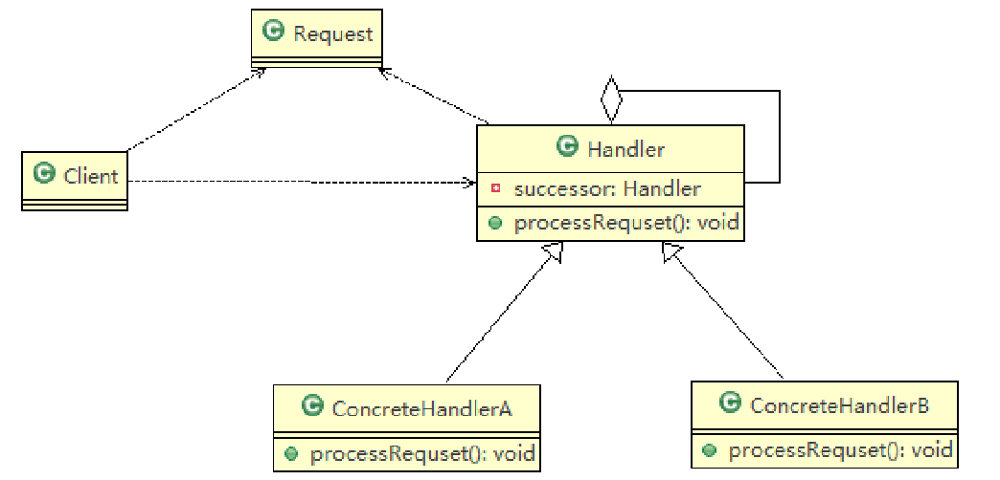
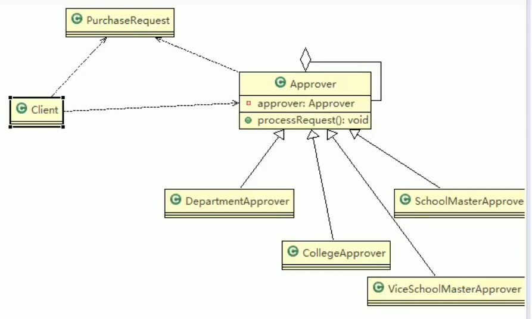
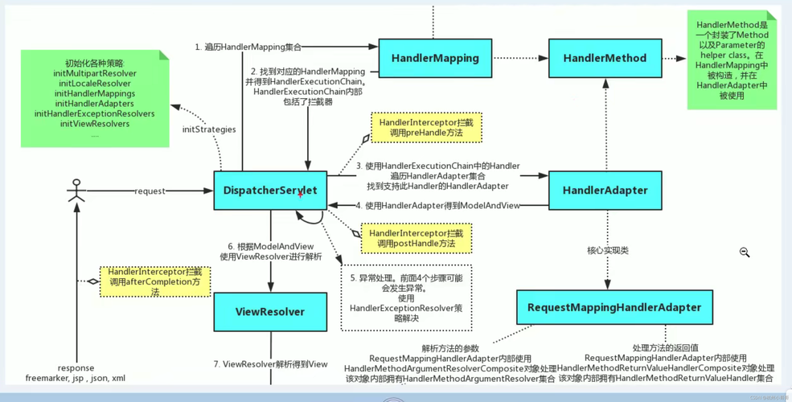

# 职责链模式

## OA系统采购审批项目

> 学校OA系统的采购审批项目：需求是
> 1) 采购员采购教学器材
> 2) 如果金额 小于等于5000, 由教学主任审批 （0<=x<=5000）
> 3) 如果金额 小于等于10000, 由院长审批 (5000<x<=10000)
> 4) 如果金额 小于等于30000, 由副校长审批 (10000<x<=30000)
> 5) 如果金额 超过30000以上，有校长审批 ( 30000<x)

### 传统方式问题

1) 传统方式是：接收到一个采购请求后，根据采购金额来调用对应的Approver (审批人)完成审批。
2) 传统方式的问题分析 : 客户端这里会使用到 分支判断(比如 switch) 来对不同的采购请求处理， 这样就存在如下问题 (1) 如果各个级别的人员审批金额发生变化，在客户端的也需要变化 (2) 客户端必须明确的知道 有多少个审批级别和访问
3) 这样 对一个采购请求进行处理 和 Approver (审批人) 就存在强耦合关系，不利于代码的扩展和维护
4) 解决方案 → 职责链模式

## 基本介绍

1) 职责链模式（Chain of Responsibility Pattern）,又叫 责任链模式，为请求创建了一个**接收者对象的链**(简单示意图)。这种模式对请求的发送者和接收者进行解耦。
2) 职责链模式通常每个接收者都包含对另一个接收者的引用。如果一个对象不能处理该请求，那么它会把相同的请求传给下一个接收者，依此类推。
3) 使多个对象都有机会处理请求，从而避免请求的发送者和接收者之间的耦合关系。将这个对象连成一条链，并沿着这条链传递该请求，直到有一个对象处理它为止.
4) 这种类型的设计模式属于行为型模式



> 1) Handler : 抽象的处理者, 定义了一个处理请求的接口, 同时含有另外Handler
> 2) ConcreteHandlerA , B 是具体的处理者, 处理它自己负责的请求， 可以访问它的后继者(即下一个处理者), 如果可以处理当前请求，则处理，否则就将该请求交个 后继者去处理，从而形成一个职责链
> 3) Request ， 含义很多属性，表示一个请求

## 职责链模式解决OA系统采购审批项目



```java
public abstract class Approver {

	Approver approver;  //下一个处理者
	String name; // 名字
	
	public Approver(String name) {
		// TODO Auto-generated constructor stub
		this.name = name;
	}

	//下一个处理者
	public void setApprover(Approver approver) {
		this.approver = approver;
	}
	
	//处理审批请求的方法，得到一个请求, 处理是子类完成，因此该方法做成抽象
	public abstract void processRequest(PurchaseRequest purchaseRequest);
}

public class CollegeApprover extends Approver {

	public CollegeApprover(String name) {
		// TODO Auto-generated constructor stub
		super(name);
	}
	
	@Override
	public void processRequest(PurchaseRequest purchaseRequest) {
		// TODO Auto-generated method stub
		if(purchaseRequest.getPrice() < 5000 && purchaseRequest.getPrice() <= 10000) {
			System.out.println(" 请求编号 id= " + purchaseRequest.getId() + " 被 " + this.name + " 处理");
		}else {
			approver.processRequest(purchaseRequest);
		}
	}
}

package com.atguigu.responsibilitychain;


//请求类
public class PurchaseRequest {

	private int type = 0; //请求类型
	private float price = 0.0f; //请求金额
	private int id = 0;
	//构造器
	public PurchaseRequest(int type, float price, int id) {
		this.type = type;
		this.price = price;
		this.id = id;
	}
	public int getType() {
		return type;
	}
	public float getPrice() {
		return price;
	}
	public int getId() {
		return id;
	}
}

public class Client {
	public static void main(String[] args) {
		// TODO Auto-generated method stub
		//创建一个请求
		PurchaseRequest purchaseRequest = new PurchaseRequest(1, 31000, 1);
		
		//创建相关的审批人
		DepartmentApprover departmentApprover = new DepartmentApprover("张主任");
		CollegeApprover collegeApprover = new CollegeApprover("李院长");
		ViceSchoolMasterApprover viceSchoolMasterApprover = new ViceSchoolMasterApprover("王副校");
		SchoolMasterApprover schoolMasterApprover = new SchoolMasterApprover("佟校长");
	
		//需要将各个审批级别的下一个设置好 (处理人构成环形: )
		departmentApprover.setApprover(collegeApprover);
		collegeApprover.setApprover(viceSchoolMasterApprover);
		viceSchoolMasterApprover.setApprover(schoolMasterApprover);
		schoolMasterApprover.setApprover(departmentApprover);
		
		departmentApprover.processRequest(purchaseRequest);
		viceSchoolMasterApprover.processRequest(purchaseRequest);
	}

}

```

# 职责链模式的注意事项和细节

1) 将请求和处理分开，实现解耦，提高系统的灵活性
2) 简化了对象，使对象不需要知道链的结构
3) 性能会受到影响，特别是在链比较长的时候，因此需控制链中最大节点数量，一般通过在Handler中设置一个最大节点数量，在setNext()方法中判断是否已经超过阀值，超过则不允许该链建立，避免出现超长链无意识地破坏系统性能
4) 调试不方便。采用了类似递归的方式，调试时逻辑可能比较复杂
5) 最佳应用场景：有多个对象可以处理同一个请求时，比如：多级请求、请假/加薪等审批流程、Java Web中Tomcat对Encoding的处理、拦截器

# ✅ SpringMVC 中的职责链模式应用



#### 1. **HandlerInterceptor 拦截器链**

SpringMVC 的拦截器机制就是典型的职责链：

- 你可以配置多个拦截器（实现 `HandlerInterceptor` 接口）
- SpringMVC 会按配置顺序依次执行它们：
  - `preHandle`：请求处理前
  - `postHandle`：请求处理后
  - `afterCompletion`：完成后（无论是否异常）

➡️ 这些拦截器被组织成一个链，由 **`HandlerExecutionChain`** 来维护：

```java
public class HandlerExecutionChain {
    private final Object handler;
    private HandlerInterceptor[] interceptors;
}
```

**工作流程：**

```plaintext
请求到达 DispatcherServlet
    ↓
找到对应的 Handler 和其关联的 Interceptor 链
    ↓
依次执行拦截器的 preHandle()
    ↓
执行 Handler（Controller 方法）
    ↓
依次执行拦截器的 postHandle()
    ↓
最终执行 afterCompletion()（用于资源释放等）
```

所以这里就形成了一个 典型的职责链模式结构：Interceptor1 -> Interceptor2 -> Interceptor3 -> Handler

每个拦截器都可以选择：

- 拦截（返回 false，终止链）
- 放行（返回 true，交由下一个处理者处理）

#### 2. **Filter 链（Servlet 层）**

虽然属于 Servlet 层，但在 Spring Boot 项目中常见。Filter 是按顺序执行的 Servlet 过滤器链，执行流程如下：

```
Filter1 -> Filter2 -> Filter3 -> DispatcherServlet -> ...
```

这也符合职责链模式，每个 Filter 决定是否继续调用 `chain.doFilter()`。

#### 3. **ExceptionResolver 链**

SpringMVC 中有多个 `HandlerExceptionResolver`：

- Spring会遍历所有配置的异常解析器，直到有一个能处理异常为止。
- 同样形成了一条异常处理链，也符合职责链模式。