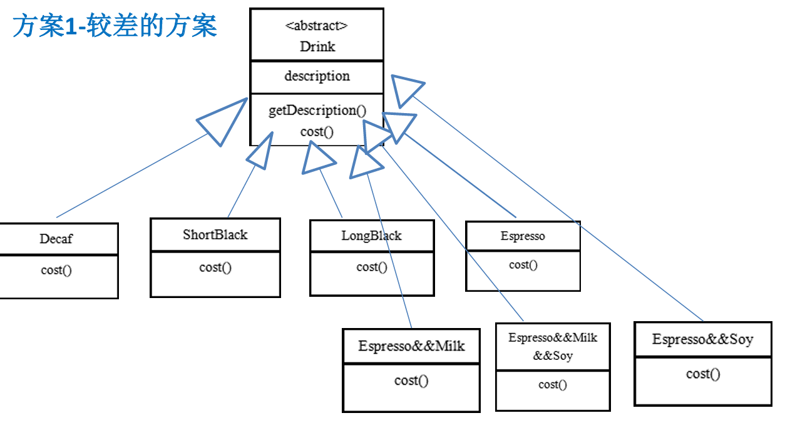
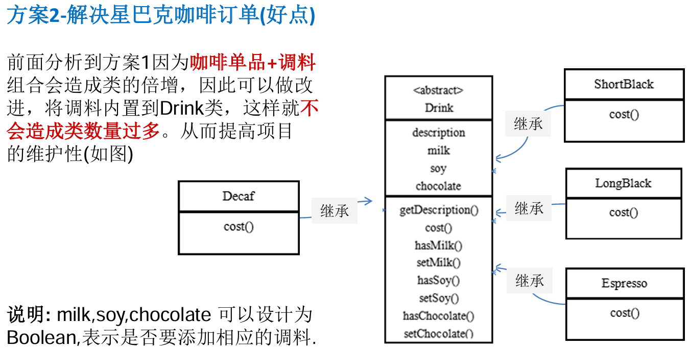
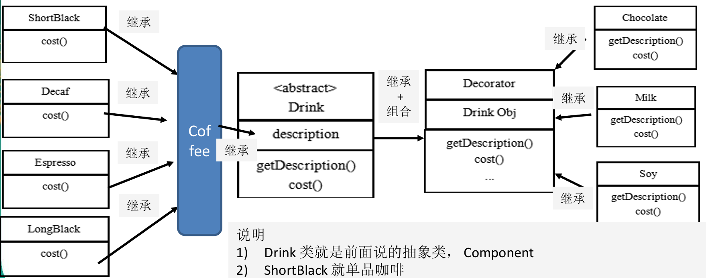
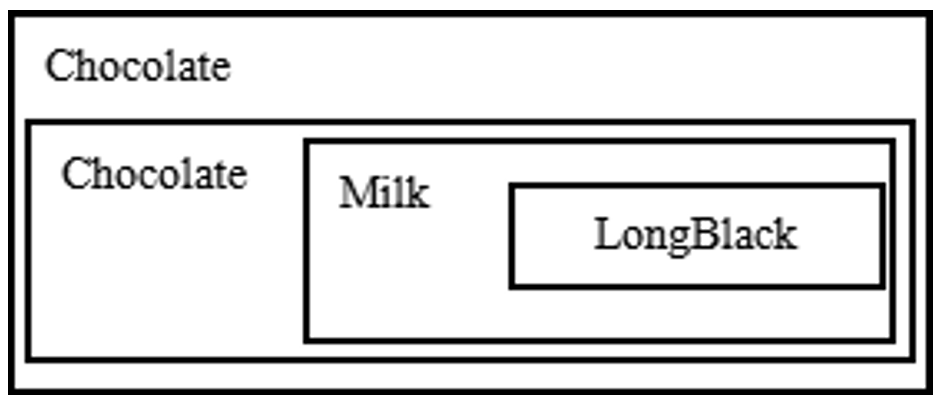
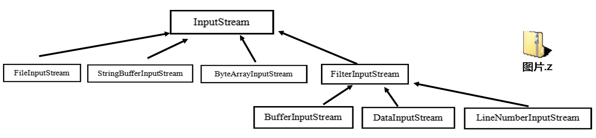

# 星巴克咖啡订单项目

## 方案1



> 1. Drink是一个抽象类，表示饮料
> 2. des就是对咖啡的描述，比如咖啡的名字
> 3. cost()方法就是计算费用，Drink类中做成一个抽象方法
> 4. Decaf就是单品咖啡，继承Drink,并实现cost
> 5. Espress&&Milk就是单品咖啡+调料，这个组合很多
> 6. 问题：这样设计，会有很多类，当我们增加一个单品咖啡，或者一个新的调料，类的数量就会倍增，就会出现类爆炸

## 方案2



> 1. 方案2可以控制类的数量，不至于造成很多的类
> 2. 在增加或者删除调料种类时，代码的维护量还是很大
> 3. 考虑到用户可以添加多份调料时，可以将hasMilk返回一个对应int
> 4. 考虑使用装饰者模式

## 装饰者模式

### 基本介绍

1. 装饰者模式：动态的将新功能附加到对象上。在对象功能扩展方面，它比继承更 有弹性，装饰者模式也体现了开闭原则(ocp)
2. 这里提到的动态的将新功能附加到对象和ocp原则，在后面的应用实例上会以代 码的形式体现，请同学们注意体会。

### 原理

装饰者模式就像打包一个快递 

主体：比如：陶瓷、衣服(Component) // 被装饰者 

包装：比如：报纸填充、塑料泡沫、纸板、木板(Decorator) 

Component 主体：比如类似前面的Drink

### 装饰者模式解决星巴克咖啡订单



> 1) Drink 类就是前面说的抽象类，Component
> 2)  ShortBlack 就单品咖啡 
> 3) Decorator 是一个装饰类，含有一个被装饰的对象(Drink obj)
> 4) Decorator 的cost 方法进行一个费用的叠加计算，递归的计算价格

**举例：**

装饰者模式下的订单：一份LongBlack+两份巧克力和一份牛奶



1) Milk包含了LongBlack
2) 一份Chocolate包含了(Milk+LongBlack)
3)  一份Chocolate包含了(Chocolate+Milk+LongBlack)
4) 这样不管是什么形式的单品咖啡+调料组合，通过递归方式可以方便的组合和维护。

### 代码

```java
public abstract class Drink {

	public String des; // 描述
	private float price = 0.0f;
	public String getDes() {
		return des;
	}
	public void setDes(String des) {
		this.des = des;
	}
	public float getPrice() {
		return price;
	}
	public void setPrice(float price) {
		this.price = price;
	}
	
	//计算费用的抽象方法
	//子类来实现
	public abstract float cost();
	
}

public class Coffee extends Drink {
	@Override
	public float cost() {
		// TODO Auto-generated method stub
		return super.getPrice();
	}
}

public class LongBlack extends Coffee {

	public LongBlack() {
		setDes(" longblack ");
		setPrice(5.0f);
	}
}


public class Decorator extends Drink {
	private Drink obj;
	
	public Decorator(Drink obj) { //组合
		// TODO Auto-generated constructor stub
		this.obj = obj;
	}
	
	@Override
	public float cost() {
		// TODO Auto-generated method stub
		// getPrice 自己价格
		return super.getPrice() + obj.cost();
	}
	
	@Override
	public String getDes() {
		// TODO Auto-generated method stub
		// obj.getDes() 输出被装饰者的信息
		return des + " " + getPrice() + " && " + obj.getDes();
	}
}


//具体的Decorator， 这里就是调味品
public class Chocolate extends Decorator {
	public Chocolate(Drink obj) {
		super(obj);
		setDes(" 巧克力 ");
		setPrice(3.0f); // 调味品 的价格
	}
}

```

```java
package com.atguigu.decorator;

public class CoffeeBar {

	public static void main(String[] args) {
		// TODO Auto-generated method stub
		// 装饰者模式下的订单：2份巧克力+一份牛奶的LongBlack

		// 1. 点一份 LongBlack
		Drink order = new LongBlack();
		System.out.println("费用1=" + order.cost());
		System.out.println("描述=" + order.getDes());

		// 2. order 加入一份牛奶
		order = new Milk(order);

		System.out.println("order 加入一份牛奶 费用 =" + order.cost());
		System.out.println("order 加入一份牛奶 描述 = " + order.getDes());

		// 3. order 加入一份巧克力

		order = new Chocolate(order);

		System.out.println("order 加入一份牛奶 加入一份巧克力  费用 =" + order.cost());
		System.out.println("order 加入一份牛奶 加入一份巧克力 描述 = " + order.getDes());

		// 3. order 加入一份巧克力

		order = new Chocolate(order);

		System.out.println("order 加入一份牛奶 加入2份巧克力   费用 =" + order.cost());
		System.out.println("order 加入一份牛奶 加入2份巧克力 描述 = " + order.getDes());
	
		System.out.println("===========================");
		
		Drink order2 = new DeCaf();
		
		System.out.println("order2 无因咖啡  费用 =" + order2.cost());
		System.out.println("order2 无因咖啡 描述 = " + order2.getDes());
		
		order2 = new Milk(order2);
		
		System.out.println("order2 无因咖啡 加入一份牛奶  费用 =" + order2.cost());
		System.out.println("order2 无因咖啡 加入一份牛奶 描述 = " + order2.getDes());

	
	}
}
```

# 装饰者模式在JDK应用的源码分析



> 1. public abstract class InputStream implements Closeable{} //是一个抽象类，即Component，`类似Drink`
>
> 2. FileInputStream时InputStream子类，`类似前面的Decaf，LongBlack`
>
> 3. public class FilterInputStream extends InputStream { //是一个装饰者类Decorator，`类似Decorator`
>
>    protected volatile InputStream in //被装饰的对象 } 
>
> 4. class DataInputStream extends FilterInputStream implements DataInput { //FilterInputStream 子类，`类似Chocolate`