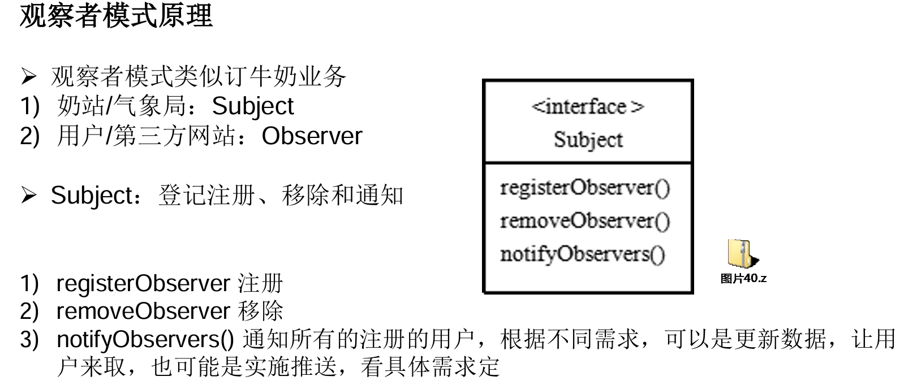
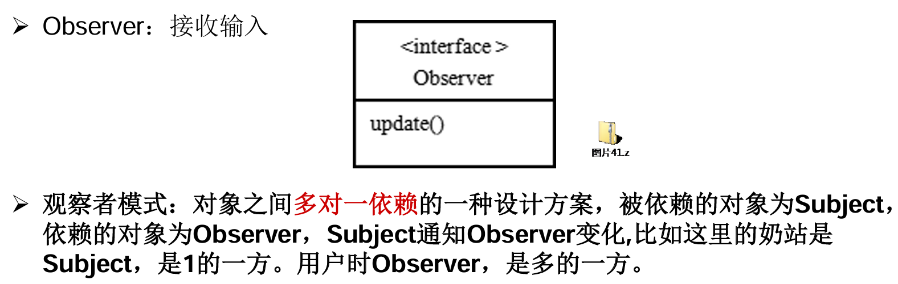
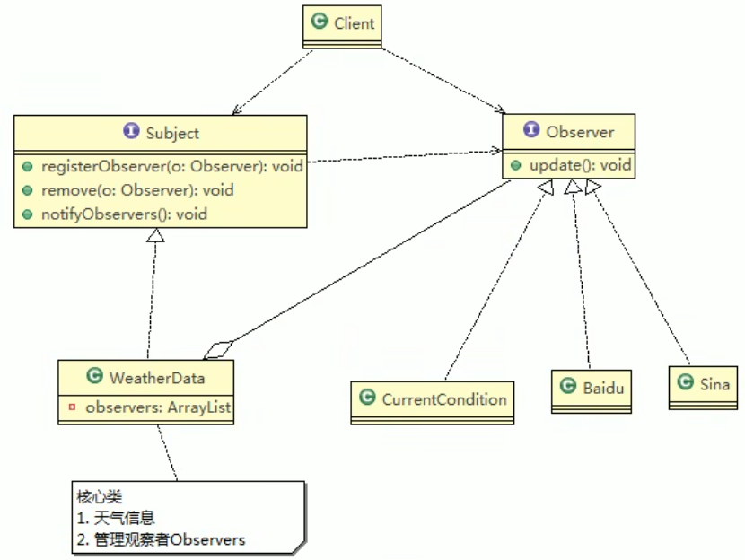

# 观察者模式

## 天气预报设计方案

>1. 通过getXxx方法，可以让第三方接入，并得到相关信息
>2. 当数据有更新时，气象站通过调用dataChange()去更新数据，当第三方再次获取数据时，就能得到最新数据，当然也可以推送。
>3. 推送：WeatherData里维护他管理的网站，调用其他网站的update()方法

- 缺点：无法在运行时动态的添加第三方，违反了OCP原则

## 观察者模式





## 观察者模式



```java
/**
 * 类是核心
 * 1. 包含最新的天气情况信息 
 * 2. 含有 观察者集合，使用ArrayList管理
 * 3. 当数据有更新时，就主动的调用   ArrayList, 通知所有的（接入方）就看到最新的信息
 * @author Administrator
 *
 */
public class WeatherData implements Subject {
	private float temperatrue;
	private float pressure;
	private float humidity;
	//观察者集合
	private ArrayList<Observer> observers;
	
	//加入新的第三方
	public WeatherData() {
		observers = new ArrayList<Observer>();
	}

	public float getTemperature() {
		return temperatrue;
	}

	public float getPressure() {
		return pressure;
	}

	public float getHumidity() {
		return humidity;
	}

	public void dataChange() {
		//调用 接入方的 update
		notifyObservers();
	}

	//当数据有更新时，就调用 setData
	public void setData(float temperature, float pressure, float humidity) {
		this.temperatrue = temperature;
		this.pressure = pressure;
		this.humidity = humidity;
		//调用dataChange， 将最新的信息 推送给 接入方 currentConditions
		dataChange();
	}

	//注册一个观察者
	@Override
	public void registerObserver(Observer o) {
		// TODO Auto-generated method stub
		observers.add(o);
	}

	//移除一个观察者
	@Override
	public void removeObserver(Observer o) {
		// TODO Auto-generated method stub
		if(observers.contains(o)) {
			observers.remove(o);
		}
	}

	//遍历所有的观察者，并通知
	@Override
	public void notifyObservers() {
		// TODO Auto-generated method stub
		for(int i = 0; i < observers.size(); i++) {
			observers.get(i).update(this.temperatrue, this.pressure, this.humidity);
		}
	}
}

public class BaiduSite implements Observer {

	// 温度，气压，湿度
	private float temperature;
	private float pressure;
	private float humidity;

	// 更新 天气情况，是由 WeatherData 来调用，我使用推送模式
	public void update(float temperature, float pressure, float humidity) {
		this.temperature = temperature;
		this.pressure = pressure;
		this.humidity = humidity;
		display();
	}

	// 显示
	public void display() {
		System.out.println("===百度网站====");
		System.out.println("***百度网站 气温 : " + temperature + "***");
		System.out.println("***百度网站 气压: " + pressure + "***");
		System.out.println("***百度网站 湿度: " + humidity + "***");
	}

}
```

# JDK的Observable类

1. Observable的作用和地位等价于Subject
2. Observable是类，而不是接口，类中已经实现了管理Observer的核心方法，add、delete、notify
3. Observer的作用和地位等价于Observer，有update
4. Observable 和 Observer 的使用方法和前面讲过的一样，只是Observable 是 类，通过继承来实现观察者模式