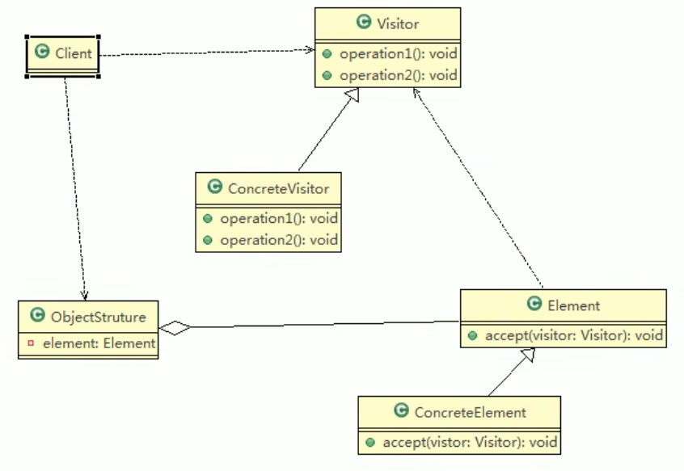
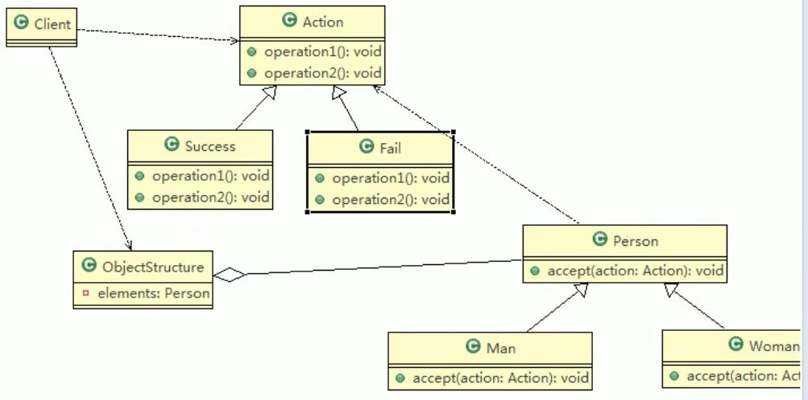

# 访问者模式

## 测评系统的需求

1. 将观众分为男人和女人，对歌手进行测评，当看完某个歌手表演后，得到他们对 该歌手不同的评价(评价有不同的种类，比如成功、失败等）
2. 如果系统比较小，还是ok的，但是考虑系统增加越来越多新的功能时，对代码改 动较大，违反了ocp原则，不利于维护
3. 扩展性不好，比如增加了新的人员类型，或者管理方法，都不好做

## 访问者模式基本介绍

1. 访问者模式，封装一些作用于某种数据结构的各元素的操作，它可以在不改变数据结构的前提下定义作用于这些元素的新的操作。
2. 主要将数据结构与数据操作分离，解决数据结构和操作耦合性的问题
3. 访问者模式的基本工作原理是：在被访问的类里面加一个对外提供接待访问者的接口
4. 访问者模式的主要应用场景是：需要对一个对象结构中的对象进行很多不同操作（这些操作彼此没有关联），同时需要避免让这些操作“污染”这些对象的类，可以选用访问者模式解决



> 1. Visitor是抽象访问者，为该对象结构中的ConcreteElement的每一个类声明一个visit操作
> 2. ConcreteVisitor：是一个具体的访问者，实现每个有Visitor声明的操作，是每个操作实现的部分
> 3. ObjectStructure能枚举它的元素，可以提供一个高层的接口，用来允许访问者访问元素
> 4. Element定义了一个accept方法，接收一个访问者对象
> 5. ConcreteElement为具体元素，实现了accept方法

## 访问者模式解决歌手打分问题



```java
package com.atguigu.visitor;

//说明
//1. 这里我们使用到了双分派, 即首先在客户端程序中，将具体状态作为参数传递Woman中(第一次分派)
//2. 然后Woman 类调用作为参数的 "具体方法" 中方法getWomanResult, 同时将自己(this)作为参数
//   传入，完成第二次的分派
public class Woman extends Person{
	@Override
	public void accept(Action action) {
		// TODO Auto-generated method stub
		action.getWomanResult(this);
	}
}


public class Success extends Action {
	@Override
	public void getManResult(Man man) {
		// TODO Auto-generated method stub
		System.out.println(" 男人给的评价该歌手很成功 !");
	}
    
	@Override
	public void getWomanResult(Woman woman) {
		// TODO Auto-generated method stub
		System.out.println(" 女人给的评价该歌手很成功 !");
	}
}


//数据结构，管理很多人（Man , Woman）
public class ObjectStructure {

	//维护了一个集合
	private List<Person> persons = new LinkedList<>();
	
	//增加到list
	public void attach(Person p) {
		persons.add(p);
	}
	//移除
	public void detach(Person p) {
		persons.remove(p);
	}
	
	//显示测评情况
	public void display(Action action) {
		for(Person p: persons) {
			p.accept(action);
		}
	}
}


public class Client {

	public static void main(String[] args) {
		// TODO Auto-generated method stub
		//创建ObjectStructure
		ObjectStructure objectStructure = new ObjectStructure();
		
		objectStructure.attach(new Man());
		objectStructure.attach(new Woman());
		
		//成功
		Success success = new Success();
		objectStructure.display(success);
		
		System.out.println("===============");
		Fail fail = new Fail();
		objectStructure.display(fail);
		
		System.out.println("=======给的是待定的测评========");
		
		Wait wait = new Wait();
		objectStructure.display(wait);
	}

}

```

## 双分派

- 所谓双分派是指不管类怎么变化，我们都能找到期望的方法运行。 双分派意味着得到执行的操作取决于请求的种类和两个接收者的类型
- 以上述实例为例，假设我们要添加一个Wait的状态类，考察Man类和Woman类的反 应，由于使用了双分派，只需增加一个Action子类即可在客户端调用即可，不 需要改动任何其他类的代码。
- **双分派（Double Dispatch）** 是指在**运行时**，方法的调用会根据 **接收者对象的实际类型** 和 **传入参数的实际类型** 来决定执行哪个具体的方法。
- 在 Java 这样的单分派语言中，**方法调用默认只根据接收者（this）的实际类型来确定执行的方法**，而双分派则额外考虑了参数的实际类型。

## 优缺点

### **1. 优点**

✅ **符合开闭原则**：不需要修改 `Employee`，就能添加新的操作，例如添加 `TaxCalculatorVisitor`（税收计算）。
 ✅ **适用于复杂数据结构**：如果数据结构不经常变化，但需要对其进行不同的操作，访问者模式很有用。
 ✅ **统一操作**：所有访问者的操作集中到 `Visitor` 类，符合单一职责原则，便于管理。

### **2. 缺点**

❌ **违反依赖倒置原则**：访问者依赖于具体的 `Element`，增加新 `Element` 类型时，需要修改所有 `Visitor`。
 ❌ **数据结构较稳定时适用**：如果 `Element` 结构变化频繁，访问者模式的维护成本较高。
 ❌ **双重分派**：访问者模式涉及**双重分派**（double dispatch），即运行时确定 `Element` 的具体类型，再调用对应的 `visit()` 方法，这可能影响性能。