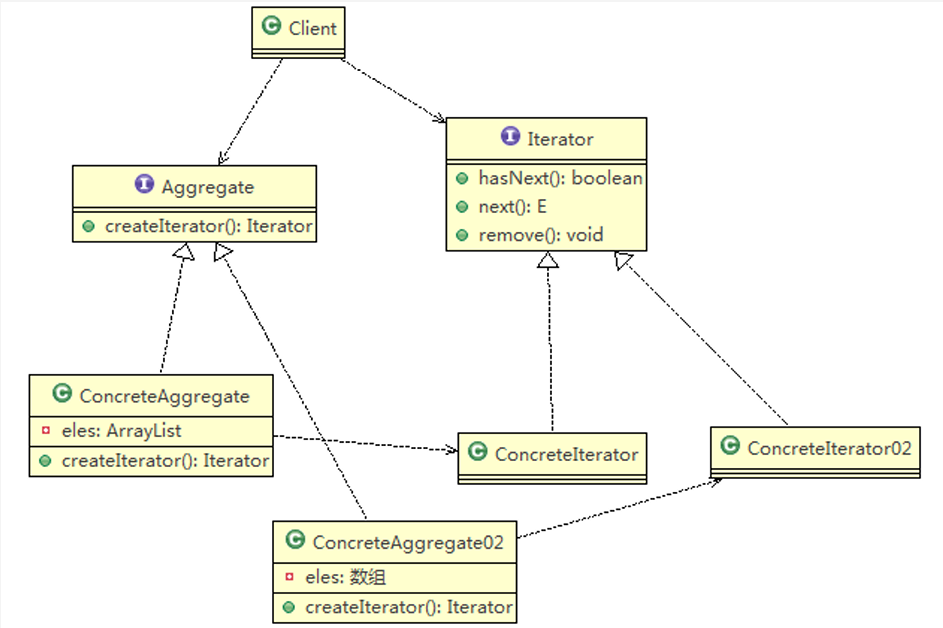
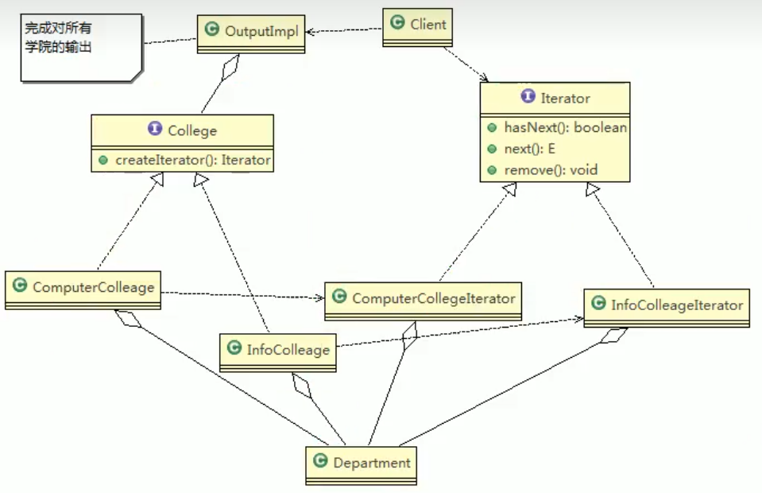
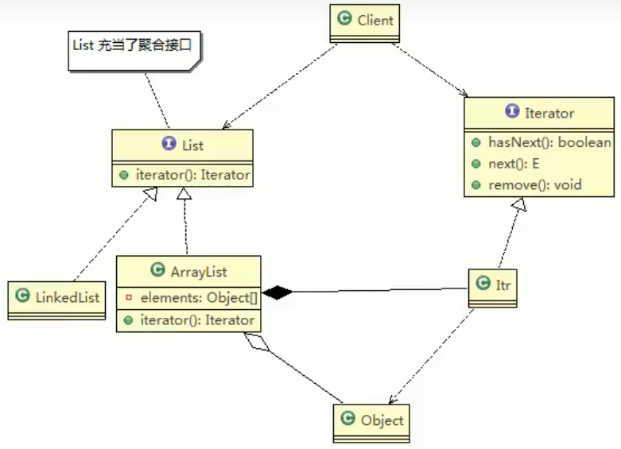

# 迭代器模式

## 基本介绍 

1. 迭代器模式（Iterator Pattern）是常用的设计模式，属于行为型模式 
2. 如果我们的集合元素是用不同的方式实现的，有数组，还有java的集合类， 或者还有其他方式，当客户端要遍历这些集合元素的时候就要使用多种遍历 方式，而且还会暴露元素的内部结构，可以考虑使用迭代器模式解决。 
3. 迭代器模式，提供一种遍历集合元素的统一接口，用一致的方法遍历集合元素， 不需要知道集合对象的底层表示，即：不暴露其内部的结构。



> Iterator：迭代器接口，是系统提供，含有hasNext，next,remove
>
> ConcreteIterator：具体的迭代器，管理迭代
>
> Aggregate：一个统一的混合聚合接口，将客户端和具体聚合解耦
>
> ConcreteAggregate：具体的聚合持有对象集合，并提供一个方法，返回一个迭代器，该迭代器可以正确遍历集合
>
> Client：客户端，通过Iterator和Aggregate依赖子类

## 迭代器实例



```java
package com.atguigu.iterator;

import java.util.Iterator;


public class ComputerCollegeIterator implements Iterator {

	//这里我们需要Department 是以怎样的方式存放=>数组
	Department[] departments;
	int position = 0; //遍历的位置
	
	public ComputerCollegeIterator(Department[] departments) {
		this.departments = departments;
	}

	//判断是否还有下一个元素
	@Override
	public boolean hasNext() {
		// TODO Auto-generated method stub
		if(position >= departments.length || departments[position] == null) {
			return false;
		}else {
		
			return true;
		}
	}

	@Override
	public Object next() {
		// TODO Auto-generated method stub
		Department department = departments[position];
		position += 1;
		return department;
	}
	
	//删除的方法，默认空实现
	public void remove() {
		
	}
}


public class OutPutImpl {
	
	//学院集合
	List<College> collegeList;

	public OutPutImpl(List<College> collegeList) {
		this.collegeList = collegeList;
	}
	//遍历所有学院,然后调用printDepartment 输出各个学院的系
	public void printCollege() {
		
		//从collegeList 取出所有学院, Java 中的 List 已经实现Iterator
		Iterator<College> iterator = collegeList.iterator();
		
		while(iterator.hasNext()) {
			//取出一个学院
			College college = iterator.next();
			System.out.println("=== "+college.getName() +"=====" );
			printDepartment(college.createIterator()); //得到对应迭代器
		}
	}
	
	//输出 学院输出 系
	public void printDepartment(Iterator iterator) {
		while(iterator.hasNext()) {
			Department d = (Department)iterator.next();
			System.out.println(d.getName());
		}
	}
}
```

# JDK源码分析



>1. 内部类Itr充当具体实现迭代器Iterator的类，作为ArrayList内部类
>2. List就是充当了聚合接口，含有一个iterator()方法，返回一个迭代器对象
>3. ArrayList实现聚合接口List的子类，实现了iterator()
>4. Iterator接口系统提供
>5. 迭代器模式解决了不同集合（ArrayList，LinkedList）统一遍历问题

# 迭代器模式的注意事项和细节

## 优点

1. 提供一个统一的方法遍历对象，客户不用再考虑聚合的类型，使用一种方法就可以 遍历对象了。
2. 隐藏了聚合的内部结构，客户端要遍历聚合的时候只能取到迭代器，而不会知道聚 合的具体组成。 
3. 提供了一种设计思想，就是一个类应该只有一个引起变化的原因（叫做单一责任 原则）。在聚合类中，我们把迭代器分开，就是要把管理对象集合和遍历对象集 合的责任分开，这样一来集合改变的话，只影响到聚合对象。而如果遍历方式改变 的话，只影响到了迭代器。 
4. 当要展示一组相似对象，或者遍历一组相同对象时使用, 适合使用迭代器模式

## 缺点

- 每个聚合对象都要一个迭代器，会生成多个迭代器不好管理
