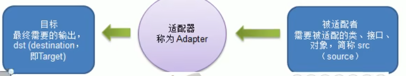
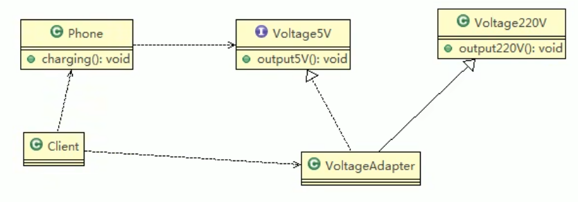
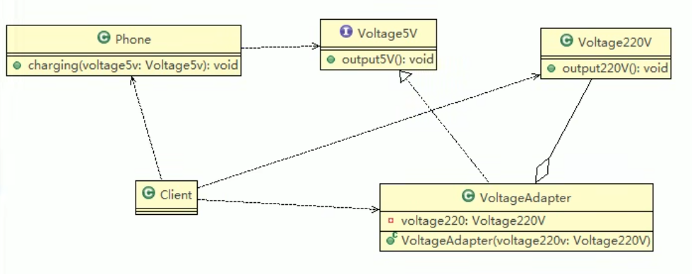
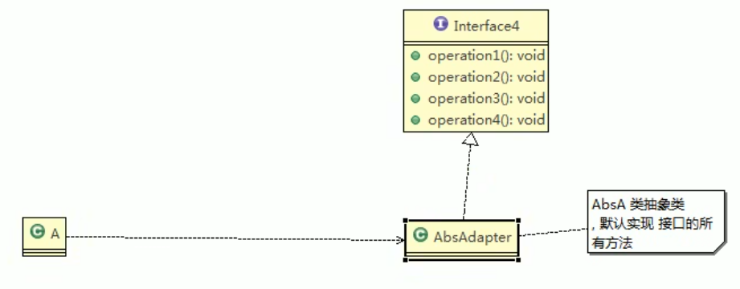
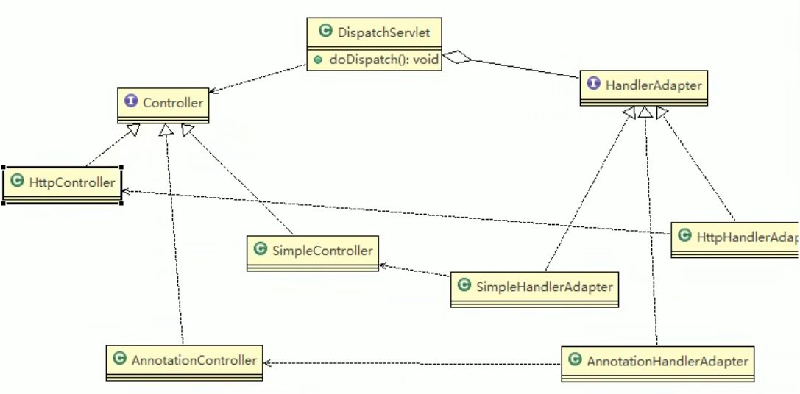

# 适配器模式

## 基本介绍

1. 适配器模式将某个类的接口转换成客户端期望的另一个接口表示，主的目的是兼容性，让原本因接口不匹配不能一起工作的两个类可以协同工作。其别名为包装器（Wrapper）
2. 适配器模式属于结构型模式
3. 主要分为三类：类适配器模式、对象适配器模式，接口适配器模式

## 工作原理

1. 将一个类的接口转换成另一种接口，让原本接口不兼容的类可以兼容
2. 从用户的角度看不到的适配者，是解耦的。
3. 用户→适配器→目标接口



## 类适配器（把src当类，继承）

- Adapter类，通过继承src类，实现dst类的接口，完成src→dst的适配。



```java
public class VoltageAdapter2 extends Voltage220 implements Voltage5{
}
```


- Java是单继承机制，所以类适配器需要继承src类这一点算是一个缺点，因为这要求dst必须是接口，有一定局限性
- src类的方法在Adapter种都会暴露出来，也增加了使用的成本
- 由于其继承了src类，所以它可以根据需求重写src类的方法，使得Adapter的灵活性增强了。

## 对象适配器（把src当对象，持有）

- 基本思路和类的适配器模式相同，只是将Adapter类作修改，不是继承src类，而是持有src类的实例，以解决兼容性的问题。即：持有src类，实现dst类的接口，完成适配
- 根据合成复用原则，在系统中尽量使用关联关系来替代继承关系
- 对象适配器模式是适配器模式常用的一种。



```java
public class VoltageAdapter2 implements Voltage5{
    private Voltage220 voltage220; //持有Voltage220对象，而不是继承
}
```

- 对象适配器解决了类适配器必须是接口的问题

## 接口适配器模式（把src当接口，实现）

- 一些书籍称为：适配器模式或缺省适配器模式
- 当不需要全部实现接口提供的方法时，可先设计一个抽象类实现接口，并为该接口中每个方法提供一个默认实现（空方法），那么该抽象类的子类可有选择的覆盖父类的某些方法来实现需求
- 适用于一个接口不想使用其所有的方法的情况

 

```java
//在AbsAdapter 我们将 Interface4 的方法进行默认实现
public abstract class AbsAdapter implements Interface4 {

	//默认实现
	public void m1() {

	}

	public void m2() {

	}

	public void m3() {

	}

	public void m4() {

	}
}

public class Client {
	public static void main(String[] args) {
		
		AbsAdapter absAdapter = new AbsAdapter() {
			//只需要去覆盖我们 需要使用 接口方法
			@Override
			public void m1() {
				// TODO Auto-generated method stub
				System.out.println("使用了m1的方法");
			}
		};
		
		absAdapter.m1();
	}
}

```

## SpringMVC框架

- SprinvMVC中的HandlerAdapter就使用了适配器模式

```java
//DispatcherServlet类中的doDispatch方法
mappedHandler = getHandler(processedRequest);
if (mappedHandler == null) {
    noHandlerFound(processedRequest, response);
    return;
}

// Determine handler adapter for the current request.
HandlerAdapter ha = getHandlerAdapter(mappedHandler.getHandler());
```

```java
//找到适合对应的Adapter
protected HandlerAdapter getHandlerAdapter(Object handler) throws ServletException {
		if (this.handlerAdapters != null) {
			for (HandlerAdapter adapter : this.handlerAdapters) {
				if (adapter.supports(handler)) {
					return adapter;
				}
			}
		}
		throw new ServletException("No adapter for handler [" + handler +
				"]: The DispatcherServlet configuration needs to include a HandlerAdapter that supports this handler");
	}
```

```java
// Actually invoke the handler.
// 通过适配器执行handle
mv = ha.handle(processedRequest, response, mappedHandler.getHandler());
```

