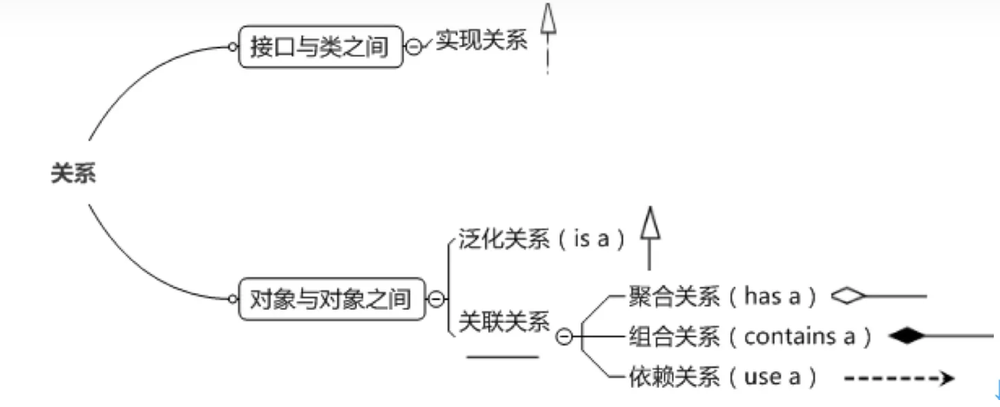

# UML基本介绍

- UML（统一建模语言）

  

## UML图分类

1. 用例图
2. 静态结构图：类图、对象图、包图、组件图、部署图
3. 动态行为图：交互图（时序图与协作图）、状态图、活动图

# UML类图

## 类图

- 用于描述系统中类本身的组成和类之间的各种静态关系
- 类之间的关系：依赖、泛化（继承）、实现、聚合、组合

## 类图——依赖关系

- 只要是在类中用到了对方，那么他们之间就存在依赖关系。如果没有对方，连编译都通过不了。

```java
public class PersonServiceBean {
    private PersonDao personDao;

    public void save(Person person) {
        personDao.save(person);
    }
    
    class PersonDao {
        public void save(Person person) {
            System.out.println("Person saved!");
        }
    }
    
    class Person {
        private String name;
        private int age;
    }
}

```

> 依赖关系：类中用到了对方；如果是类的成员属性；如果是方法的返回类型；是方法接收的参数类型；方法中使用到

## 类图——泛化关系

- 泛化关系实际上就是继承关系，是依赖关系的特例
- 箭头指向父类

## 类图——实现关系

- 实现关系实际上就是A类实现B类，也是依赖关系的特例。
- 箭头指向接口

## 类图——关联关系

- 关联关系实际上就是类鱼类之间的联系，也是依赖关系的特例
- 关联具有导航性：即双向关系或单向关系
- 一个类的成员变量包含另一个类，两者构成基本关联关系

## 类图——聚合关系（Aggregation）

- 聚合关系表示的是整体和部分的关系，整体与部分可以分开。聚合关系是关联关系的特例，所以它具有关联的导航性与多重性。

```java
public class Computer{
    private Mouse mouse;
    private Monitor monitor;
    
    public void setMouse(Mouse mouse){
        this.mouse = mouse;
    }
    
    public void setMonitor(Monitor monitor){
        this.monitor = monitor;
    }
}
```

- 空心菱形从Mouse指向Computer。

## 类图——组合关系

- 如果我们认为Mouse和Computer是不可分割的，则升级为组合关系
- 如果在程序中Computer实体定义了对Mouse进行级联删除，即删除Computer时联通Mouse一起删除，那么两者也是组合关系

```java
public class Computer{
    private Mouse mouse = new Mouse();
    private Monitor monitor = new Monitor();
}
```

- 实心菱形从Mouse指向Computer。
