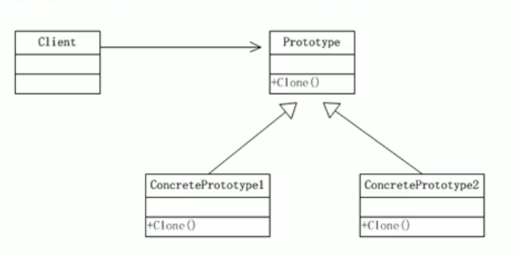

# 原型模式

## 克隆羊的问题

```java
@Data
public class Sheep implements Cloneable{
    private String name;
    private int age;
    private String color;
    
    public Sheep(String name, int age, String color){
        this.name = name;
        this.age = age;
        this.color = color;
    }
    
    //克隆该实例，使用默认的clone方法来完成
    @Override
    protected Object clone() throws CloneNotSupportedExcepotion{
        Sheep sheep = null;
        sheep = (Sheep)super.clone();
        return sheep
    }
}

public class Client{
    public static void main(String[] args){
        Sheep sheep = new Sheep("tom", 1, "白色");
        Sheep sheep1 = (Sheep)sheep.clone();
    }
}
```

## 基本介绍

- 原型模式是指：用原型实例指定创建对象的种类，并且通过拷贝这些原型，创建新的对象
- 原型模式是一种创建型设计模式，允许一个对象再创建另一个可定制的对象，无需知道如何创建的细节
- 工作原理是：通过将一个原型对象传给那个要发动创建的对象，这个要发动创建的对象通过请求原型对象拷贝他们自己来实施创建，即`对象.clone()`



> Prototype：原型类，声明一个克隆自己的接口
>
> ConcretePrototype：具体的原型类，实现克隆自己的操作
>
> Client：让一个原型对象克隆自己，从而创建一个新的对象（属性一样）

## 原型模式的注意事项和细节

- 创建对象比较复杂时，可以利用原型模式简化对象的创建过程，同时也能够提高效率
- 不用重新初始化对象，而是动态地获得对象运行时的状态
- 如果原始对象发生变化（增加或减少属性），其它克隆对象也会发生相应变化，无需修改代码
- 在实现深克隆的时候可能需要比较复杂的代码
- 缺点：需要为每一个类配备一个克隆方法，这对全新的类来说不是很难，但对已有的类进行改造时，需要修改其源代码，违背了OCP原则

# 深拷贝和浅拷贝

## 浅拷贝

- 对于数据类型是基本数据类型的成员变量，浅拷贝会直接进行值传递，也就是将该属性值复制一份给新的对象。
- 对于数据类型是引用数据类型的成员变量，比如说成员变量是某个数组、某个类的对象等，那么浅拷贝会进行引用传递，也就是只是将该成员变量的引用值（内存地址）复制一份给新的对象。因为实际上两个对象的该成员变量都指向同一个实例。在这种情况下，在一个对象中修改该成员变量会影响到另一个对象的该成员变量值。
- 浅拷贝时使用默认的clone()方法来实现`sheep=(Sheep)super.clone();`

## 深拷贝

- 复制对象的所有基本数据类型的成员变量值
- 为所有引用数据类型的成员变量申请内存空间，并复制每个引用数据类型成员变量所引用的对象，直到该对象可达的所有对象。也就是说，对象进行深拷贝要对整个对象进行拷贝
- 深拷贝实现方式1：重写clone方法来实现深拷贝
- 深拷贝实现方式2：通过对象序列化来实现深拷贝

```java
@Data
public class Sheep implements Serializable, Cloneable{
    private String name;
    private int age;
    private String color;
    private Sheep firend;
    
    public Sheep(String name, int age, String color){
        this.name = name;
        this.age = age;
        this.color = color;
    }
    
    //深拷贝 - 方式1使用clone方法
    @Override
    protected Object clone() throws CloneNotSupportedExcepotion{
        Sheep sheep = null;
        //这里完成对基本数据类型（属性）和String的克隆
        sheep = (Sheep)super.clone();
        //对引用类型的属性进行单独处理
        sheep.firend = (Sheep)sheep.clone();
        return sheep
    }
    
    //深拷贝 - 方式2通过对象的序列化实现（推荐）
    public Object deepCLone() {
        ByteArrayOutputStream bos = null;
        ObjectOutputStream oos = null;
        ByteArrayInputStream bis = null;
        ObjectInputStream ois = null;
        try{
            //序列化
            bos = new ByteArrayOutputStream();
            oos = new ObjectOutputStream(bos);
            oos.writeObject(this); //当前这个对象以对象流的方式输出
            
            //反序列化
            bis = new ByteArrayInputStream(bos.toByteArray());
            ois = new ObjectInputStream(bis);
            Sheep sheep = (Sheep) ois.readObject();
            return sheep
        }catch (Exception e){
            e.printStackTrace();
            return null;
        }finally{
            try{
                bos.close();
                oos.close();
                bis.close();
                ois.close();
            }catch (Exception e2){
                 e.printStackTrace();
            	return null;
            }
        }
    }
}
```

# 原型模式在Spring框架中的使用

- Spring中原型bean的创建。如下中的prototype表示原型模式。

```xml
<bean id="id1" class="com.org.Monster" scope="prototype"/>
```