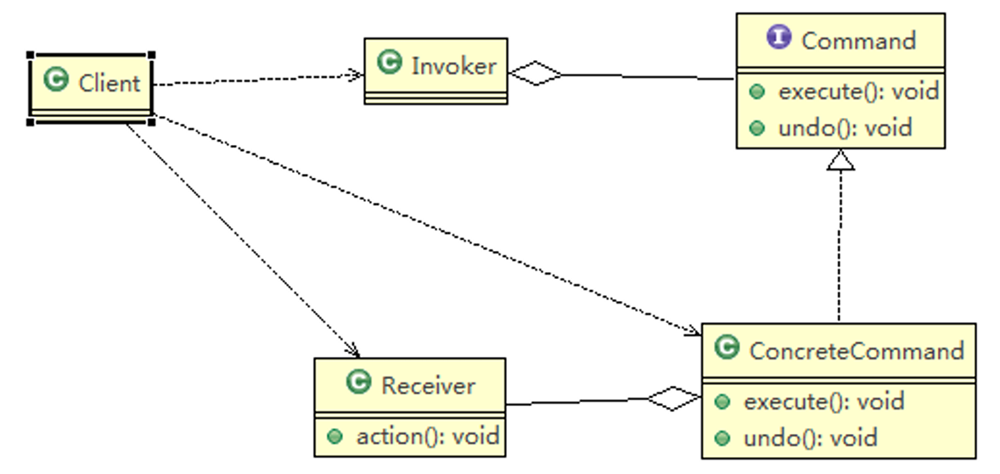
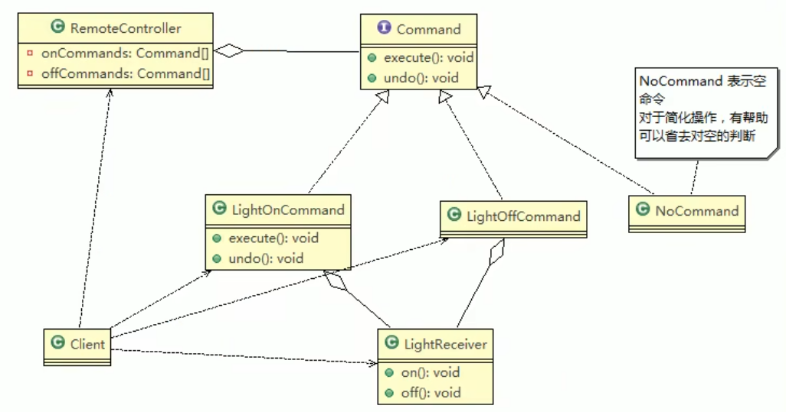

# 命令模式

## 基本介绍

1) 命令模式（Command Pattern）：在软件设计中，我们经常需要 向某些对象发送请求，但是并不知道请求的接收者是谁，也不知 道被请求的操作是哪个， 我们只需在程序运行时指定具体的请求接收者即可，此时，可以 使用命令模式来进行设计 
2) 命名模式使得请求发送者与请求接收者消除彼此之间的耦合，让 对象之间的调用关系更加灵活，实现解耦。 
3) 在命名模式中，会将一个请求封装为一个对象，以便使用不同参 数来表示不同的请求(即命名)，同时命令模式也支持可撤销的操作。 
4) 通俗易懂的理解：将军发布命令，士兵去执行。其中有几个角色： 将军（命令发布者）、士兵（命令的具体执行者）、命令(连接将 军和士兵)。
5)  Invoker是调用者（将军），Receiver是被调用者（士兵）， MyCommand是命令，实现了Command接口，持有接收对象



> 1. Invoker 是调用者角色
> 2. Command：是命令角色，需要执行的所有命令都在这里，可以是接口或抽象类
> 3. Receiver：接收者角色，知道如何实施和执行一个请求相关的操作
> 4. ConcreteCommand：将一个接收者对象与一个动作绑定，调用接受者相应的操作，实现execute.

## 命令模式解决智能生活项目



```java
public class LightOnCommand implements Command {

	//聚合LightReceiver
	
	LightReceiver light;
	
	//构造器
	public LightOnCommand(LightReceiver light) {
		super();
		this.light = light;
	}
	
	@Override
	public void execute() {
		// TODO Auto-generated method stub
		//调用接收者的方法
		light.on();
	}

	

	@Override
	public void undo() {
		// TODO Auto-generated method stub
		//调用接收者的方法
		light.off();
	}
}

public class RemoteController {

	// 开 按钮的命令数组
	Command[] onCommands;
	Command[] offCommands;

	// 执行撤销的命令
	Command undoCommand;

	// 构造器，完成对按钮初始化

	public RemoteController() {

		onCommands = new Command[5];
		offCommands = new Command[5];

		for (int i = 0; i < 5; i++) {
			onCommands[i] = new NoCommand();
			offCommands[i] = new NoCommand();
		}
	}

	// 给我们的按钮设置你需要的命令
	public void setCommand(int no, Command onCommand, Command offCommand) {
		onCommands[no] = onCommand;
		offCommands[no] = offCommand;
	}

	// 按下开按钮
	public void onButtonWasPushed(int no) { // no 0
		// 找到你按下的开的按钮， 并调用对应方法
		onCommands[no].execute();
		// 记录这次的操作，用于撤销
		undoCommand = onCommands[no];

	}

	// 按下开按钮
	public void offButtonWasPushed(int no) { // no 0
		// 找到你按下的关的按钮， 并调用对应方法
		offCommands[no].execute();
		// 记录这次的操作，用于撤销
		undoCommand = offCommands[no];

	}
	
	// 按下撤销按钮
	public void undoButtonWasPushed() {
		undoCommand.undo();
	}

}
```

# JdbcTemplate

- StatementCallback 接口 ,类似命令接口(Command)
- class QueryStatementCallback implements StatementCallback, SqlProvider , 匿名内部类，实现了命令接口，同时也充当命令接收者
- 命令调用者是JdbcTemplate , 其中execute(StatementCallback action) 方法中，调 用action.doInStatement 方法.  不同的 实现 StatementCallback 接口的对象，对应不同 的doInStatemnt 实现逻辑
- 另外实现 StatementCallback 命令接口的子类还有 QueryStatementCallback

# 命令模式的注意事项和细节 

1. 将发起请求的对象与执行请求的对象解耦。发起请求的对象是调用者，调用者只要 调用命令对象的execute()方法就可以让接收者工作，而不必知道具体的接收者对 象是谁、是如何实现的，命令对象会负责让接收者执行请求的动作，也就是说：” 请求发起者”和“请求执行者”之间的解耦是通过命令对象实现的，命令对象起到 了纽带桥梁的作用。 
2. 容易设计一个命令队列。只要把命令对象放到列队，就可以多线程的执行命令 
3. 容易实现对请求的撤销和重做 
4. 命令模式不足：可能导致某些系统有过多的具体命令类，增加了系统的复杂度，这 点在在使用的时候要注意 
5. 空命令也是一种设计模式，它为我们省去了判空的操作。在上面的实例中，如果没 有用空命令，我们每按下一个按键都要判空，这给我们编码带来一定的麻烦。 
6.  命令模式经典的应用场景：界面的一个按钮都是一条命令、模拟CMD（DOS命令） 订单的撤销/恢复、触发-反馈机制