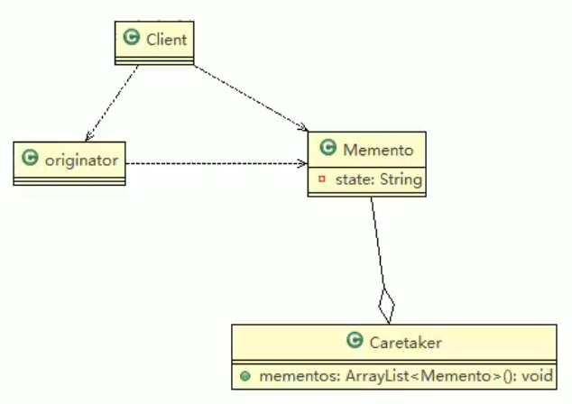

# 备忘录模式

## 基本介绍

1) 备忘录模式（Memento Pattern）在不破坏封装性的前提下，捕获一个对象的内部状态，并在该对象之外保存这个状态。这样以后就可将该对象恢复到原先保
存的状态
2) 可以这里理解备忘录模式：现实生活中的备忘录是用来记录某些要去做的事情，或者是记录已经达成的共同意见的事情，以防忘记了。而在软件层面，备忘录模式有着相同的含义，备忘录对象主要用来记录一个对象的某种状态，或者某些数据，当要做回退时，可以从备忘录对象里获取原来的数据进行恢复操作
3) 备忘录模式属于行为型模式



>1) originator : 对象(需要保存状态的对象)
>2) Memento ： 备忘录对象,负责保存好记录，即Originator内部状态
>3) Caretaker: 守护者对象,负责保存多个备忘录对象， 使用集合管理，提高效率
>4) 说明：如果希望保存多个originator对象的不同时间的状态，也可以，只需要要 HashMap <String, 集合>

```java
public class Originator {

	private String state;//状态信息

	public String getState() {
		return state;
	}

	public void setState(String state) {
		this.state = state;
	}
	
	//编写一个方法，可以保存一个状态对象 Memento
	//因此编写一个方法，返回 Memento
	public Memento saveStateMemento() {
		return new Memento(state);
	}
	
	//通过备忘录对象，恢复状态
	public void getStateFromMemento(Memento memento) {
		state = memento.getState();
	}
}


public class Memento {
	private String state;

	//构造器
	public Memento(String state) {
		super();
		this.state = state;
	}

	public String getState() {
		return state;
	}	
}


public class Caretaker {
	
	//在List 集合中会有很多的备忘录对象
	private List<Memento> mementoList = new ArrayList<Memento>();
	
	public void add(Memento memento) {
		mementoList.add(memento);
	}
	
	//获取到第index个Originator 的 备忘录对象(即保存状态)
	public Memento get(int index) {
		return mementoList.get(index);
	}
}


public class Client {

	public static void main(String[] args) {
		// TODO Auto-generated method stub
		
		Originator originator = new Originator();
		Caretaker caretaker = new Caretaker();
		
		originator.setState(" 状态#1 攻击力 100 ");
		
		//保存了当前的状态
		caretaker.add(originator.saveStateMemento());
		
		originator.setState(" 状态#2 攻击力 80 ");
		
		caretaker.add(originator.saveStateMemento());
		
		originator.setState(" 状态#3 攻击力 50 ");
		caretaker.add(originator.saveStateMemento());
		
		
		
		System.out.println("当前的状态是 =" + originator.getState());
		
		//希望得到状态 1, 将 originator 恢复到状态1
		
		originator.getStateFromMemento(caretaker.get(0));
		System.out.println("恢复到状态1 , 当前的状态是");
		System.out.println("当前的状态是 =" + originator.getState());
	}

}

```

# 备忘录模式的注意事项和细节

1) 给用户提供了一种可以恢复状态的机制，可以使用户能够比较方便地回到某个历史的状态
2) 实现了信息的封装，使得用户不需要关心状态的保存细节
3) 如果类的成员变量过多，势必会占用比较大的资源，而且每一次保存都会消耗一定的内存, 这个需要注意
4) 适用的应用场景：1、后悔药。 2、打游戏时的存档。 3、Windows 里的 ctri + z。4、IE 中的后退。 4、数据库的事务管理
5) 为了节约内存，备忘录模式可以和原型模式配合使用