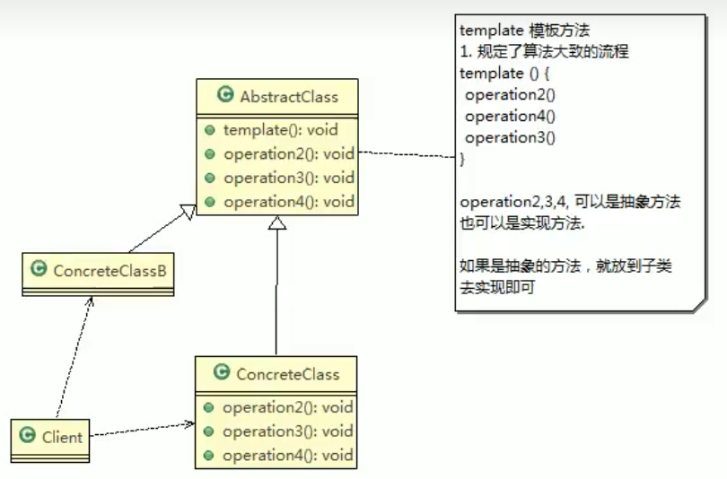
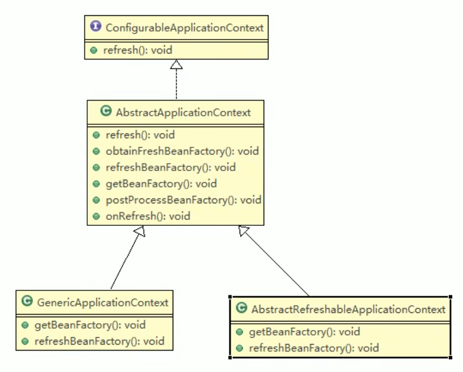

# 模板方法模式

## 基本介绍

1. 模板方法模式，又叫模板模式，在一个抽象类公开定义了执行它的方法的模板。它的子类可以按需要重写方法实现，但调用将以抽象类中定义的方式进行。
2. 简单说，模板方法模式定义一个操作中的算法的骨架，而将一些步骤延迟到子类中，使得子类可以不改变一个算法的结构，就可以重定义该算法的某些特定步骤。
3. 这种类型的设计模式属于行为型模式



> 1. AbstractClass抽象类，类中实现了模板方法，定义了算法的骨架，具体子类需要去实现其它的抽象方法operation2,3,4
> 2. ConcreteClass实现了抽象方法operation2,3,4，以完成算法中特定子类的步骤

## 模板方法模式解决豆浆制作问题

```java
//抽象类，表示豆浆
public abstract class SoyaMilk {

	//模板方法, make , 模板方法可以做成final , 不让子类去覆盖.
	final void make() {
		
		select(); 
		addCondiments();
		soak();
		beat();
		
	}
	
	//选材料
	void select() {
		System.out.println("第一步：选择好的新鲜黄豆  ");
	}
	
	//添加不同的配料， 抽象方法, 子类具体实现
	abstract void addCondiments();
	
	//浸泡
	void soak() {
		System.out.println("第三步， 黄豆和配料开始浸泡， 需要3小时 ");
	}
	 
	void beat() {
		System.out.println("第四步：黄豆和配料放到豆浆机去打碎  ");
	}
}

```

### 钩子方法

```java
//抽象类，表示豆浆
public abstract class SoyaMilk {

	//模板方法, make , 模板方法可以做成final , 不让子类去覆盖.
	final void make() {
		
		select(); 
		if(customerWantCondiments()) {
			addCondiments();
		}
		soak();
		beat();
		
	}
	
	//选材料
	void select() {
		System.out.println("第一步：选择好的新鲜黄豆  ");
	}
	
	//添加不同的配料， 抽象方法, 子类具体实现
	abstract void addCondiments();
	
	//浸泡
	void soak() {
		System.out.println("第三步， 黄豆和配料开始浸泡， 需要3小时 ");
	}
	 
	void beat() {
		System.out.println("第四步：黄豆和配料放到豆浆机去打碎  ");
	}
	
	//钩子方法，决定是否需要添加配料
	boolean customerWantCondiments() {
		return true;
	}
}

```

# IOC源码

### SpringIOC容器初始化

> refresh就是模板方法



# 注意事项

1. 基本思想是：算法只存在于一个地方，也就是在父类中，容易修改。需要修改算 法时，只要修改父类的模板方法或者已经实现的某些步骤，子类就会继承这些修改 
2. 实现了最大化代码复用。父类的模板方法和已实现的某些步骤会被子类继承而直接 使用。 
3. 既统一了算法，也提供了很大的灵活性。父类的模板方法确保了算法的结构保持不 变，同时由子类提供部分步骤的实现。
4. 该模式的不足之处：每一个不同的实现都需要一个子类实现，导致类的个数增加， 使得系统更加庞大 
5. 一般模板方法都加上final关键字，防止子类重写模板方法. 
6. 模板方法模式使用场景：当要完成在某个过程，该过程要执行一系列步骤，这一 系列的步骤基本相同，但其个别步骤在实现时可能不同，通常考虑用模板方法模 式来处理