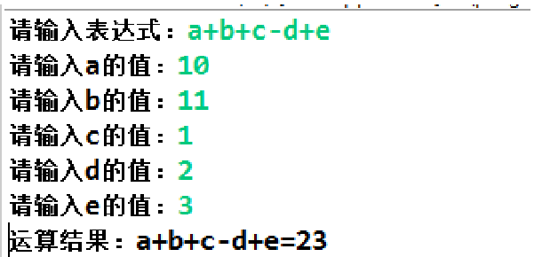
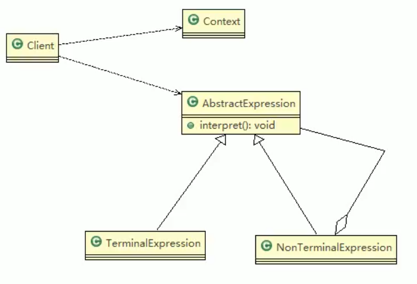
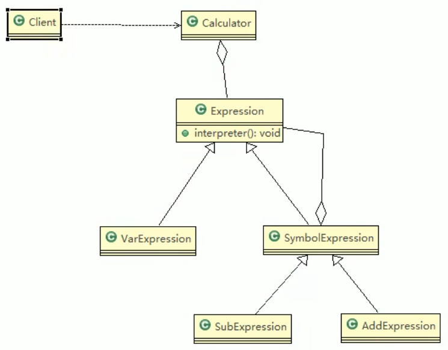

# 解释器模式

## 四则运算问题

通过解释器模式来实现四则运算，如计算a+b-c的值，具体要求

1) 先输入表达式的形式，比如 a+b+c-d+e, 要求表达式的字母不能重复
2) 在分别输入a ,b, c, d, e 的值
3) 最后求出结果：如图



## 基本介绍

1) 在编译原理中，一个算术表达式通过词法分析器形成词法单元，而后这些词法单元再通过语法分析器构建语法分析树，最终形成一颗抽象的语法分析树。这里的词法分析器和语法分析器都可以看做是解释器
2) 解释器模式（Interpreter Pattern）：是指给定一个语言(表达式)，定义它的文法的一种表示，并定义一个解释器，使用该解释器来解释语言中的句子(表达式)
3) 应用场景
    • 应用可以将一个需要解释执行的语言中的句子表示为一个抽象语法树
    • 一些重复出现的问题可以用一种简单的语言来表达
    • 一个简单语法需要解释的场景
4) 这样的例子还有，比如编译器、运算表达式计算、正则表达式、机器人等



> 1) Context: 是环境角色,含有解释器之外的全局信息.
> 2) AbstractExpression: 抽象表达式， 声明一个抽象的解释操作,这个方法为抽象语法树中所有的节点所共享
> 3) TerminalExpression: 为终结符表达式, 实现与文法中的终结符相关的解释操作
> 4) NonTermialExpression: 为非终结符表达式，为文法中的非终结符实现解释操作.
> 5) 说明： 输入Context 和 TerminalExpression 信息通过Client 输入即可

## 解释器模式解决四则运算



```java
/**
 * 抽象类表达式，通过HashMap 键值对, 可以获取到变量的值
 * 
 * @author Administrator
 *
 */
public abstract class Expression {
	// a + b - c
	// 解释公式和数值, key 就是公式(表达式) 参数[a,b,c], value就是就是具体值
	// HashMap {a=10, b=20}
	public abstract int interpreter(HashMap<String, Integer> var);
}


/**
 * 变量的解释器
 * @author Administrator
 *
 */
public class VarExpression extends Expression {
	private String key; // key=a,key=b,key=c
	public VarExpression(String key) {
		this.key = key;
	}

	// var 就是{a=10, b=20}
	// interpreter 根据 变量名称，返回对应值
	@Override
	public int interpreter(HashMap<String, Integer> var) {
		return var.get(this.key);
	}
}


/**
 * 抽象运算符号解析器 这里，每个运算符号，都只和自己左右两个数字有关系，
 * 但左右两个数字有可能也是一个解析的结果，无论何种类型，都是Expression类的实现类
 * 
 * @author Administrator
 *
 */
public class SymbolExpression extends Expression {
	protected Expression left;
	protected Expression right;

	public SymbolExpression(Expression left, Expression right) {
		this.left = left;
		this.right = right;
	}

	//因为 SymbolExpression 是让其子类来实现，因此 interpreter 是一个默认实现
	@Override
	public int interpreter(HashMap<String, Integer> var) {
		// TODO Auto-generated method stub
		return 0;
	}
}


/**
 * 加法解释器
 * @author Administrator
 *
 */
public class AddExpression extends SymbolExpression  {
	public AddExpression(Expression left, Expression right) {
		super(left, right);
	}

	//处理相加
	//var 仍然是 {a=10,b=20}..
	//一会我们debug 源码,就ok
	public int interpreter(HashMap<String, Integer> var) {
		//super.left.interpreter(var) ： 返回 left 表达式对应的值 a = 10
		//super.right.interpreter(var): 返回right 表达式对应值 b = 20
		return super.left.interpreter(var) + super.right.interpreter(var);
	}
}

/**
 * 减法解释器
 * @author Administrator
 *
 */
public class SubExpression extends SymbolExpression {
	public SubExpression(Expression left, Expression right) {
		super(left, right);
	}

	//求出left 和 right 表达式相减后的结果
	public int interpreter(HashMap<String, Integer> var) {
		return super.left.interpreter(var) - super.right.interpreter(var);
	}
}

/**
 * 计算器
 */
public class Calculator {

	// 定义表达式
	private Expression expression;

	// 构造函数传参，并解析
	public Calculator(String expStr) { // expStr = a+b
		// 安排运算先后顺序
		Stack<Expression> stack = new Stack<>();
		// 表达式拆分成字符数组 
		char[] charArray = expStr.toCharArray();// [a, +, b]

		Expression left = null;
		Expression right = null;
		//遍历我们的字符数组， 即遍历  [a, +, b]
		//针对不同的情况，做处理
		for (int i = 0; i < charArray.length; i++) {
			switch (charArray[i]) {
			case '+': //
				left = stack.pop();// 从stack取出left => "a"
				right = new VarExpression(String.valueOf(charArray[++i]));// 取出右表达式 "b"
				stack.push(new AddExpression(left, right));// 然后根据得到left 和 right 构建 AddExpresson加入stack
				break;
			case '-': // 
				left = stack.pop();
				right = new VarExpression(String.valueOf(charArray[++i]));
				stack.push(new SubExpression(left, right));
				break;
			default: 
				//如果是一个 Var 就创建要给 VarExpression 对象，并push到 stack
				stack.push(new VarExpression(String.valueOf(charArray[i])));
				break;
			}
		}
		//当遍历完整个 charArray 数组后，stack 就得到最后Expression
		this.expression = stack.pop();
	}

	public int run(HashMap<String, Integer> var) {
		//最后将表达式a+b和 var = {a=10,b=20}
		//然后传递给expression的interpreter进行解释执行
		return this.expression.interpreter(var);
	}
}
```

# Spring中的SpelExpressionParser

### SpEL 解释器模式的关键类

Spring 的 `SpelExpressionParser` 内部由多个 **表达式解释器类** 组成，每个解释器类对应 SpEL 语法中的不同部分：

| 组件                       | 作用                                         | 解释器模式中的角色                     |
| -------------------------- | -------------------------------------------- | -------------------------------------- |
| `SpelExpressionParser`     | 解析 SpEL 表达式，生成 AST                   | **解析器（构建语法树）**               |
| `SpelExpression`           | 代表一个 SpEL 表达式                         | **抽象表达式（Expression）**           |
| `LiteralExpression`        | 解析数字、字符串等字面量，如 `10`、`"Hello"` | **终结符表达式（VarExpression）**      |
| `OperatorAdd`              | 解析加法 `+`                                 | **非终结符表达式（SymbolExpression）** |
| `OperatorMultiply`         | 解析乘法 `*`                                 | **非终结符表达式（SymbolExpression）** |
| `MethodReference`          | 解析方法调用，如 `"hello".toUpperCase()`     | **非终结符表达式**                     |
| `PropertyOrFieldReference` | 解析对象属性，如 `user.name`                 | **非终结符表达式**                     |

### 解析执行过程

当 `exp.getValue()` 被调用时，Spring 解释器会递归执行 AST：

1. `OperatorAdd` 发现自己有两个子节点：`LiteralExpression(10)` 和 `OperatorMultiply(20, 3)`
2. 先求 `OperatorMultiply(20, 3)`，递归：
   - `OperatorMultiply` 计算 `20 * 3 = 60`
3. 然后 `OperatorAdd` 计算 `10 + 60 = 70`
4. 最终返回 `70`

# 解释器模式注意事项

1) 当有一个语言需要解释执行，可将该语言中的句子表示为一个抽象语法树，就可以考虑使用解释器模式，让程序具有良好的扩展性
2) 应用场景：编译器、运算表达式计算、正则表达式、机器人等
3) 使用解释器可能带来的问题：解释器模式会引起类膨胀、解释器模式采用递归调用方法，将会导致调试非常复杂、效率可能降低.