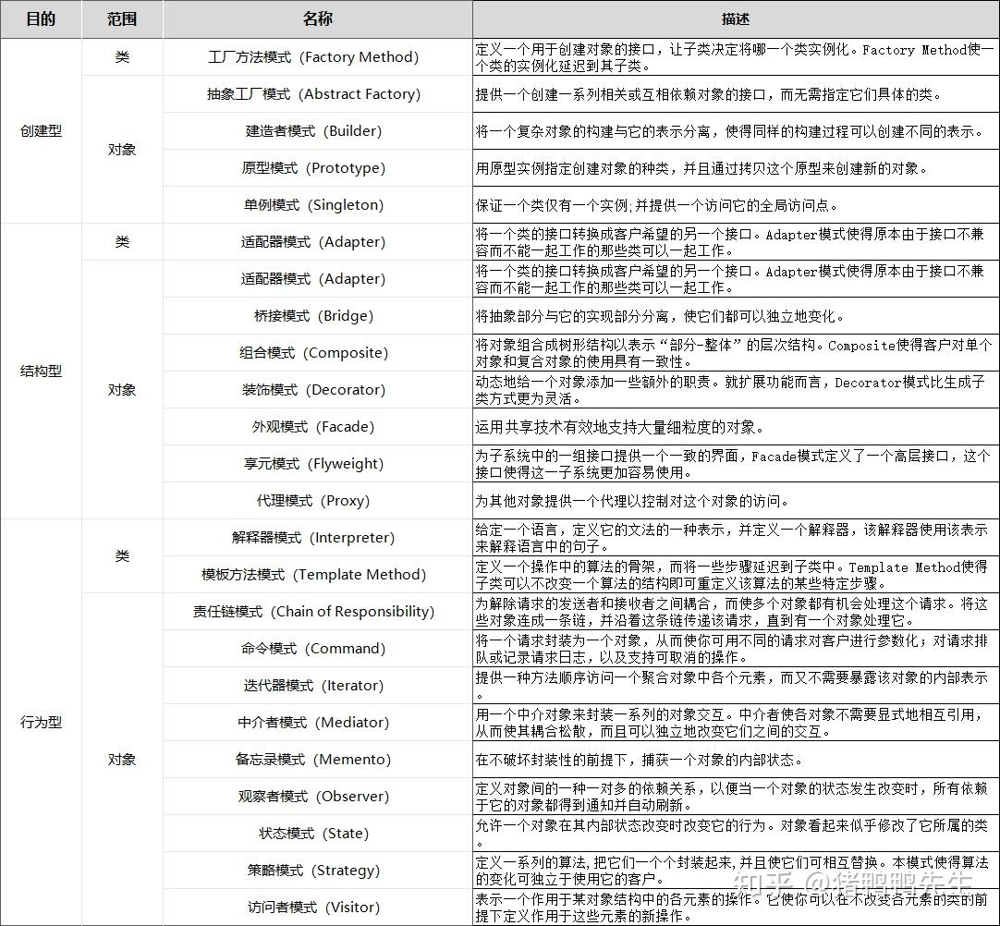

# 设计模式七大原则

1. 单一职责原则
2. 接口隔离原则
3. 依赖倒转原则
4. 里氏替换原则
5. 开闭原则OCP
6. 迪米特法则
7. 合成复用原则

# 单一职责原则

## 基本介绍

- 对类来说的，即一个类应该只负责一项职责。如类A负责两个不同职责：职责1，职责2。 当职责1需求变更而改变A时，可能造成职责2执行错误，所以需要将类A的粒度分解为 A1，A2。

## 注意事项和细节

1. 降低类的复杂度，一个类只负责一项职责。
2. 提高类的可读性，可维护性
3. 降低变更引起的风险
4. 通常情况下，我们应当遵守单一职责原则，只有逻辑足够简单，才可以在代码级违 反单一职责原则；只有类中方法数量足够少，可以在方法级别保持单一职责原则

# 接口隔离原则

## 基本介绍

- 客户端不应该依赖它不需要的接口，即一个类对另一个类的依赖 应该建立在最小的接口上

## 改进方法

1. 类A通过接口Interface1依赖类B，类C通过接口Interface1依赖类D，如果接口 Interface1对于类A和类C来说不是最小接口，那么类B和类D必须去实现他们不 需要的方法
2. 将接口Interface1拆分为独立的几个接口，类A和类C分别与他们需要的接口建立 依赖关系。也就是采用接口隔离原则
3. 接口Interface1中出现的方法，根据实际情况拆分为三个接口

# 依赖倒转原则

## 基本介绍

1. 高层模块不应该依赖底层模块，二者都应该依赖其抽象
2. `抽象不应该依赖细节，细节应该依赖抽象。`
3. 依赖倒转的中心思想是面向接口编程
4. 依赖倒转原则是基于这样的设计理念：相对于细节的多变性，抽象的东西要稳定的多。以抽象为基础搭建的架构比以细节为基础的架构要稳定的多。在java中，抽象值指的是接口或抽象类，细节就是具体的实现类。
5. 使用接口或抽象类的目的是制定好规范，而不涉及任何具体的操作，把展现细节的任务交给他们的实现类去完成。

## 依赖关系传递的三种方式

1. 接口传递
2. 构造方法传递
3. setter方式传递

## 依赖倒转原则的注意事项

1. 底层模块尽量都要有抽象类或接口，程序稳定性更好
2. 变量的声明类型尽量使抽象类或接口，这样我们的变量引用和实际对象间，就存在一个缓冲层，利于程序扩展和优化。
3. 继承时遵循里氏替换原则。

# 里氏替换原则

## 基本介绍

- 继承再给程序设计带来遍历的同时，也带来了弊端
- 基本原则：所有应用基类的地方必须能透明地使用其子类的对象。
- 在使用继承的时候，遵循里氏替换原则，在子类中尽量不要重写父类的方法
- 适当情况下，可以通过聚合、组合、依赖来解决

# 开闭原则

## 基本介绍

- 一个软件实体，如类、模块和函数应该对扩展开放（提供方），对修改关闭（对使用方）。用抽象构建框架，用实现扩展细节。
- 当软件需要变化时，尽量通过扩展软件实体的行为来实现变化，而不是通过修改已有的代码来实现变化。
- 编程中遵循其他原则，以及使用设计模式的目的就是遵循开闭原则。

# 迪米特法则

## 基本介绍

- 一个对象应该对其它对象保持最少的了解
- 类与类关系越密切，耦合度越大
- 迪米特法则又叫最少知道原则，即一个类对自己依赖的类知道的越少越好。也就是说，对于被依赖的类不管多么复杂，都尽量将逻辑封装在类的内部。对外除了提供的public方法，不对外泄露任何信息

- 迪米特法则还有个更简单的定义：只与直接的朋友通信

# 合成复用原则

## 基本介绍

- 原则是尽量使用合成/聚合的方式，而不是使用继承。

# 设计原则核心思想

- 找出应用中可能需要变化之处，把它们独立出来，不要和那些不需要变化的代码混在一起
- 针对接口编程，而不是针对实现编程。
- 为了交互对象之间的松耦合设计而努力。

# 设计模式类型

- 创建型模式：单例模式、抽象工厂模式、原型模式、建造者模式、工厂模式
- 结构型模式：适配器模式、桥接模式、装饰模式、组合模式、外观模式、享元模式、代理模式
- 行为型模式：模板方法模式、命令模式、访问者模式、迭代器模式、观察者模式、中介者模式、备忘录模式、解释器模式、状态模式、策略模式、职责链模式

